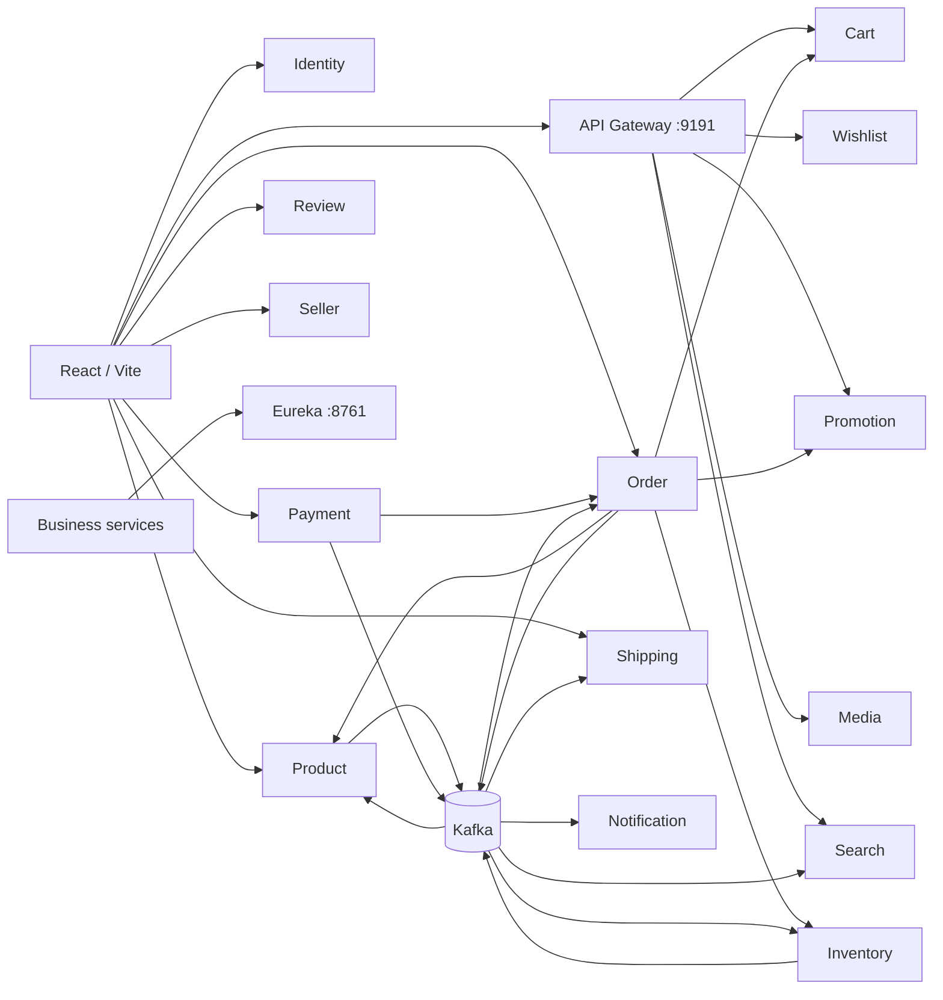

# E-commerce Microservices

[](https://github.com/dangkhoi88x/e-com-microNservice/actions/workflows/ci.yml)

Hệ thống e-commerce được xây dựng bằng Java/Spring Boot theo kiến trúc microservices, kèm một ứng dụng web React/Vite. Mỗi service sở hữu nghiệp vụ và dữ liệu của mình; REST được dùng cho các bước cần phản hồi ngay, Kafka cho các sự kiện bất đồng bộ.

Tài liệu này bám theo mã nguồn và cấu hình hiện có trong repo. Bảng Gateway bên dưới phản ánh đúng `api-gateway-service/.../GatewayConfiguration.java`, nguồn khai báo route duy nhất.

Xem thêm [code-flow.md](code-flow.md) để có sơ đồ luồng của các chức năng chính.

## Mục lục

- [Kiến trúc](#kiến-trúc)
- [Thành phần và port](#thành-phần-và-port)
- [Quyền sở hữu dữ liệu](#quyền-sở-hữu-dữ-liệu)
- [Luồng nghiệp vụ](#luồng-nghiệp-vụ)
- [API chính](#api-chính)
- [Chạy local](#chạy-local)
- [Cấu trúc thư mục](#cấu-trúc-thư-mục)
- [Kiểm tra và các giới hạn hiện tại](#kiểm-tra-và-các-giới-hạn-hiện-tại)

## Kiến trúc



> Gateway hiện route Cart, Wishlist, Promotion, Flash Deal, Media và Search. Route `/order/**` cũng đã được cấu hình nhưng **không khớp** controller Order hiện dùng `/api/v1/orders/**`, nên Order vẫn cần gọi trực tiếp qua `:8086` cho đến khi predicate được sửa. Identity, Product, Inventory, Payment, Profile, Notification, Shipping, Review và Seller chưa có route Gateway.

### Cách các service giao tiếp

| Kiểu | Khi dùng | Ví dụ trong code |
| --- | --- | --- |
| REST/WebClient | Cần kết quả ngay | Order lấy sản phẩm, reserve inventory, lấy cart và reserve promotion |
| Kafka | Không cần response đồng bộ | Payment phát event thành công/thất bại; Inventory, Product và Search đồng bộ read model |
| Eureka | Tìm service theo tên | `ORDER-SERVICE`, `INVENTORY-SERVICE`, `PROMOTION-SERVICE` |
| gRPC | Gateway kiểm tra token với Identity | Gateway gọi Identity tại `localhost:9090` |

## Thành phần và port

| Thành phần | Module | Port | Trách nhiệm |
| --- | --- | ---: | --- |
| Identity Service | `Microservice-ecom` | 8090 HTTP, 9090 gRPC | Đăng ký, đăng nhập, refresh token, introspect JWT |
| Profile Service | `profile-service` | 8081 | Hồ sơ người dùng |
| Notification Service | `notification-service` | 8083 | Nhận event và cung cấp thông báo |
| Product Service | `product-service` | 8084 | Category, product, variant và catalog |
| Order Service | `order-service` | 8086 | Tạo order, checkout và vòng đời order |
| Inventory Service | `inventory-service` | 8087 | Tồn kho thực: available, reserved, sold |
| Payment Service | `payment-service` | 8088 | Tạo và cập nhật payment |
| Cart Service | `cart-service` | 8089 | Giỏ hàng và khoá item khi checkout |
| Wishlist Service | `wishlist-service` | 8092 | Wishlist của user |
| Search Service | `search-service` | 8093 | Tìm kiếm Elasticsearch |
| Promotion Service | `promotion-service` | 8095 | Campaign, validate/reserve/confirm/release khuyến mãi |
| Shipping Service | `shipping-service` | 8096 | Shipment và trạng thái giao hàng |
| Review Service | `review-service` | 8097 | Review sản phẩm và moderation |
| Seller Service | `seller-service` | 8098 | Đăng ký, xét duyệt và quản lý shop |
| Media Service | `media-service` | 8099 mặc định | Upload và phân phối media qua S3-compatible storage |
| Discovery Server | `discovery-server` | 8761 | Eureka service registry |
| API Gateway | `api-gateway-service` | 9191 | Entry point cho các route đã khai báo |
| Web app | `web-app` | Vite mặc định 5173 | React 19 frontend |

### Gateway routes đang hoạt động

Khai báo trong `GatewayConfiguration.java`. Route có `stripPrefix(1)` sẽ cắt đoạn đầu trước khi chuyển tiếp, ví dụ `/order/api/v1/orders` tới Order thành `/api/v1/orders`.

| Path trên Gateway | Service đích | Biến đổi path |
| --- | --- | --- |
| `/identity/**` | `IDENTITY-SERVICE` | strip 1 + thêm `/identity/api` |
| `/profile/**` | `PROFILE-SERVICE` | strip 1 |
| `/notification/**` | `NOTIFICATION-SERVICE` | strip 1 |
| `/product/**` | `PRODUCT-SERVICE` | strip 1 |
| `/order/**` | `ORDER-SERVICE` | strip 1 |
| `/payment/**` | `PAYMENT-SERVICE` | strip 1 |
| `/inventory/**`, `/search/**` | `INVENTORY-SERVICE`, `SEARCH-SERVICE` | strip 1 |
| `/api/v1/cart/**` | `CART-SERVICE` | giữ nguyên |
| `/api/v1/wishlist/**` | `WISHLIST-SERVICE` | giữ nguyên |
| `/api/v1/media/**` | `MEDIA-SERVICE` | giữ nguyên |
| `/api/v1/promotions/**`, `/api/v1/flash-deals/**` | `PROMOTION-SERVICE` | giữ nguyên |
| `/api/v1/search/**` | `SEARCH-SERVICE` | giữ nguyên |
| `/api/v1/inventory/**` | `INVENTORY-SERVICE` | giữ nguyên |
| `/api/v1/shipments/**` | `SHIPPING-SERVICE` | giữ nguyên |
| `/api/v1/reviews/**` | `REVIEW-SERVICE` | giữ nguyên |
| `/api/v1/sellers/**` | `SELLER-SERVICE` | giữ nguyên |
| `/api/v1/seller/products/**`, `/api/v1/admin/products/**` | `PRODUCT-SERVICE` | giữ nguyên |

Prefix `/internal/**` **không** được Gateway route. Đó là ranh giới bảo vệ các endpoint service-to-service (`/internal/cart`, `/internal/inventory`, `/internal/promotions`, `/internal/flash-deals`).

## Quyền sở hữu dữ liệu

### Catalog và tồn kho

`Inventory Service` là **source of truth** cho số lượng hàng.

| Field ở Inventory | Ý nghĩa |
| --- | --- |
| `availableQuantity` | Số lượng có thể bán ngay |
| `reservedQuantity` | Số lượng đã giữ cho order đang chờ thanh toán |
| `soldQuantity` | Số lượng đã bán |

`Product.quantity` và `Search.inStock` là dữ liệu denormalized để đọc/list/filter nhanh. Không dùng chúng để quyết định có thể mua hay không; checkout luôn reserve tại Inventory.

### Các service sở hữu dữ liệu

| Service | Dữ liệu/nghiệp vụ sở hữu |
| --- | --- |
| Product | Product, category, variant, giá và trạng thái catalog |
| Inventory | Stock và reservation theo order |
| Cart | Cart item; `checkoutOrderId` khoá item khi đang checkout |
| Order | Snapshot item, subtotal, discount, total, trạng thái order |
| Payment | Payment và trạng thái thanh toán |
| Promotion | Campaign và lượt sử dụng/reservation khuyến mãi |
| Wishlist | Wishlist theo user/product/variant |
| Search | Elasticsearch document phục vụ search |

## Luồng nghiệp vụ

### 1. Tạo product và đồng bộ search

```text
Seller/Admin tạo hoặc sửa Product
-> Product Service lưu catalog
-> publish product-created / product-updated / product-deleted
-> Search Service cập nhật Elasticsearch document
```

Khi inventory thay đổi, Inventory phát `inventory-updated`; Product cập nhật bản sao số lượng và phát event product update để Search cập nhật `inStock`.

### 2. Checkout từ cart

```text
POST /api/v1/orders/checkout
-> Order lấy các cart item chưa bị khoá
-> lấy product/variant và snapshot giá hiện tại
-> nếu có campaignCode: validate promotion theo subtotal
-> lưu Order PENDING
-> reserve Inventory
-> reserve Promotion (nếu có)
-> Order PENDING_PAYMENT
-> đánh dấu các cart item bằng checkoutOrderId
```

Nếu reserve inventory hoặc promotion lỗi, Order lưu trạng thái lỗi (`INVENTORY_FAILED` hoặc `PROMOTION_FAILED`) và thực hiện bù trừ phần đã reserve. Khi order bị huỷ hoặc payment thất bại, reservation được release và cart item được mở khoá.

### 3. Thanh toán

```text
POST /api/v1/payments
-> Payment Service hỏi Order
-> chỉ tạo payment khi Order đang PENDING_PAYMENT
-> Payment PENDING

Payment SUCCESS
-> publish payment-success
-> Order CONFIRMED
-> confirm Promotion, Inventory và finalize cart item

Payment FAILED/CANCELLED
-> publish event tương ứng
-> release Promotion, Inventory và cart item
```

Payment chỉ cho phép một payment pending cho mỗi order ở mức database (`uk_payments_one_pending_per_order`). Các chuyển trạng thái sai như `CANCELLED -> SUCCESS` bị chặn. Endpoint mô phỏng success/failed/cancel là luồng demo; thanh toán online thực tế vẫn cần webhook đã xác thực từ cổng thanh toán.

### 4. Wishlist

Wishlist yêu cầu JWT. Client cần lấy lại `GET /api/v1/wishlist` sau thao tác thêm/xoá để hiển thị trạng thái từ server. Backend dùng ràng buộc duy nhất theo user/product/variant và thêm item theo hướng idempotent, nên retry không sinh dòng trùng.

## API chính

Tất cả API dưới đây trả về wrapper `ApiResponse` (gồm `status`, `message`, `data`) và các API cần user dùng header:

```http
Authorization: Bearer <access-token>
```

Các path Gateway có thể gọi bằng `http://localhost:9191`; các path không nằm trong bảng Gateway phải gọi trực tiếp qua port service.

| Nhóm | Method / path | Ghi chú |
| --- | --- | --- |
| Auth | `POST :8090/users`, `POST :8090/auth/login` | Đăng ký và đăng nhập |
| Auth | `POST :8090/auth/refresh-token`, `POST :8090/auth/logout` | Quản lý JWT |
| Profile | `GET`, `PUT :8081/api/v1/user-profile/me` | Hồ sơ user hiện tại |
| Category | `POST/GET :8084/api/v1/categories`, `GET/PUT/DELETE .../{id}` | Category |
| Product | `POST/GET :8084/api/v1/products`, `GET .../slug/{slug}`, `GET/PUT/DELETE .../{id}` | Catalog và variant |
| Inventory | `POST :8087/api/v1/inventory`, `GET .../products/{productId}` | Tạo và xem stock |
| Inventory | `POST :8087/internal/inventory/reserve`, `.../confirm`, `.../release` | API nội bộ cho order/payment flow; Gateway không route `/internal/**` |
| Cart | `GET /api/v1/cart`, `POST /api/v1/cart/items` | Xem và thêm item qua Gateway hoặc `:8089` |
| Cart | `PUT/DELETE /api/v1/cart/items/{itemId}`, `DELETE /api/v1/cart/items` | Sửa, xoá hoặc clear cart |
| Wishlist | `GET /api/v1/wishlist`, `POST /api/v1/wishlist/items` | Xem/thêm wishlist |
| Wishlist | `DELETE /api/v1/wishlist/items/{productId}?variantId=...`, `DELETE /api/v1/wishlist` | Xoá một item hoặc clear |
| Order | `POST :8086/api/v1/orders`, `POST .../checkout` | Tạo order trực tiếp hoặc từ selected cart item |
| Order | `GET .../my-orders`, `GET .../{id}`, `PUT .../{id}/cancel` | Order của user |
| Payment | `POST :8088/api/v1/payments`, `GET .../my-payments` | Tạo/xem payment của user |
| Payment | `PUT .../{id}/success`, `.../failed`, `.../cancel` | Cập nhật payment cho demo; kiểm tra quyền trong service |
| Search | `GET /api/v1/search/products` | Search product qua Gateway hoặc `:8093` |
| Search | `GET .../products/suggestions`, `.../products/aggregations` | Gợi ý và aggregation |
| Promotion | `POST/GET /api/v1/promotions/campaigns` | Tạo/lấy campaign qua Gateway hoặc `:8095` |
| Promotion | `GET/PUT/DELETE .../campaigns/{id}` | Chi tiết và quản trị campaign |

Xem request mẫu cho Promotion tại [bruno/promotion-service](bruno/promotion-service/README.md). Chi tiết kiểu request/response nên lấy trực tiếp từ các DTO `dto/request` và `dto/response` của từng module để luôn khớp version code hiện tại.

## Chạy local

### Điều kiện

- JDK phù hợp với từng Maven module
- Docker Desktop đang chạy
- Node.js và npm cho `web-app`

### 1. Khởi động hạ tầng

```bash
docker compose up -d
```

Compose chạy PostgreSQL cho product/identity/inventory/promotion/shipping/review/seller/media, Redis, MongoDB, Kafka, Kafka UI, Elasticsearch, Kibana; đồng thời build/chạy Promotion, Shipping, Review, Seller và Wishlist Service.

Các URL hữu ích:

| Công cụ | URL |
| --- | --- |
| Eureka | http://localhost:8761 |
| Gateway | http://localhost:9191 |
| Kafka UI | http://localhost:8085 |
| Elasticsearch | http://localhost:9200 |
| Kibana | http://localhost:5601 |

### 2. Seed catalog demo (tuỳ chọn)

Chạy product trước rồi mới seed inventory để product và variant đã có stock:

```bash
docker compose exec -T product-postgres psql -U root -d postgres < database/seed-products.sql
docker compose exec -T inventory-postgres psql -U postgres -d inventory_db < database/seed-inventory.sql
```

`seed-inventory.sql` chỉ tạo inventory còn thiếu, không ghi đè số lượng đã thay đổi bởi checkout.

### 3. Khởi động service

Khởi động Discovery trước, sau đó Identity và các business service cần dùng. Mỗi service có Maven Wrapper riêng:

```bash
cd discovery-server && ./mvnw spring-boot:run
```

Mở terminal riêng cho từng service cần demo, ví dụ:

```bash
cd Microservice-ecom && mvn spring-boot:run
cd product-service && ./mvnw spring-boot:run
cd inventory-service && ./mvnw spring-boot:run
cd cart-service && ./mvnw spring-boot:run
cd promotion-service && ./mvnw spring-boot:run
cd order-service && ./mvnw spring-boot:run
cd payment-service && ./mvnw spring-boot:run
cd search-service && ./mvnw spring-boot:run
cd api-gateway-service && ./mvnw spring-boot:run
```

Các service Shipping, Review, Seller và Media chạy tương tự từ thư mục module tương ứng. `Microservice-ecom` không có Maven Wrapper nên dùng `mvn spring-boot:run`.

Compose map Promotion Service ra host port `8095` trùng với container port. Phải giữ 1:1 vì Spring Cloud đăng ký lên Eureka bằng port Tomcat thật trong container; host port khác container port sẽ làm service không discover được từ host. Vì cả Docker lẫn IntelliJ đều dùng `8095`, chỉ chạy một trong hai để tránh hai instance `promotion-service` cùng đăng ký Eureka.

### 4. Khởi động frontend

```bash
cd web-app
npm install
npm run dev
```

Build production:

```bash
npm run build
```

## Cấu trúc thư mục

```text
.
├── Microservice-ecom/        # Identity Service
├── api-gateway-service/      # Spring Cloud Gateway + gRPC token introspection
├── cart-service/             # Cart và checkout lock
├── discovery-server/         # Eureka
├── inventory-service/        # Stock source of truth
├── notification-service/     # Notification consumer/API
├── order-service/            # Order + checkout orchestration
├── payment-service/          # Payment lifecycle + Kafka events
├── product-service/          # Catalog/category/variant
├── profile-service/          # User profile
├── promotion-service/        # Campaign và promotion reservation
├── search-service/           # Elasticsearch search
├── shipping-service/         # Shipment và trạng thái giao hàng
├── review-service/           # Product review và moderation
├── seller-service/           # Seller shop và eligibility
├── media-service/            # Media metadata + S3 upload/download URL
├── wishlist-service/         # Wishlist
├── web-app/                  # React 19 + Vite frontend
├── database/                 # SQL seed data
├── bruno/                    # API collections/examples
├── docker-compose.yaml       # Local infrastructure
├── architecture.md           # Phân tích flow chi tiết (cần đồng bộ khi đổi config)
└── improvement-plan.md       # Roadmap kỹ thuật
```

## Kiểm tra và các giới hạn hiện tại

### Build

Root `pom.xml` là aggregator cho toàn bộ service Spring Boot, bao gồm Promotion, Shipping, Review, Seller và Media. Build từng service bằng wrapper của chính module (hoặc `mvn` với `Microservice-ecom`), ví dụ:

```bash
cd payment-service && ./mvnw -DskipTests compile
cd order-service && ./mvnw -DskipTests compile
cd web-app && npm run build
```

### Lưu ý trước khi triển khai production

- Các datasource/JWT secret trong YAML là cấu hình local demo; chuyển sang biến môi trường hoặc secret manager trước khi deploy.
- Một số internal endpoint hiện được permit để các service gọi lẫn nhau. Cần bảo vệ bằng service-to-service auth/mTLS hoặc network policy ở môi trường production.
- `ddl-auto: update` tiện cho local, nhưng migration versioned (Flyway/Liquibase) an toàn hơn cho production.
- Kafka event hiện cần bổ sung outbox, retry/DLT, tracing và reconciliation để chịu được lỗi mạng/consumer.
- Online payment cần webhook đã ký, kiểm tra amount/order, idempotency và cơ chế đối soát; không dùng endpoint demo `success` làm bằng chứng thanh toán thực.
- Khi thêm Gateway route hoặc đổi port, cập nhật đồng thời README này và [architecture.md](architecture.md).

## Tài liệu liên quan

- [Architecture chi tiết](architecture.md)
- [Technical improvement plan](improvement-plan.md)
- [Promotion Bruno collection](bruno/promotion-service/README.md)
