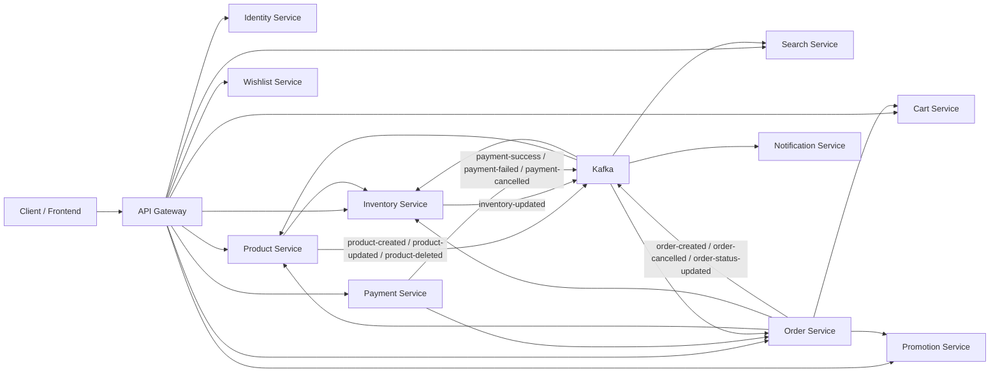

# E-commerce Microservices Architecture

Tài liệu này mô tả kiến trúc hiện tại của project microservice e-commerce trong repo `e-com-microNservice`.

Mục tiêu chính của hệ thống:

- Tách nghiệp vụ theo từng service nhỏ.
- Dùng REST cho các bước cần phản hồi ngay.
- Dùng Kafka cho các sự kiện bất đồng bộ giữa service.
- Dùng Inventory Service làm source of truth cho tồn kho.
- Dùng Product/Search làm read model để hiển thị catalog nhanh.

## 1. Tổng Quan Service

| Service | Vai trò chính | Giao tiếp chính |
| --- | --- | --- |
| Discovery Server | Eureka service registry | Service đăng ký và tìm nhau qua Eureka |
| API Gateway | Entry point cho client | Route request vào các service |
| Identity Service | Đăng ký, đăng nhập, phát JWT | REST, Kafka user event |
| Profile Service | Quản lý thông tin profile user | REST, Kafka user/profile event |
| Notification Service | Gửi email/thông báo | Kafka consumer |
| Product Service | Quản lý catalog sản phẩm, giá, category, status | REST, Kafka product/inventory event |
| Search Service | Index và search product bằng Elasticsearch | Kafka product event, REST search |
| Inventory Service | Quản lý tồn kho thật: available, reserved, sold | REST, Kafka payment/inventory event |
| Cart Service | Giỏ hàng và khoá item trong lúc checkout | REST từ Order Service |
| Wishlist Service | Wishlist theo user/product/variant | REST qua Gateway |
| Order Service | Tạo order, giữ trạng thái order | REST tới product/inventory, Kafka payment event |
| Payment Service | Tạo payment và đổi trạng thái payment | REST tới order, Kafka payment event |
| Promotion Service | Campaign và reservation khuyến mãi | REST từ Order Service |

## 2. Nguyên Tắc Ownership Dữ Liệu

### Product Service

Product Service quản lý thông tin mô tả sản phẩm:

- `name`
- `description`
- `price`
- `images`
- `category`
- `status`
- `sellerId`

Product Service hiện vẫn có field `quantity`, nhưng field này được xem là bản sao denormalized từ Inventory Service, dùng để list/filter nhanh.

### Inventory Service

Inventory Service là source of truth cho tồn kho:

- `availableQuantity`: số lượng thật còn có thể bán.
- `reservedQuantity`: số lượng đang giữ cho order chưa thanh toán.
- `soldQuantity`: số lượng đã bán.

Mọi quyết định còn hàng hay hết hàng khi tạo order phải dựa vào Inventory Service, không dựa vào Product Service.

### Search Service

Search Service là read model cho catalog/search. Dữ liệu search được cập nhật qua event từ Product Service.

Field `inStock` trong Search Service là dữ liệu denormalized, phục vụ lọc nhanh. Khi cần chắc chắn stock thật, service nghiệp vụ phải hỏi Inventory Service.

## 3. Sơ Đồ Giao Tiếp Tổng Quan



## 4. API Gateway Routes

Gateway là entry point cho client.

Các route chính hiện tại:

| Public path | Target service |
| --- | --- |
| `/api/v1/search/**` | `SEARCH-SERVICE` |
| `/api/v1/cart/**` | `CART-SERVICE` |
| `/api/v1/wishlist/**` | `WISHLIST-SERVICE` |
| `/api/v1/promotions/**` | `PROMOTION-SERVICE` |

Gateway cũng xử lý JWT security trước khi request đi vào service cần bảo vệ. Hiện các API Identity, Profile, Product, Inventory, Order, Payment và Notification **chưa có route trong Gateway YAML**, nên client local gọi trực tiếp vào port service hoặc phải bổ sung route trước.

## 5. Flow Product Và Inventory

### 5.1. Tạo Product

Use case:

```text
Seller tạo product
```

Flow:

```text
Client
-> API Gateway
-> Product Service
-> Product DB
-> Kafka topic: product-created
-> Search Service index product
```

Product Service publish `product-created` để Search Service index vào Elasticsearch.

Lưu ý:

- Product Service không còn là nơi quyết định tồn kho thật.
- Nếu cần tạo tồn kho ban đầu, seller/admin cần tạo Inventory cho product đó trong Inventory Service.

### 5.2. Tạo Inventory

Use case:

```text
Admin/Seller tạo inventory cho product
```

Flow:

```text
Client
-> API Gateway
-> Inventory Service
-> Inventory DB
-> Kafka topic: inventory-updated
-> Product Service sync product.quantity
-> Kafka topic: product-updated
-> Search Service update index
```

Ý nghĩa:

- Inventory Service giữ số lượng thật.
- Product Service giữ bản sao `quantity` để list nhanh.
- Search Service nhận `product-updated` để cập nhật `inStock`.

### 5.3. Product List Và Product Detail

Product list:

```text
Client
-> Product/Search Service
-> Product Service có thể gọi Inventory batch API để lấy stock nhiều product trong một request
```

List dùng `quantity`/`inStock` denormalized để trả nhanh.

Product detail:

```text
Client
-> Product Service
-> Inventory Service
-> trả availableQuantity mới nhất
```

Product detail lấy quantity chính xác hơn bằng cách gọi Inventory Service.

## 6. Flow Order

### 6.1. Tạo Order Thành Công

Use case:

```text
User tạo order
```

Flow:

```text
Client
-> API Gateway
-> Order Service
-> Product Service: lấy product name, price, status
-> Order Service save order status PENDING
-> Inventory Service reserve
-> Order Service update status PENDING_PAYMENT
-> Kafka topic: order-created
-> Kafka topic: order-status-updated
```

Order Service chỉ kiểm:

- Product tồn tại.
- Product đang `ACTIVE`.
- Giá và tên sản phẩm tại thời điểm tạo order.

Order Service không check `product.quantity`.

Inventory Service mới là nơi kiểm stock thật:

```text
availableQuantity >= order item quantity
```

Nếu đủ hàng:

```text
availableQuantity giảm
reservedQuantity tăng
reservation status = PENDING
order status = PENDING_PAYMENT
```

### 6.2. Tạo Order Nhưng Reserve Inventory Fail

Flow:

```text
Client
-> Order Service save order status PENDING
-> Inventory Service reserve fail
-> Order Service update status INVENTORY_FAILED
-> trả order response cho client
```

Ở mức demo, service không throw exception sau khi set `INVENTORY_FAILED`, để transaction không rollback mất trạng thái failed.

Kết quả:

```text
Order vẫn tồn tại trong DB với status INVENTORY_FAILED
```

Lợi ích:

- Dễ debug.
- Client biết order đã tạo nhưng không reserve được hàng.
- Dễ giải thích trong microservice flow.

## 7. Flow Payment

### 7.1. Tạo Payment

Use case:

```text
User tạo payment cho order
```

Flow:

```text
Client
-> Payment Service
-> Order Service: get order detail
-> validate order.status == PENDING_PAYMENT
-> Payment Service save payment status PENDING
```

Payment chỉ được tạo khi order đã reserve hàng thành công và đang chờ thanh toán.

### 7.2. Payment Success

Flow:

```text
Client/Admin/Test
-> Payment Service mark SUCCESS
-> Kafka topic: payment-success
-> Order Service consume payment-success
-> Order status PENDING_PAYMENT -> CONFIRMED
-> Inventory Service consume payment-success
-> reservation PENDING -> CONFIRMED
-> reservedQuantity giảm
-> soldQuantity tăng
-> Inventory Service publish inventory-updated
-> Product Service sync quantity
-> Search Service update inStock
```

Payment status rule:

```text
PENDING -> SUCCESS: allowed
FAILED -> SUCCESS: blocked
CANCELLED -> SUCCESS: blocked
SUCCESS -> FAILED: blocked
```

### 7.3. Payment Failed Hoặc Cancelled

Flow:

```text
Payment Service mark FAILED/CANCELLED
-> Kafka topic: payment-failed hoặc payment-cancelled
-> Inventory Service release reservation
-> reservedQuantity giảm
-> availableQuantity tăng
-> Inventory Service publish inventory-updated
-> Product Service sync quantity
-> Search Service update inStock
```

Inventory confirm/release được xử lý idempotent ở mức demo:

- Nếu reservation đã confirm/release rồi, service không cộng/trừ lại.
- Nếu không có reservation nào của order, service báo lỗi reservation not found.

## 8. Flow Cancel Order

Use case:

```text
User hủy order
```

Flow:

```text
Client
-> Order Service cancel order
-> nếu order status = PENDING_PAYMENT thì gọi Inventory Service release
-> Order Service update status CANCELLED
-> Kafka topic: order-cancelled
```

Chỉ các trạng thái được hủy:

- `PENDING`
- `PENDING_PAYMENT`
- `CONFIRMED`

Nếu order đang `PENDING_PAYMENT`, nghĩa là đã reserve hàng, nên phải release inventory trước khi chuyển sang `CANCELLED`.

## 9. Kafka Topics

### Product Topics

| Topic | Producer | Consumer | Mục đích |
| --- | --- | --- | --- |
| `product-created` | Product Service | Search Service | Index product mới |
| `product-updated` | Product Service | Search Service | Update product document |
| `product-deleted` | Product Service | Search Service | Xóa product document |

### Inventory Topics

| Topic | Producer | Consumer | Mục đích |
| --- | --- | --- | --- |
| `inventory-updated` | Inventory Service | Product Service | Sync `product.quantity` từ `availableQuantity` |

### Order Topics

| Topic | Producer | Consumer | Mục đích |
| --- | --- | --- | --- |
| `order-created` | Order Service | Notification/other read models | Báo order đã tạo |
| `order-cancelled` | Order Service | Notification/other read models | Báo order bị hủy |
| `order-status-updated` | Order Service | Notification/other read models | Báo trạng thái order đổi |

Product Service không còn consume `order-created` để trừ stock.

### Payment Topics

| Topic | Producer | Consumer | Mục đích |
| --- | --- | --- | --- |
| `payment-success` | Payment Service | Order Service, Inventory Service | Confirm order và confirm inventory |
| `payment-failed` | Payment Service | Inventory Service | Release inventory |
| `payment-cancelled` | Payment Service | Inventory Service | Release inventory |

## 10. Use Case Tổng Hợp

### Use Case 1: User mua hàng thành công

```text
1. User xem catalog/search product.
2. User vào product detail.
3. Product Service lấy quantity mới nhất từ Inventory Service.
4. User tạo order.
5. Order Service lấy product price/name/status từ Product Service.
6. Order Service save order PENDING.
7. Order Service gọi Inventory Service reserve.
8. Inventory reserve thành công.
9. Order chuyển sang PENDING_PAYMENT.
10. User tạo payment.
11. Payment chuyển SUCCESS.
12. Payment Service publish payment-success.
13. Order Service chuyển order sang CONFIRMED.
14. Inventory Service confirm reservation, tăng soldQuantity.
15. Inventory publish inventory-updated.
16. Product Service sync quantity.
17. Search Service update inStock qua product-updated.
```

### Use Case 2: User tạo order nhưng hết hàng

```text
1. User tạo order.
2. Order Service save order PENDING.
3. Order Service gọi Inventory Service reserve.
4. Inventory Service thấy availableQuantity không đủ.
5. Reserve fail.
6. Order Service đổi status INVENTORY_FAILED.
7. Client nhận order response với status INVENTORY_FAILED.
```

### Use Case 3: Payment thất bại

```text
1. Order đang PENDING_PAYMENT.
2. Payment chuyển FAILED.
3. Payment Service publish payment-failed.
4. Inventory Service release reservation.
5. availableQuantity tăng lại.
6. Inventory publish inventory-updated.
7. Product/Search sync lại quantity/inStock.
```

### Use Case 4: User hủy order

```text
1. User gọi cancel order.
2. Nếu order đang PENDING_PAYMENT, Order Service gọi Inventory Service release.
3. Order chuyển CANCELLED.
4. Order Service publish order-cancelled.
```

## 11. Tại Sao Không Bị Loop Service

Flow hiện tại không có vòng gọi trực tiếp nguy hiểm kiểu:

```text
Order -> Payment -> Order -> Payment
```

Các service giao tiếp theo hướng rõ:

```text
Order -> Product: lấy thông tin sản phẩm
Order -> Inventory: reserve/release hàng
Payment -> Order: kiểm order có payable không
Payment -> Kafka: publish payment result
Kafka -> Order/Inventory: cập nhật trạng thái sau payment
Inventory -> Kafka: publish stock changed
Kafka -> Product/Search: sync read model
```

Điểm quan trọng:

- Product Service không trừ stock theo `order-created`.
- Inventory Service là nơi duy nhất quyết định stock thật.
- Product/Search chỉ giữ bản sao để đọc nhanh.

## 12. Ghi Chú Local Config

Các service chính hiện đã được cấu hình port không trùng nhau:

| Service | Port hiện tại |
| --- | --- |
| Identity Service | `8090` HTTP, `9090` gRPC |
| Profile Service | `8081` |
| Notification Service | `8083` |
| Product Service | `8084` |
| Order Service | `8086` |
| Inventory Service | `8087` |
| Payment Service | `8088` |
| Cart Service | `8089` |
| Wishlist Service | `8092` |
| Search Service | `8093` |
| Promotion Service | `8095` |
| Discovery Server | `8761` |
| API Gateway | `9191` |

## 13. Những Điểm Có Thể Cải Thiện Sau

Các điểm này chưa bắt buộc cho demo, nhưng nên biết để trả lời khi phỏng vấn:

1. Tách event DTO ra module chung như `common-event`.
2. Thêm Outbox Pattern cho các event quan trọng.
3. Thêm retry + DLT cho mọi Kafka consumer.
4. Đổi tên `product.quantity` thành `cachedAvailableQuantity` hoặc `availableQuantity`.
5. Thêm migration bằng Flyway/Liquibase thay vì `ddl-auto: update`.
6. Thêm distributed tracing để trace flow order-payment-inventory.
