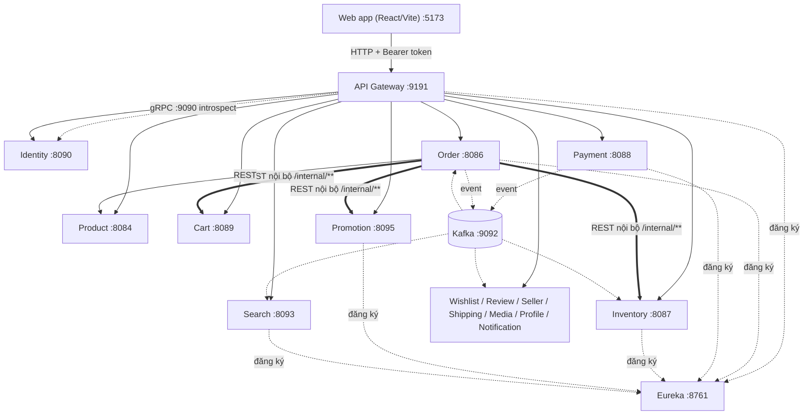
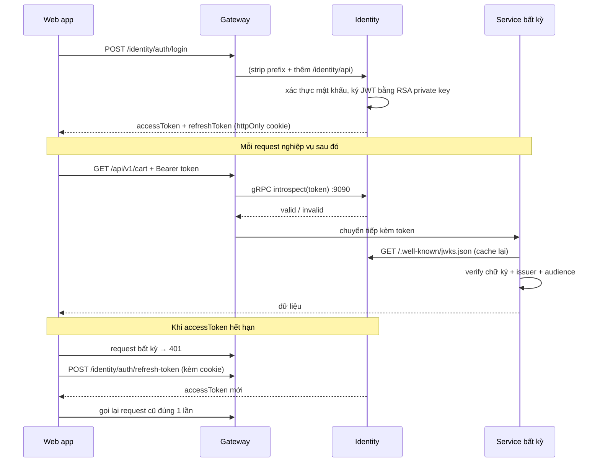
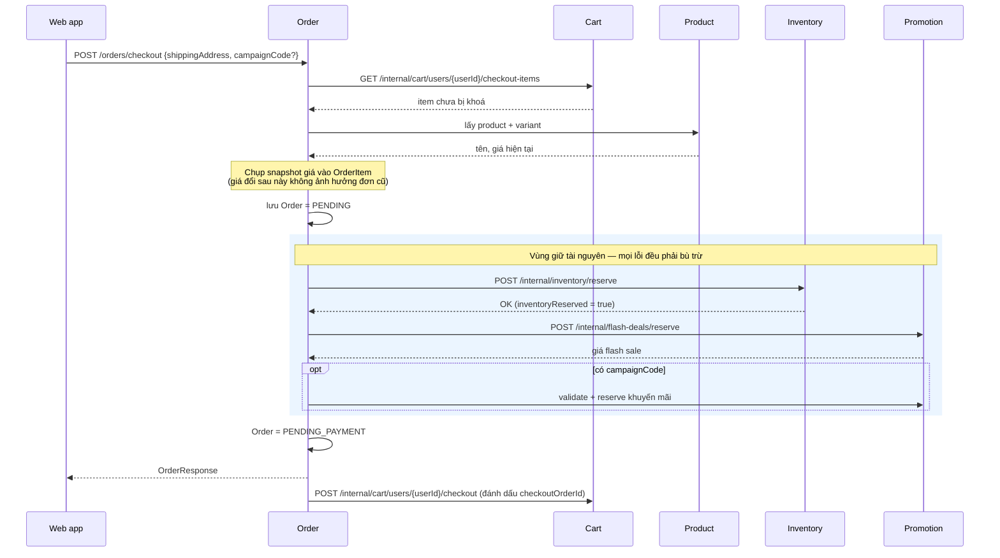
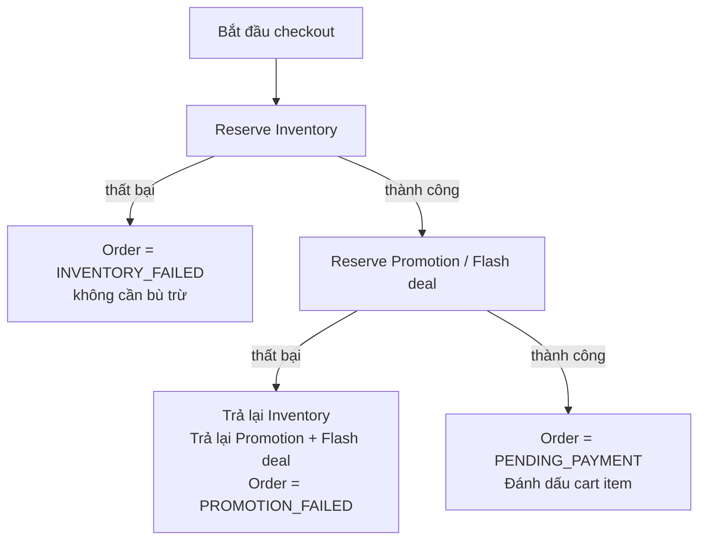
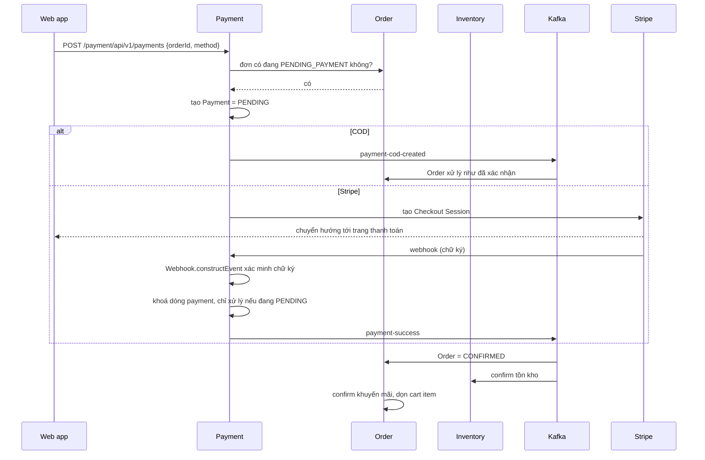
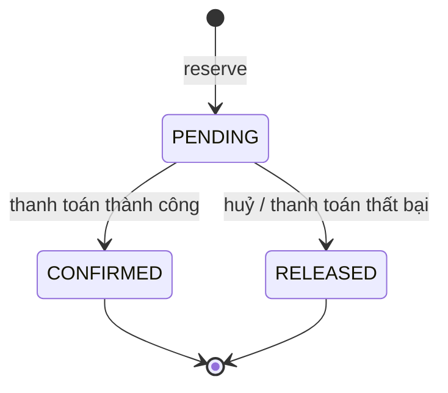
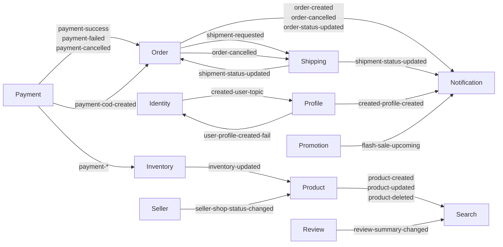
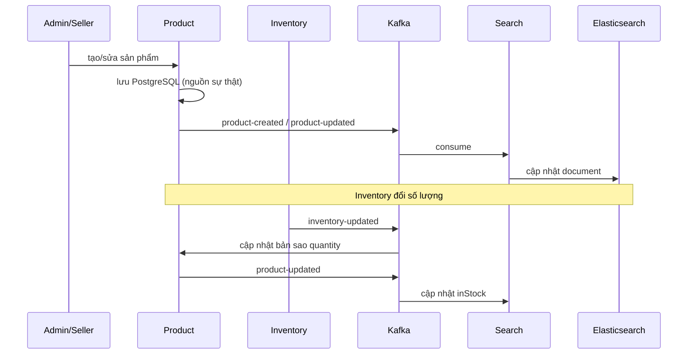

# Code Flow — Sơ đồ luồng và ghi chú kỹ thuật

Tài liệu này mô tả **luồng code thật** của các chức năng quan trọng, dựng từ mã nguồn hiện tại chứ không phải sơ đồ kiến trúc lý thuyết. Mỗi sơ đồ đều ghi rõ class/endpoint tương ứng để tra ngược vào code.

Xem thêm: [README.md](README.md) (tổng quan, port, cách chạy) · [architecture.md](architecture.md) · [agent_context.md](agent_context.md) (invariant nghiệp vụ).

## Mục lục

- [1. Bản đồ hệ thống](#1-bản-đồ-hệ-thống)
- [2. Luồng xác thực](#2-luồng-xác-thực)
- [3. Luồng checkout (quan trọng nhất)](#3-luồng-checkout-quan-trọng-nhất)
- [4. Luồng thanh toán](#4-luồng-thanh-toán)
- [5. Vòng đời tồn kho](#5-vòng-đời-tồn-kho)
- [6. Bản đồ Kafka](#6-bản-đồ-kafka)
- [7. Đồng bộ catalog sang Search](#7-đồng-bộ-catalog-sang-search)
- [8. Kiến thức rút ra từ codebase này](#8-kiến-thức-rút-ra-từ-codebase-này)

---

## 1. Bản đồ hệ thống

Ba đường giao tiếp, mỗi đường dùng cho mục đích khác nhau:



| Kiểu giao tiếp | Dùng khi nào | Ví dụ trong code |
| --- | --- | --- |
| **REST đồng bộ** | Cần kết quả ngay để đi tiếp | `OrderServiceImpl` gọi `InventoryClient.reserveInventory` |
| **Kafka** | Không cần trả lời ngay, chấp nhận eventual consistency | `payment-success` → Order cập nhật trạng thái |
| **gRPC** | Gateway kiểm tra token mỗi request, cần độ trễ thấp | `GatewayAuthenticationFilter` → Identity `:9090` |

### Ba lớp path và ý nghĩa bảo mật

| Prefix | Gateway có route? | Ai gọi được |
| --- | --- | --- |
| `/api/v1/**`, `/product/**`, `/order/**`… | ✅ Có | Client bên ngoài (đã qua xác thực) |
| `/internal/**` | ❌ **Không** | Chỉ service gọi service, trong mạng nội bộ |
| `/actuator/health` | ❌ | Hạ tầng |

> `/internal/**` không được khai báo trong `GatewayConfiguration.java` — **đó chính là cơ chế bảo vệ**. Các endpoint này nhận `userId`/`orderId` thẳng từ path và không kiểm tra quyền sở hữu, nên nếu lộ ra Internet thì bất kỳ ai đăng nhập cũng thao túng được dữ liệu người khác.

---

## 2. Luồng xác thực

Identity **ký** token bằng RSA private key; các service khác chỉ **xác minh** bằng public key lấy từ JWKS. Không service nào ngoài Identity giữ khóa ký.



**Điểm cần nhớ khi đọc code:**

- `JwtKeyProvider` — nạp RSA private key từ biến môi trường `JWT_RSA_PRIVATE_KEY`, chỉ Identity có.
- `JwksController` — publish public key ở `/.well-known/jwks.json`.
- `CustomJwtDecoder` (có ở mỗi service) — `NimbusJwtDecoder.withJwkSetUri(...)` + validator kiểm tra **issuer** và **audience**. Sai issuer là từ chối sạch mọi token.
- `httpClient.js` phía frontend — interceptor 401 dùng biến `refreshPromise` để **gộp nhiều request cùng lúc vào một lần refresh**, và `_retry` để chỉ thử lại đúng một lần (tránh vòng lặp vô hạn).

---

## 3. Luồng checkout (quan trọng nhất)

Đây là một **saga có bù trừ**: nhiều bước ghi dữ liệu ở nhiều service, không có transaction phân tán, nên mỗi bước giữ tài nguyên đều phải có bước trả lại tương ứng.

**Entry point:** `POST /order/api/v1/orders/checkout` → `OrderController.checkout` → `OrderServiceImpl.checkout` → `createOrder`



### Khi có lỗi giữa chừng



Code tương ứng nằm trong khối `catch (RuntimeException)` của `createOrder`:

```java
if (inventoryReserved) {
    safeReleaseInventory(savedOrder, token);
    safeReleasePromotion(savedOrder);
}
if (flashDealsReserved) safeReleaseFlashDeals(savedOrder);
savedOrder.setStatus(inventoryReserved
        ? OrderStatus.PROMOTION_FAILED
        : OrderStatus.INVENTORY_FAILED);
```

Hai chi tiết đáng chú ý:

1. **Cờ `inventoryReserved` quyết định trạng thái lỗi.** Tồn kho được giữ trước, nên nếu bước đó đã xong thì lỗi chắc chắn đến từ khuyến mãi. Trước đây code dựa vào *có mã giảm giá hay không*, khiến lỗi flash deal bị báo thành `INVENTORY_FAILED` và khách nhận thông báo "Tạm hết hàng" cho món vẫn còn hàng.
2. **Các hàm `safeRelease*` nuốt exception có chủ đích.** Đang trong nhánh xử lý lỗi rồi, nếu bù trừ cũng lỗi mà ném tiếp thì mất luôn nguyên nhân gốc. Chúng chỉ log ở mức `error`.

### Cart bị khoá thế nào

Cart item **không bị xoá** khi checkout. Nó được gắn `checkoutOrderId`:

| Thời điểm | `checkoutOrderId` | Ý nghĩa |
| --- | --- | --- |
| Đang mua sắm | `null` | Sửa/xoá tự do |
| Sau khi tạo đơn thành công | `= orderId` | Khoá, chờ thanh toán |
| Thanh toán thành công | item bị xoá | Đã mua xong |
| Thanh toán thất bại/huỷ | về `null` | Mở khoá, mua lại được |

> Vì sao không xoá ngay lúc checkout? Vì trong lúc chờ thanh toán, khách có thể thêm sản phẩm mới vào giỏ. Xoá theo `selected=true` sẽ xoá nhầm hàng mới. Khoá theo đúng `orderId` mới an toàn.

---

## 4. Luồng thanh toán

Hai nhánh khác hẳn nhau: COD tin tưởng nội bộ, Stripe phải xác minh chữ ký từ bên ngoài.



**Ba lớp bảo vệ trong `PaymentServiceImpl` — đây là phần được làm chắc nhất repo:**

1. **Ràng buộc DB** `uk_payments_one_pending_per_order` — một đơn chỉ có tối đa một payment đang chờ. Chặn ở tầng database, không dựa vào code.
2. **Xác minh chữ ký webhook** — `Webhook.constructEvent(payload, signature, secret)`. Không có bước này thì ai cũng giả được "đã thanh toán".
3. **Idempotency** — khoá dòng payment rồi kiểm tra `status == PENDING` trước khi xử lý. Stripe gửi lại webhook nhiều lần là chuyện bình thường; nhờ vậy gửi trùng không cộng tiền/trừ kho hai lần, và `CANCELLED → SUCCESS` bị chặn.

---

## 5. Vòng đời tồn kho

Inventory là **nguồn sự thật** duy nhất về số lượng. `Product.quantity` và `Search.inStock` chỉ là bản sao để hiển thị nhanh, **không được dùng để quyết định bán hay không**.



Ba phép toán, luôn giữ tổng không đổi:

| Thao tác | available | reserved | sold |
| --- | --- | --- | --- |
| `reserve` | −n | +n | — |
| `confirm` | — | −n | +n |
| `release` | +n | −n | — |

**Vì sao chống được bán quá số lượng:** `InventoryServiceImpl.reserveInventory` dùng `findInventoryForUpdate` (`PESSIMISTIC_WRITE`) để khoá dòng trước khi đọc-ghi. Hai request tranh nhau đơn vị hàng cuối cùng sẽ bị xếp hàng, không cùng đọc ra số dư cũ.

**Vì sao gọi lại không sai:** `confirm`/`release` chỉ lọc các reservation đang `PENDING`. Gọi lần thứ hai không tìm thấy gì để đổi nên thành no-op — Kafka gửi trùng cũng an toàn.

---

## 6. Bản đồ Kafka

Danh sách dưới đây lấy trực tiếp từ các `@KafkaListener` trong repo.



| Topic | Ai phát | Ai nhận |
| --- | --- | --- |
| `payment-success` / `payment-failed` / `payment-cancelled` | Payment | Order, Inventory |
| `payment-cod-created` | Payment | Order |
| `order-created` / `order-cancelled` / `order-status-updated` | Order | Notification |
| `shipment-requested` | Order | Shipping |
| `shipment-status-updated` | Shipping | Order, Notification |
| `product-created` / `product-updated` / `product-deleted` | Product | Search |
| `inventory-updated` | Inventory (qua outbox) | Product |
| `review-summary-changed` | Review | Search |
| `seller-shop-status-changed` | Seller | Product |
| `created-user-topic` | Identity | Profile |
| `created-profile-created` | Profile | Notification |
| `user-profile-created-fail` | Profile | Identity (bù trừ) |
| `flash-sale-upcoming` | Promotion | Notification |

**Độ tin cậy hiện tại (không đồng đều — biết rõ để nói đúng khi phỏng vấn):**

| Cơ chế | Đã có ở |
| --- | --- |
| Transactional outbox | `inventory-service` (`OutboxEvent` + `OutboxPublisher`) |
| Retry + Dead Letter Topic | inventory, shipping, search, profile |
| Circuit breaker / retry khi gọi REST | Identity, inventory, product, profile, promotion, shipping |
| Inbox / khử trùng lặp dùng chung | **chưa có** |

> Cặp `created-user-topic` → `user-profile-created-fail` là một saga bù trừ thu nhỏ đáng để ý: Profile tạo hồ sơ thất bại thì báo ngược lại cho Identity xử lý.

---

## 7. Đồng bộ catalog sang Search

Ví dụ điển hình của **CQRS đơn giản**: ghi vào Product (nguồn sự thật), đọc từ Elasticsearch (read model).



**Hệ quả phải chấp nhận:** search luôn trễ hơn database một nhịp. Vì vậy `inStock` trên trang tìm kiếm chỉ để hiển thị; lúc checkout vẫn phải đọc lại Inventory. Đây là đánh đổi có chủ đích của eventual consistency, không phải bug.

---

## 8. Kiến thức rút ra từ codebase này

Phần này ghi lại những bài học **từ bug thật đã gặp và sửa trong repo**, không phải lý thuyết chung. Đây cũng là phần dễ kể nhất khi phỏng vấn vì có bối cảnh cụ thể.

### 8.1. Service discovery: port quảng bá ≠ port publish

Promotion chạy Docker với mapping `8094:8095`. Spring Cloud **ghi đè** `eureka.instance.non-secure-port` bằng port Tomcat thật trong container (log: `Updating port to 8095`), nên nó quảng bá `8095` — port mà host không với tới. Mọi checkout đều hỏng vì `reserveFlashDeals` chạy ở tất cả đơn hàng.

> **Bài học:** container đăng ký service discovery thì mapping port nên để **1:1**. Bốn service Docker còn lại đều 1:1 nên chạy tốt — chỉ mình Promotion lệch.

### 8.2. Nuốt exception làm mất khả năng debug

`PromotionClient` bắt `WebClientException` rồi ném exception mới **không kèm cause**. Log chỉ hiện `Promotion Service Unavailable`. Nguyên nhân thật — `Connection refused: localhost:8095` — bị giấu mất, và lỗi 8.1 ở trên vì thế rất khó tìm.

```java
// Che mất nguyên nhân gốc
catch (WebClientException e) { throw new OrderServiceException(ErrorCode.X); }

// Giữ lại chuỗi nguyên nhân
catch (WebClientException e) { throw new OrderServiceException(ErrorCode.X, e); }
```

### 8.3. Thông báo lỗi sai bản chất còn tệ hơn không có

Lỗi khuyến mãi bị gán `INVENTORY_FAILED`, hiển thị cho khách là "Tạm hết hàng" cho món vẫn còn hàng. Khách sẽ bỏ đơn, còn dev thì đi tìm bug ở nhầm service.

> **Bài học:** trạng thái lỗi phải phản ánh **bước nào thực sự hỏng**, không suy đoán từ dữ liệu đầu vào.

### 8.4. Read-modify-write không khoá = mất cập nhật

```java
// Sai: hai luồng cùng đọc usedCount = 5, cùng ghi 6 → mất một lượt
campaign.setUsedCount(campaign.getUsedCount() + 1);
campaignRepository.save(campaign);

// Đúng: để database tự cộng, có điều kiện chặn vượt hạn mức
@Modifying
@Query("update PromotionCampaign c set c.usedCount = c.usedCount + 1 " +
       "where c.id = :id and (c.usageLimit <= 0 or c.usedCount < c.usageLimit)")
int incrementUsedCount(@Param("id") UUID id);
```

Trong cùng repo có sẵn hai cách làm đúng để tham khảo: `FlashDealItemRepository.reserve()` dùng UPDATE atomic có điều kiện, `InventoryServiceImpl` dùng `PESSIMISTIC_WRITE`.

### 8.5. Prefix URL có thể chính là ranh giới bảo mật

`/api/v1/cart/internal/carts/{userId}/...` nhận `userId` từ path, không kiểm tra quyền sở hữu, lại nằm dưới prefix `/api/v1/cart/**` mà Gateway route công khai → ai đăng nhập cũng mở khoá được giỏ hàng người khác giữa lúc họ đang thanh toán. Inventory cũng vậy: `/api/v1/inventory/reserve` cho phép giữ sạch tồn kho bằng `orderId` bịa.

> **Bài học:** đặt endpoint service-to-service dưới prefix mà Gateway **không** route. Rẻ hơn mTLS rất nhiều và đủ dùng ở quy mô này.

### 8.6. Đừng để startup phụ thuộc hạ tầng không thiết yếu

Identity seed user lúc khởi động và gửi Kafka event. `KafkaTemplate.send()` **cũng ném lỗi đồng bộ** khi không có broker, exception thoát khỏi `CommandLineRunner` và giết cả service. Kết quả: không đăng nhập được chỉ vì Kafka chưa lên.

> **Bài học:** phân biệt phụ thuộc **thiết yếu** (database của chính nó) và **không thiết yếu** (message broker cho việc phụ). Cái thứ hai không được chặn khởi động.

### 8.7. Một cấu hình, một nguồn

Route Gateway từng được khai báo ở **cả** `GatewayConfiguration.java` lẫn `application.yaml`, trùng 4 path. Tệ hơn: bản YAML của `/order/**` **thiếu** `stripPrefix(1)` — nếu bản đó thắng thì toàn bộ đặt hàng hỏng. Không ai đọc code đoán được bên nào thắng.

### 8.8. Snapshot dữ liệu tại thời điểm giao dịch

`OrderItem` lưu tên, giá, số lượng **tại lúc đặt hàng**, không tham chiếu động sang Product. Sau này seller đổi giá thì đơn cũ vẫn đúng số tiền khách đã trả. Đây là quy tắc chung cho mọi bản ghi tài chính.

### 8.9. Bảng kiểm khi thêm bước vào saga

Rút ra từ chính flow checkout:

- [ ] Bước này giữ tài nguyên gì? Đã có bước trả lại tương ứng chưa?
- [ ] Gọi lại lần hai có gây hiệu ứng kép không? (idempotent chưa)
- [ ] Nếu chỉ mình bước này hỏng, đơn hàng nên rơi vào trạng thái nào?
- [ ] Trạng thái đó frontend đã có nhãn hiển thị chưa?
- [ ] Bước bù trừ có tự nuốt exception để không che mất lỗi gốc không?

> Mục 4 từng bị bỏ sót thật: enum có `PROMOTION_FAILED` nhưng cả ba bảng nhãn ở frontend đều thiếu, nên đơn ở trạng thái đó sẽ hiện ra chuỗi enum thô.

---

## Phụ lục — Tra nhanh file theo chức năng

| Muốn xem | Mở file |
| --- | --- |
| Điều phối checkout | `order-service/.../service/implement/OrderServiceImpl.java` |
| Gọi service khác từ Order | `order-service/.../client/` (`CartClient`, `InventoryClient`, `PromotionClient`, `ProductClient`) |
| Cộng trừ tồn kho | `inventory-service/.../service/implement/InventoryServiceImpl.java` |
| Vòng đời thanh toán + webhook Stripe | `payment-service/.../service/implement/PaymentServiceImpl.java` |
| Khoá giỏ hàng khi checkout | `cart-service/.../service/implement/CartServiceImpl.java` |
| Khai báo route Gateway | `api-gateway-service/.../configuration/GatewayConfiguration.java` |
| Kiểm tra token ở Gateway | `api-gateway-service/.../configuration/GatewayAuthenticationFilter.java` |
| Ký JWT | `Microservice-ecom/.../configuration/JwtKeyProvider.java` |
| Xác minh JWT (mỗi service) | `*/configuration/CustomJwtDecoder.java` |
| Interceptor refresh token phía FE | `web-app/src/configurations/httpClient.js` |
