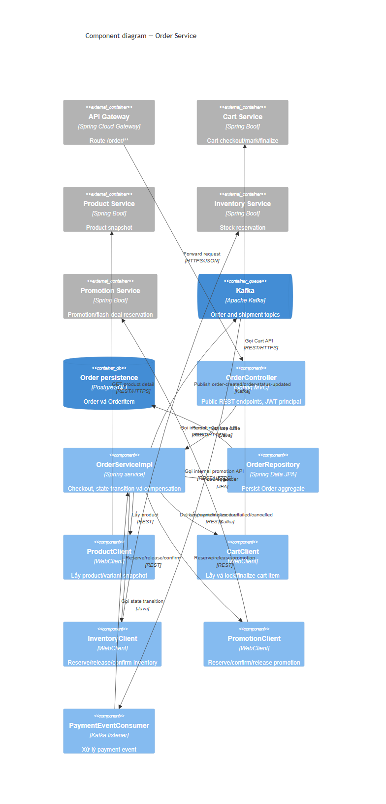
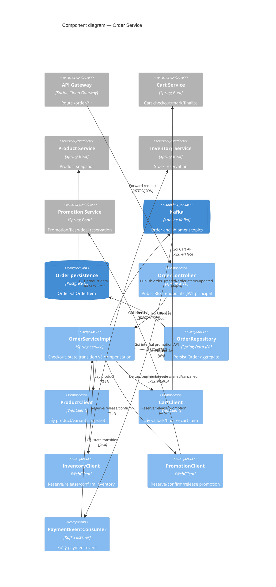

# C4 Component — Order Service

Order Service là component quan trọng nhất của checkout: lấy cart items, lấy product snapshot, điều phối reserve inventory/promotion và lưu trạng thái order. Nó phát event thay vì trực tiếp tạo shipment.

## Trạng thái và resilience đã thấy trong code

- `createOrder` tạo aggregate rồi reserve inventory trước promotion/flash deal. Khi bước sau lỗi, service gọi compensation release tương ứng và lưu status `INVENTORY_FAILED` hoặc `PROMOTION_FAILED`.
- `checkout` lấy selected items qua `CartClient.checkoutItems`, gọi `createOrder`, rồi mark cart item khi order ở `PENDING_PAYMENT`.
- `PaymentEventConsumer` nghe `payment-success`, `payment-failed`, `payment-cancelled` và `payment-cod-created` để cập nhật order; `OrderServiceImpl` publish `shipment-requested` khi order bắt đầu shipping.

## Evidence

- API: `order-service/src/main/java/com/example/orderservice/controller/OrderController.java`.
- Orchestration/state/event: `order-service/src/main/java/com/example/orderservice/service/implement/OrderServiceImpl.java`.
- Payment consumers: `order-service/src/main/java/com/example/orderservice/messaging/consumer/PaymentEventConsumer.java`.
- Clients: `order-service/src/main/java/com/example/orderservice/client/`.
