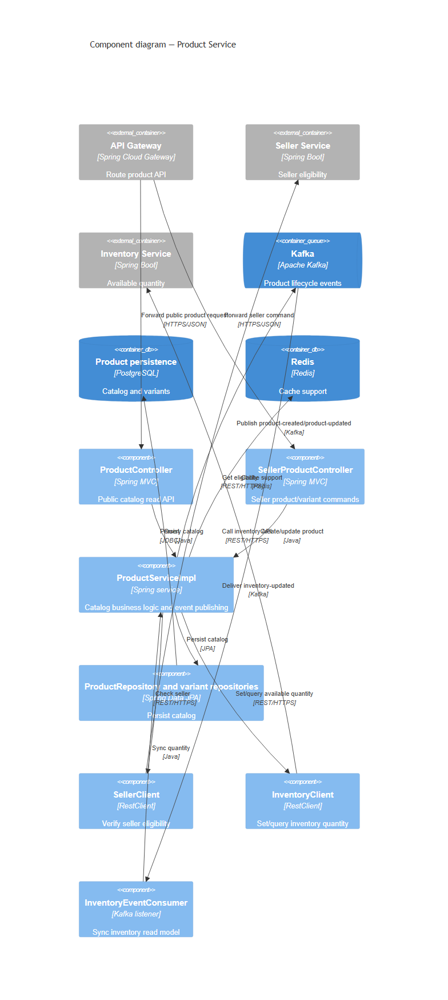
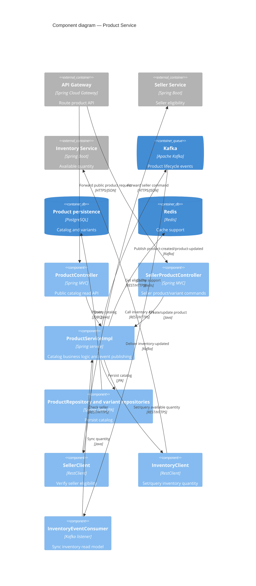

# C4 Component — Product Service

Product Service sở hữu catalog/product variant. Nó đồng bộ tồn kho với Inventory Service và publish product lifecycle events cho Search Service cập nhật read model.

## Evidence

- Public API: `product-service/src/main/java/com/example/productservice/controller/ProductController.java`.
- Seller API: `product-service/src/main/java/com/example/productservice/controller/SellerProductController.java`.
- Business/event code: `product-service/src/main/java/com/example/productservice/service/implement/ProductServiceImpl.java`.
- Inter-service clients: `product-service/src/main/java/com/example/productservice/client/SellerClient.java` và `InventoryClient.java`.
- Inventory consumer: `product-service/src/main/java/com/example/productservice/messaging/consumer/InventoryEventConsumer.java`.
