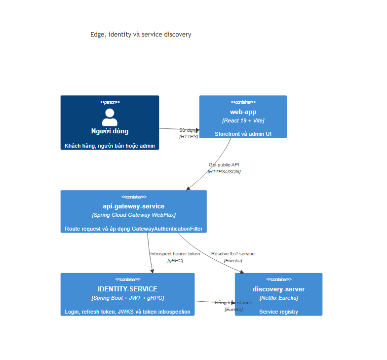
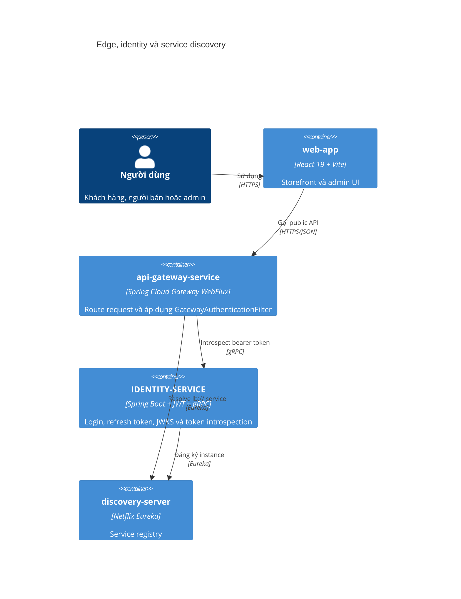
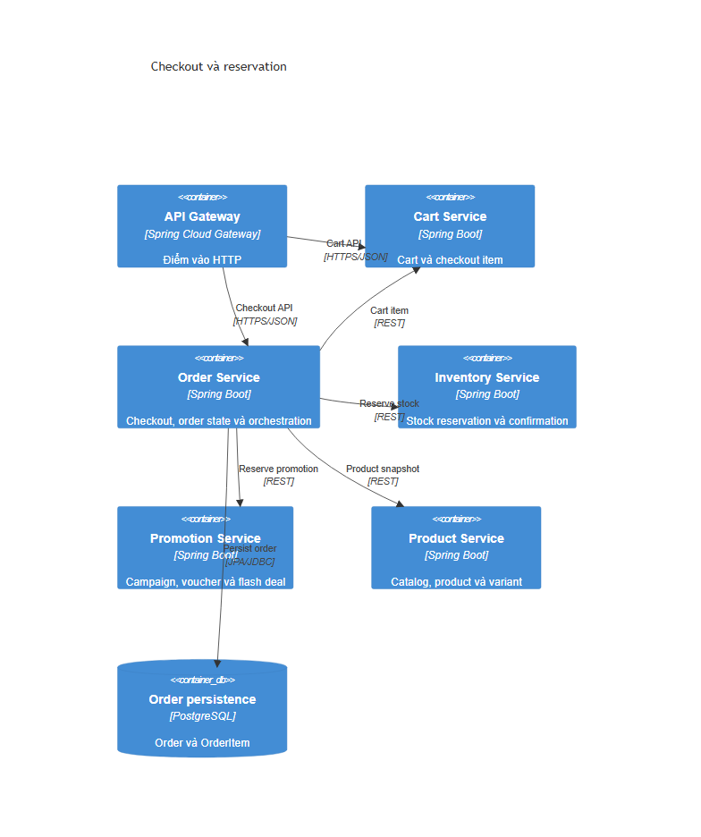
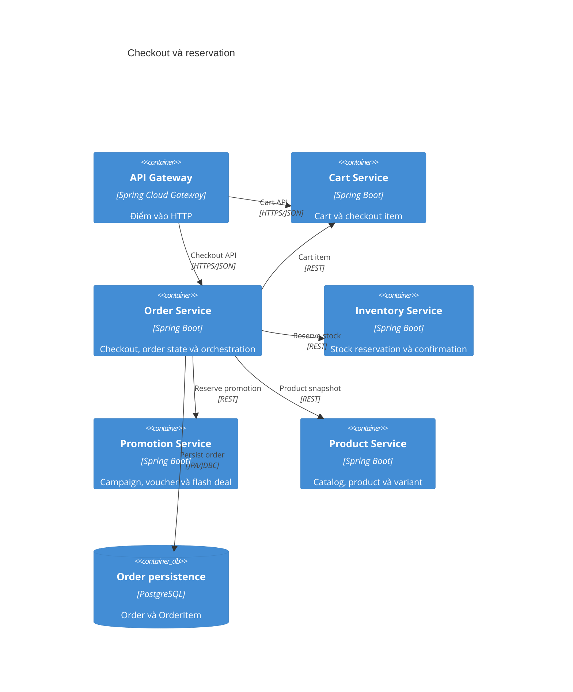
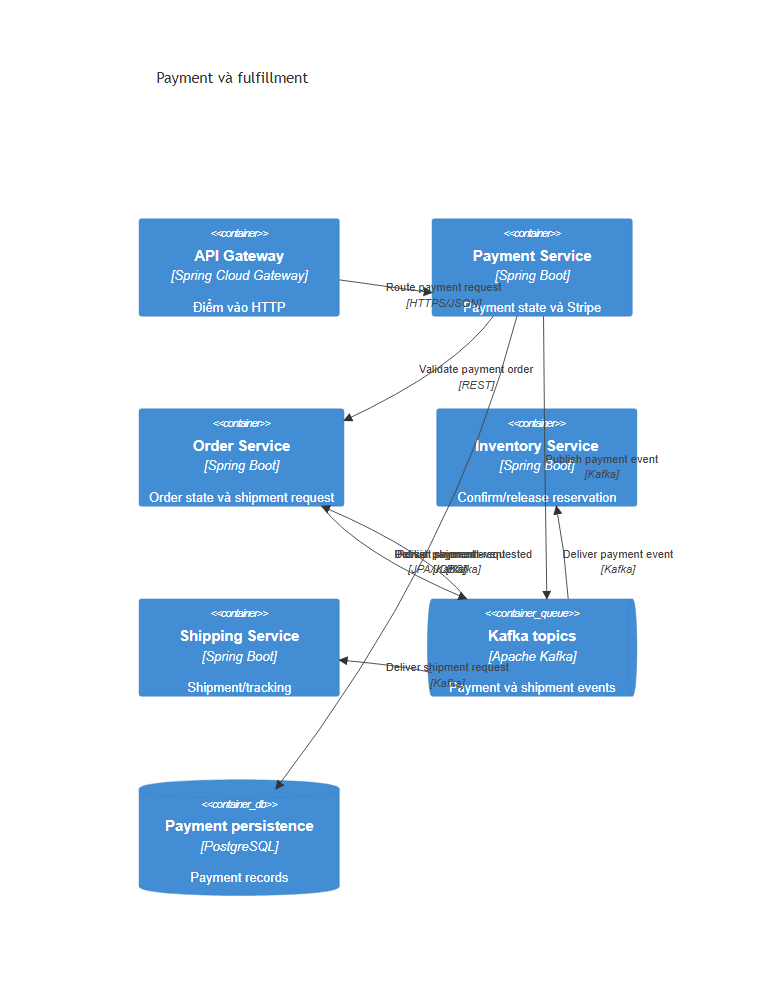
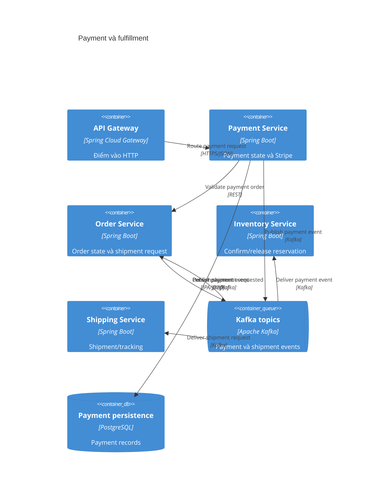
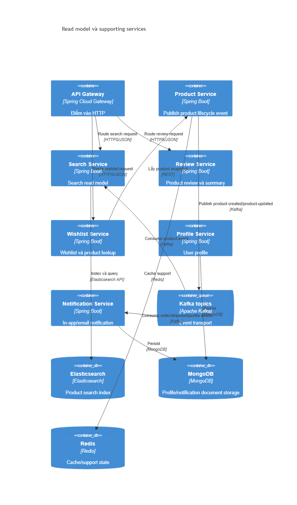
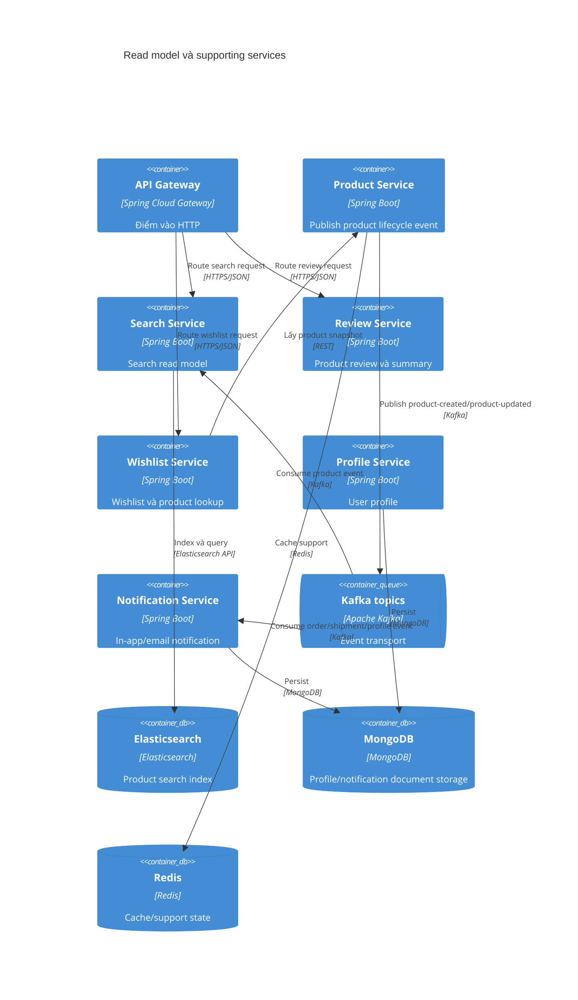
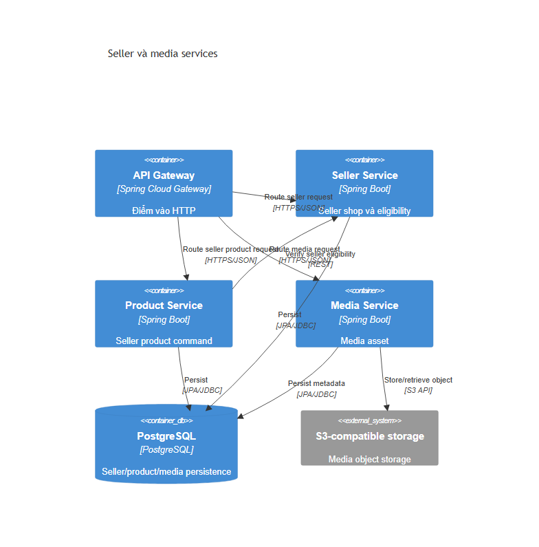
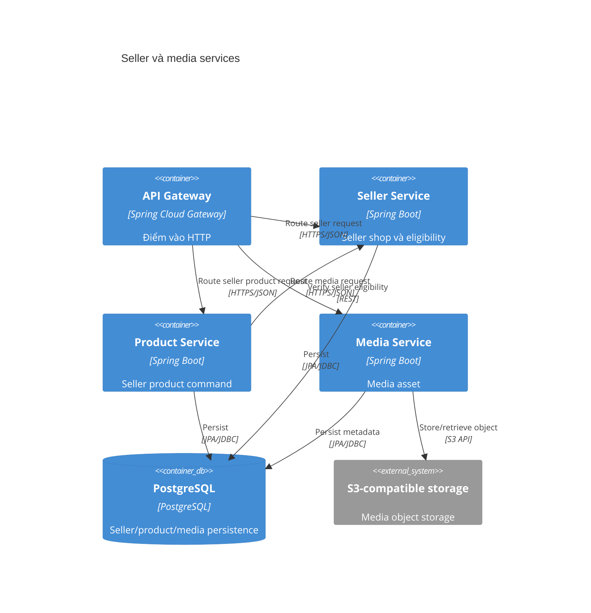

# C4 Containers — NovaShop

Hệ thống có nhiều microservice hơn mức nên đặt vào một C4 Container diagram duy nhất. Tài liệu tách thành ba view, mỗi view chỉ giữ một ranh giới kỹ thuật rõ ràng.

## 1. Edge, identity và discovery

## 2. Checkout và reservation

## 3. Payment và fulfillment

## 4. Read model và supporting services

## 5. Seller và media

## Evidence

- Gateway route map: `api-gateway-service/.../configuration/GatewayConfiguration.java`.
- Synchronous clients: `order-service/.../client/*.java`, `payment-service/.../client/OrderClient.java`, `wishlist-service/.../client/ProductClient.java`.
- Kafka: `OrderServiceImpl.java`, `PaymentServiceImpl.java`, `ProductServiceImpl.java`, `ProductEventConsumer.java`, `PaymentEventConsumer.java`, `ShipmentRequestedConsumer.java`.
- Infra: `docker-compose.yaml`.
