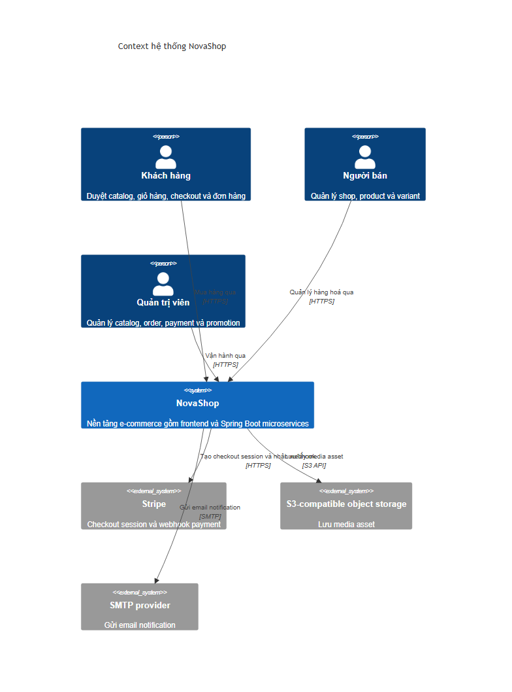
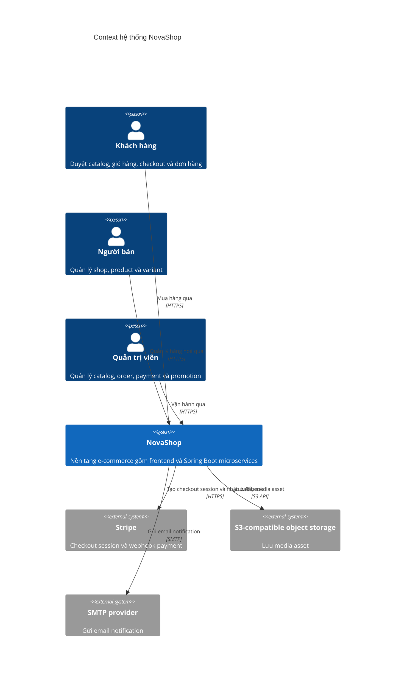

# C4 Context — NovaShop

## Mục tiêu

Context diagram mô tả ranh giới hệ thống NovaShop và các actor/hệ thống ngoài có bằng chứng trong source. Chi tiết triển khai nằm ở [C4 Containers](c4-containers.md).

## Evidence

- Actor/UI: `web-app/src/routes/AppRoutes.jsx` và các `web-app/src/pages/*`.
- Stripe: `payment-service/.../PaymentController.java` và `PaymentServiceImpl.java` có Stripe checkout, reconcile và webhook.
- Object storage: `media-service/.../configuration/S3Configuration.java` và `S3Properties.java`.
- Email: `notification-service/src/main/resources/templates/` và `notification-service/pom.xml` có mail/Thymeleaf dependencies.

## Chưa xác minh

Provider cụ thể của S3-compatible storage và SMTP được lấy từ environment/config runtime; không có giá trị credential trong tài liệu này.
