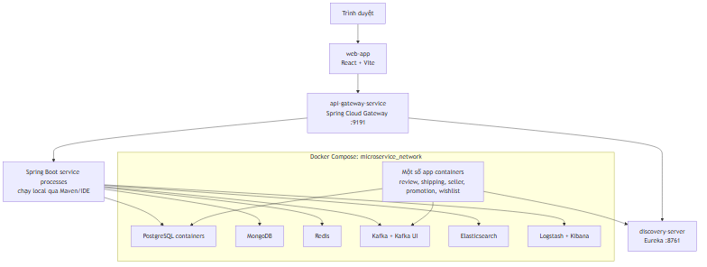
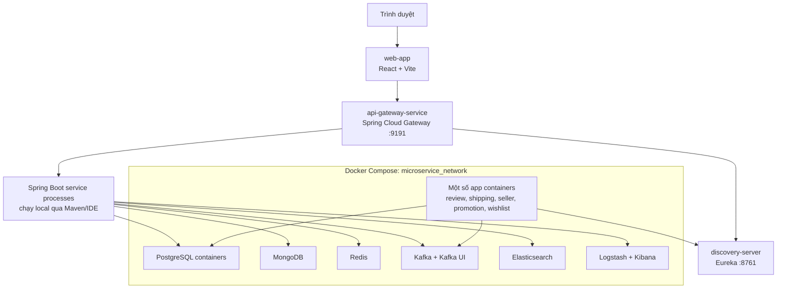

# Local deployment view

Đây là deployment view cho local development dựa trên `docker-compose.yaml`, Dockerfiles hiện có và `application.yaml`. Nó không đại diện cho production topology.

## Cách đọc topology

- Root Compose khởi tạo Kafka, Redis, MongoDB, Elasticsearch, Logstash, Kibana và PostgreSQL containers cho nhiều bounded context.
- `review-service`, `shipping-service`, `seller-service`, `promotion-service` và `wishlist-service` có application service definition trong root Compose. Những service khác có thể chạy từ Maven/IDE theo layout hiện tại.
- `media-service` và `review-service` cũng có Compose file riêng cho database local.
- API Gateway dùng Eureka `lb://...` routes. Để gọi qua Gateway, Discovery và target service cần chạy/đăng ký.
- `media-service` port runtime chưa xác minh từ `application.yaml`; không đoán port trong sơ đồ.

## Observability

Compose định nghĩa Elasticsearch, Logstash và Kibana. Đây là bằng chứng infrastructure có mặt; việc mọi service đã gửi log/trace thành công đến ELK cần xác minh bằng runtime logs.

## Evidence

- `docker-compose.yaml`
- `media-service/docker-compose.yaml`
- `review-service/docker-compose.yaml`
- `elk/logstash/pipeline/logstash.conf`
- `api-gateway-service/src/main/resources/application.yaml`
- `api-gateway-service/src/main/java/com/example/apigatewayservice/configuration/GatewayConfiguration.java`
