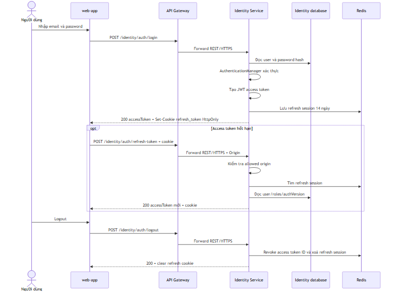
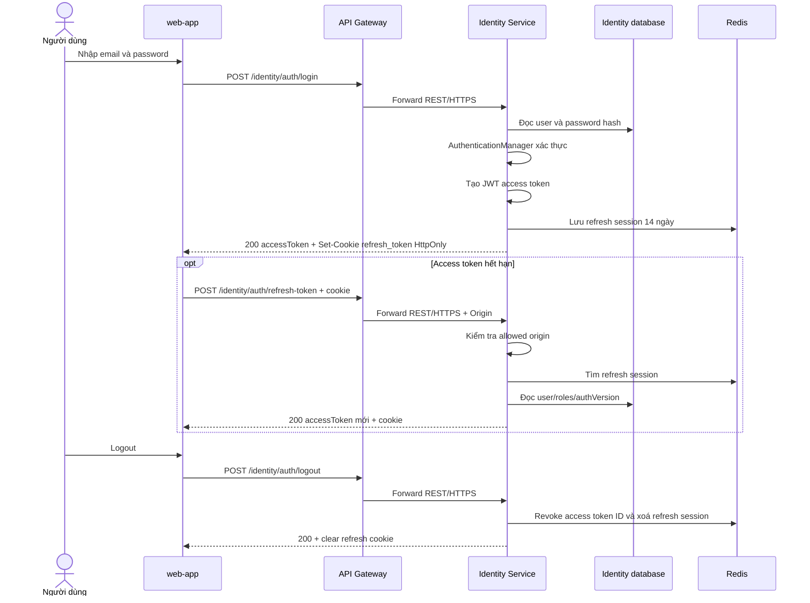
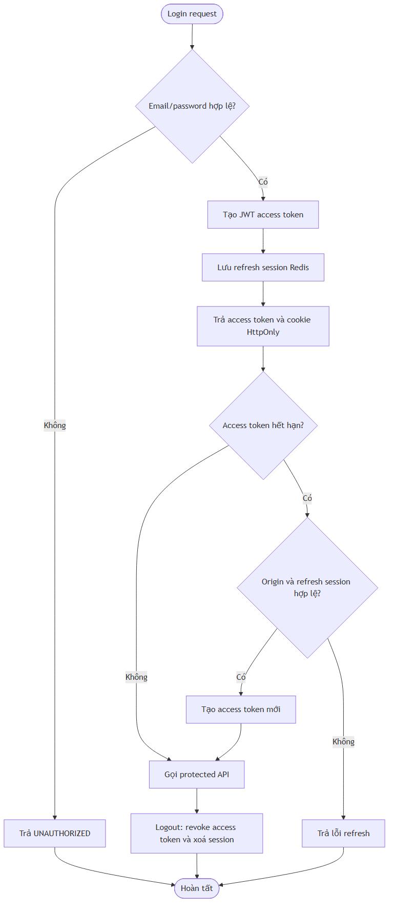
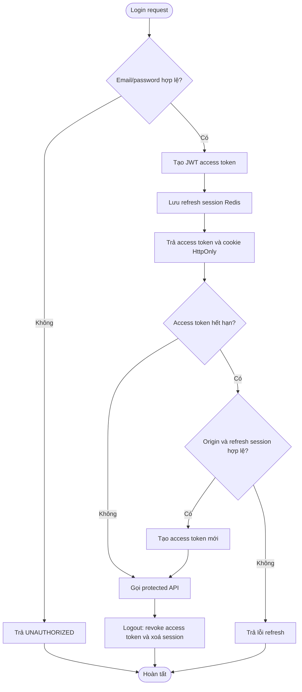

# Flow — Login, refresh token và logout

## Scope

Identity Service xác thực email/password, tạo JWT access token và refresh token. Controller chỉ trả access token trong response; refresh token nằm trong cookie `HttpOnly`. Refresh endpoint kiểm tra origin được phép, tra session Redis, tạo access token mới và giữ refresh token hiện tại. Logout đưa access-token ID vào cơ chế revoke và xoá refresh session.

## Activity: session lifecycle

## Evidence

- Auth endpoints/cookie/origin check: `Microservice-ecom/.../controller/AuthenticationController.java`.
- Login, refresh và logout: `Microservice-ecom/.../service/AuthenticationService.java`.
- Password reset invalidates sessions: `Microservice-ecom/.../service/PasswordResetService.java`.

## Chưa xác minh

- JWT expiry, Redis retention và allowed origin values là runtime configuration; không ghi giá trị vào tài liệu.
