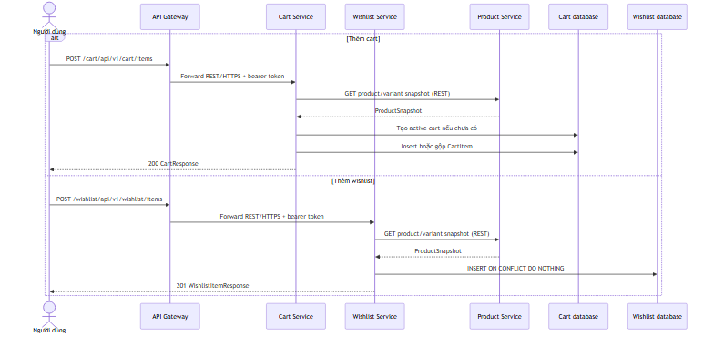
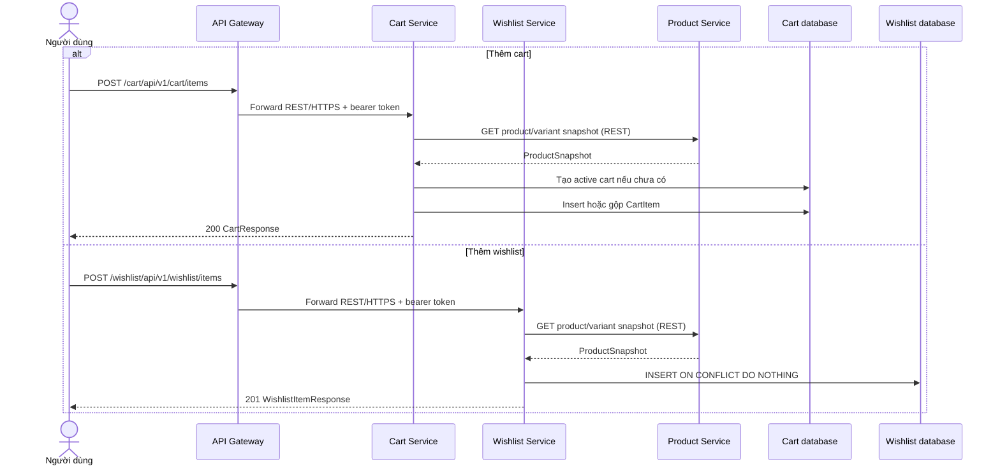
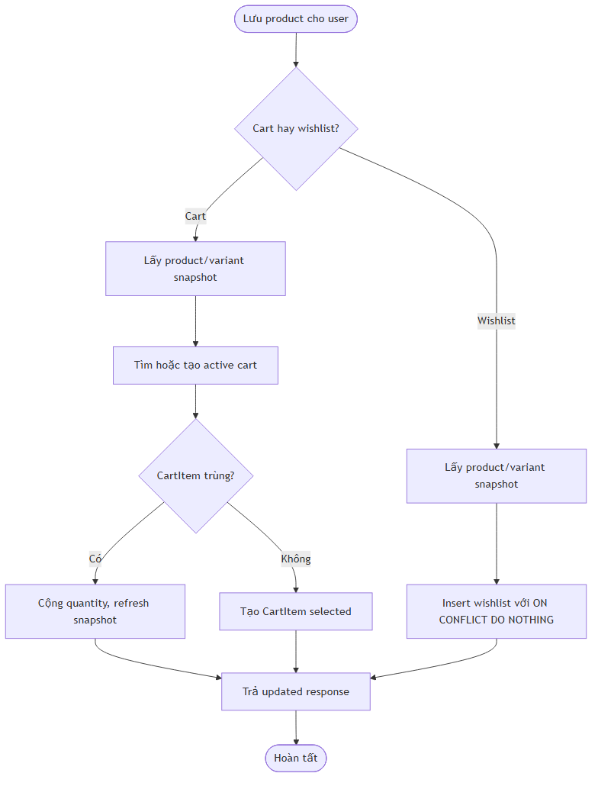
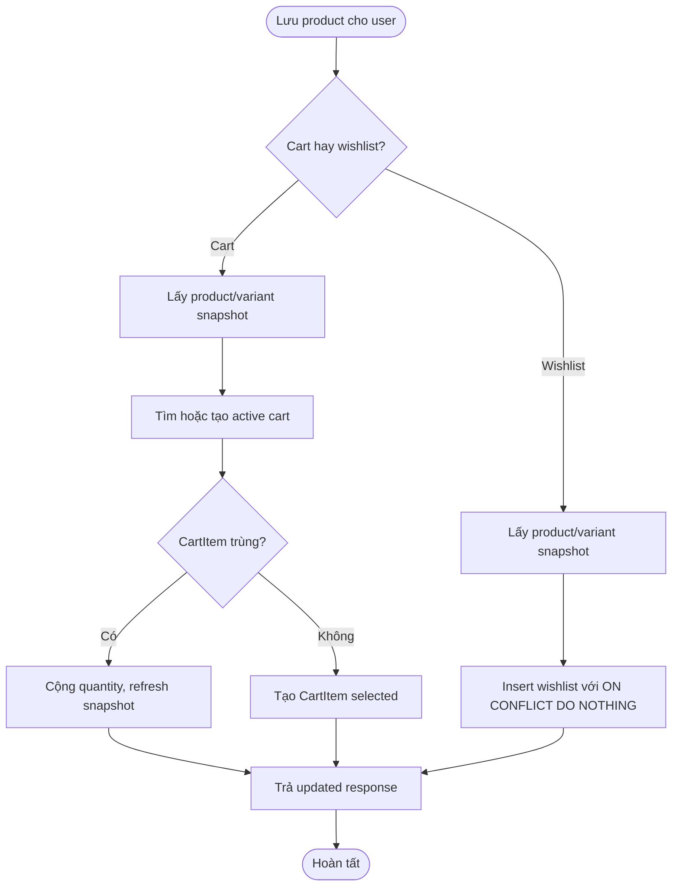

# Flow — Thêm product vào cart hoặc wishlist

## Scope

Cart Service và Wishlist Service đều lấy product/variant snapshot từ Product Service trước khi persist. Cart tự tạo active cart nếu chưa có, gộp item trùng và giữ selection/checkout lock. Wishlist dùng PostgreSQL `ON CONFLICT DO NOTHING` để idempotently tạo item theo user/product/variant.

## Activity: snapshot và persistence idempotent

## Evidence

- Cart endpoints/business logic: `cart-service/.../controller/CartController.java`, `service/implement/CartServiceImpl.java`, `client/ProductClient.java`.
- Wishlist endpoints/business logic: `wishlist-service/.../controller/WishlistController.java`, `service/implement/WishlistServiceImpl.java`, `client/ProductClient.java`.

## Chưa xác minh

- Product snapshot read consistency/cache policy giữa Product, Cart và Wishlist cần kiểm tra integration test.
