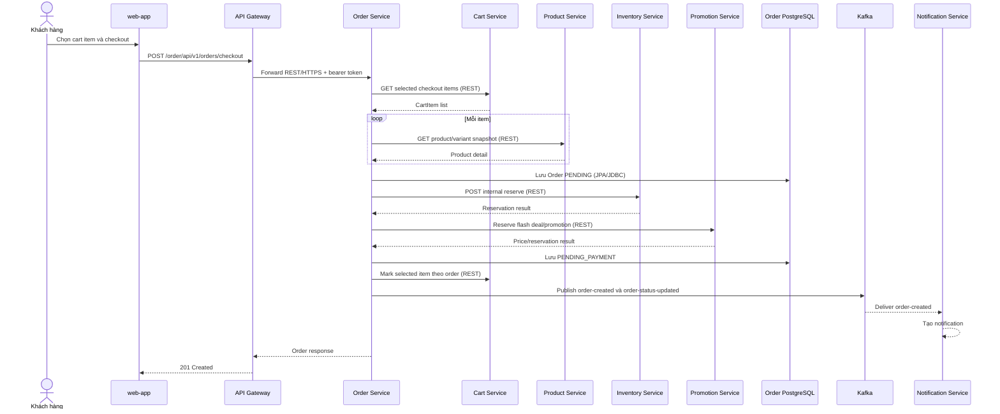
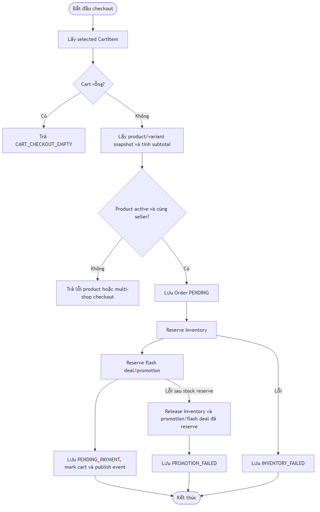
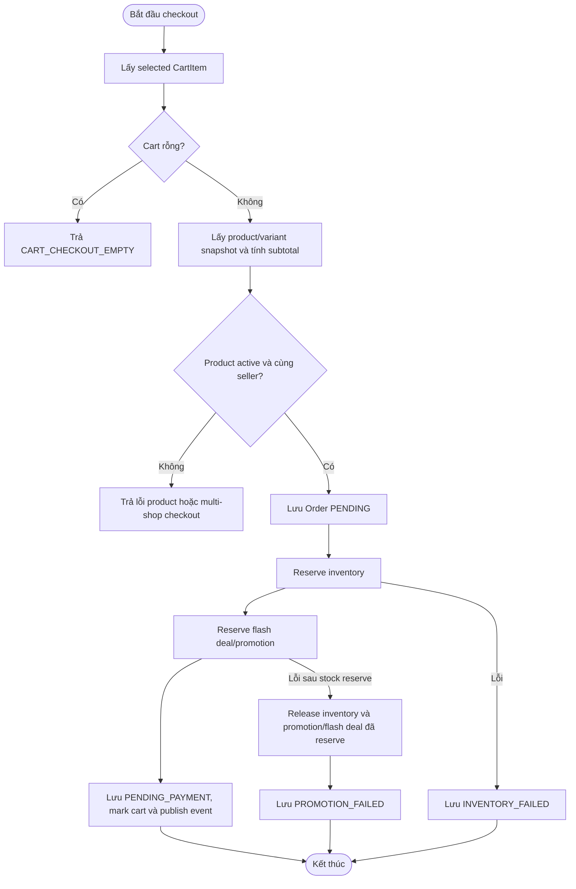

# Flow — Checkout và reservation

## Scope

Flow này mô tả `POST /api/v1/orders/checkout`. Nó chỉ mô tả bước đã có trong `OrderServiceImpl`: đọc selected cart items, snapshot product/variant, persist Order, reserve inventory/flash deal/promotion, chuyển order sang `PENDING_PAYMENT`, đánh dấu cart item và publish event.

## Activity và compensation

## Evidence

- Entry point: `order-service/src/main/java/com/example/orderservice/controller/OrderController.java` (`@PostMapping("/checkout")`).
- Orchestration: `order-service/src/main/java/com/example/orderservice/service/implement/OrderServiceImpl.java` (`checkout`, `createOrder`, `reserveInventory`, compensation helpers).
- REST clients: `order-service/src/main/java/com/example/orderservice/client/CartClient.java`, `ProductClient.java`, `InventoryClient.java`, `PromotionClient.java`.
- Notification subscription: `notification-service/src/main/java/com/example/notificationservice/messaging/consumer/OrderEventConsumer.java`.

## Chưa xác minh

Timeout/retry policy của từng HTTP dependency cần xác minh từ runtime configuration hoặc integration test; flow này không giả định distributed transaction.
