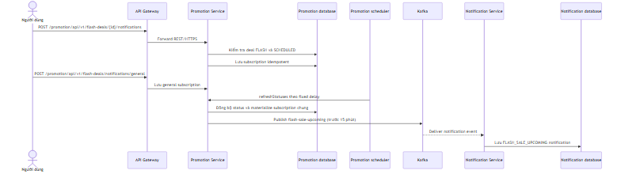
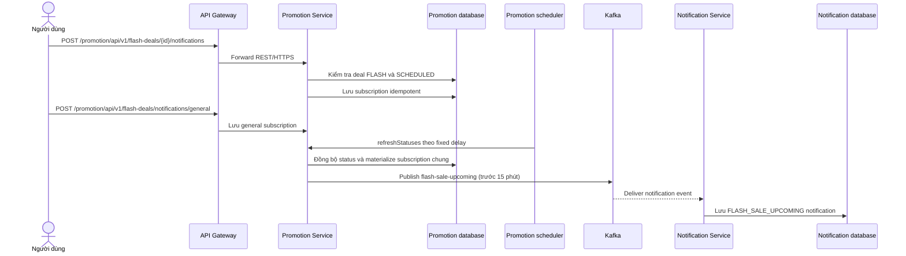
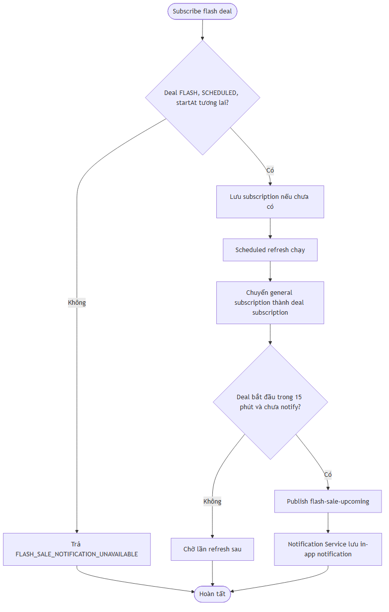
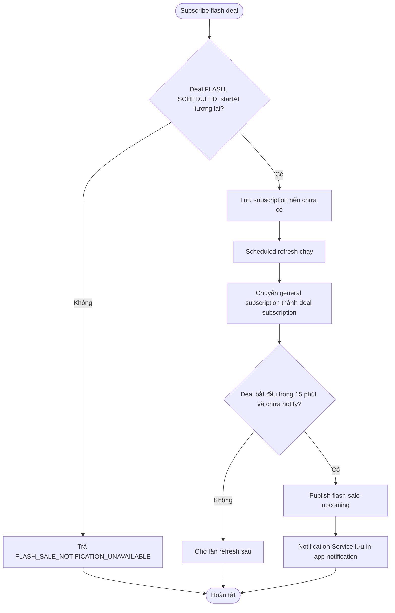

# Flow — Đăng ký flash deal và thông báo sắp diễn ra

## Scope

User có thể subscribe một flash deal `SCHEDULED` hoặc subscribe thông báo chung. Scheduled job của Promotion Service định kỳ đồng bộ status, materialize subscription chung cho deal bắt đầu trong 15 phút và phát event `flash-sale-upcoming`. Notification Service consume event để lưu in-app notification.

## Activity: subscription và scheduled notification

## Evidence

- Subscription endpoints: `promotion-service/.../controller/FlashDealNotificationController.java`.
- Scheduler, materialization và Kafka publish: `promotion-service/.../service/implement/FlashDealServiceImpl.java`.
- Notification Kafka consumer: `notification-service/.../messaging/consumer/FlashSaleEventConsumer.java`.

## Chưa xác minh

- Tần suất `flash-deal.status-refresh-ms` là runtime configuration; code chỉ định default 60 giây.
