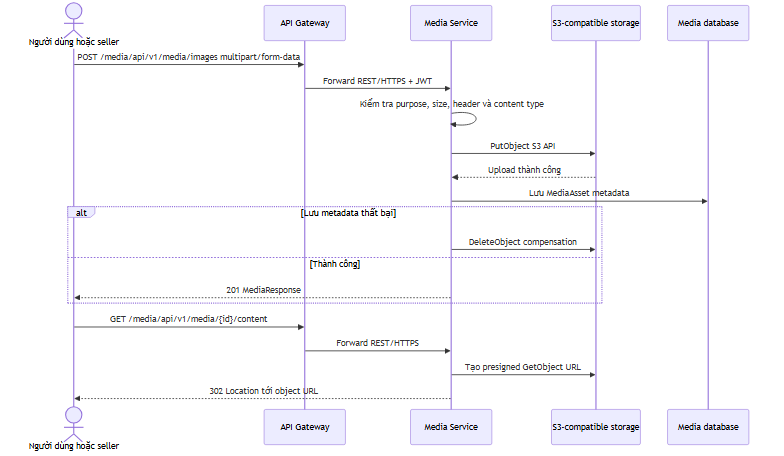
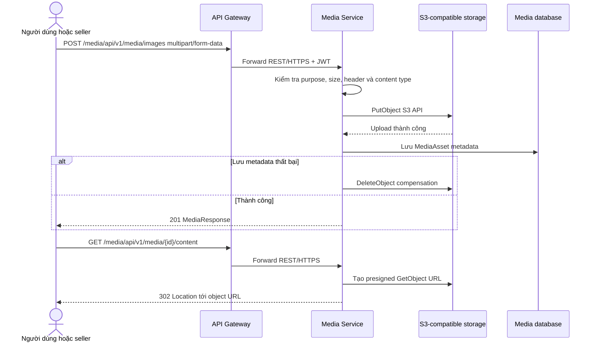
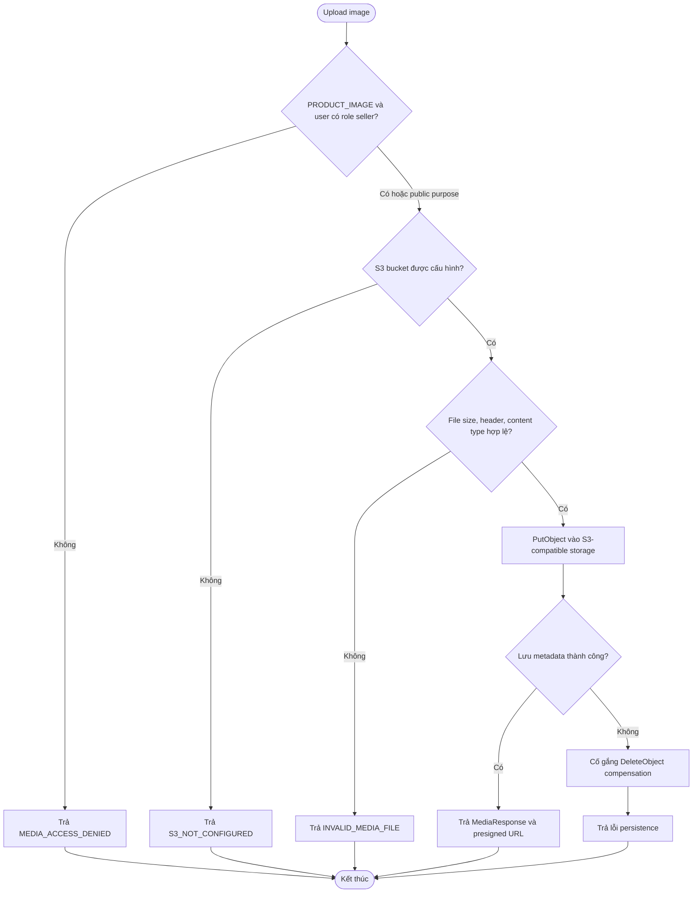

# Flow — Upload và truy cập media asset

## Scope

Media Service nhận ảnh multipart. Với `PRODUCT_IMAGE`, controller yêu cầu role seller từ JWT. Service kiểm tra bucket configuration, giới hạn kích thước, magic header JPEG/PNG/WEBP và content type; sau đó upload object vào S3-compatible storage, lưu metadata. Nếu lưu metadata thất bại, service cố gắng xoá object đã upload. Download URL là presigned URL; endpoint content trả redirect tới URL đó.

## Activity: validation và compensation upload

## Evidence

- Upload/download/content API và seller guard: `media-service/.../controller/MediaController.java`.
- Validation, S3 put/delete, metadata persistence và compensation: `media-service/.../service/MediaAssetService.java`.

## Chưa xác minh

- Bucket name, endpoint, access key, presigned URL TTL và policy là runtime secret/configuration, nên không được ghi giá trị trong tài liệu.
- Quét virus/CDN/object lifecycle không thấy trong code đã kiểm tra.
