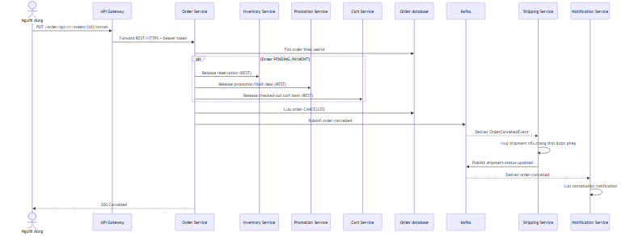
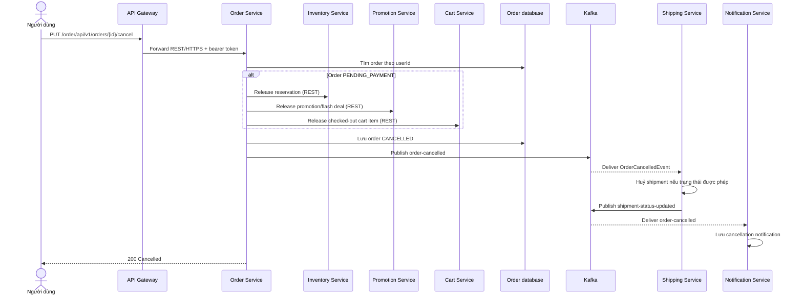
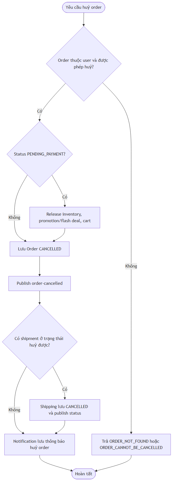
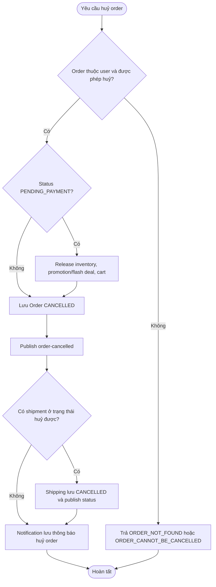

# Flow — Huỷ order và huỷ shipment liên quan

## Scope

Người dùng huỷ order qua Order Service nếu trạng thái thuộc tập được phép huỷ. Với order `PENDING_PAYMENT`, service giải phóng inventory/promotion/flash deal và cart trước khi lưu `CANCELLED`. Event `order-cancelled` được Shipping Service và Notification Service consume; Shipping chỉ huỷ shipment đang ở các trạng thái cho phép rồi phát `shipment-status-updated`.

## Activity: cancellation và shipment guard

## Evidence

- Cancel endpoint: `order-service/.../controller/OrderController.java`.
- Release dependencies và event: `order-service/.../service/implement/OrderServiceImpl.java` (`cancelOrder`).
- Shipping consumer/cancellation: `shipping-service/.../messaging/consumer/OrderCancelledConsumer.java`, `service/implement/ShipmentServiceImpl.java`.
- Notification consumer: `notification-service/.../messaging/consumer/OrderEventConsumer.java`.

## Chưa xác minh

- Khi một release REST call lỗi, transaction/compensation chi tiết cần kiểm tra thêm tại integration test; sơ đồ không suy đoán distributed transaction.
