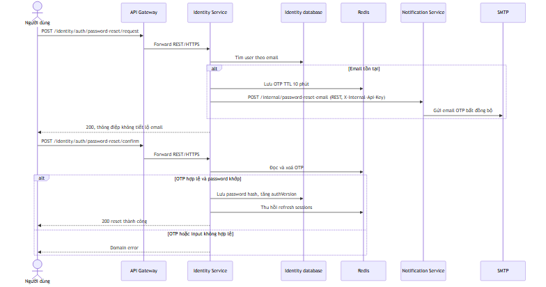
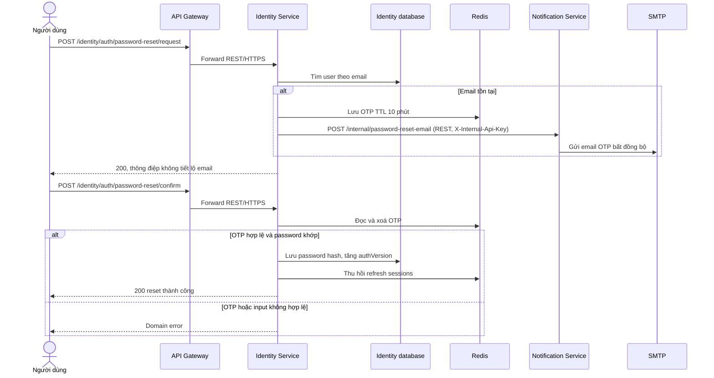
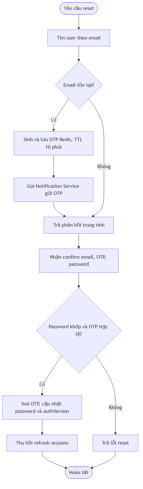
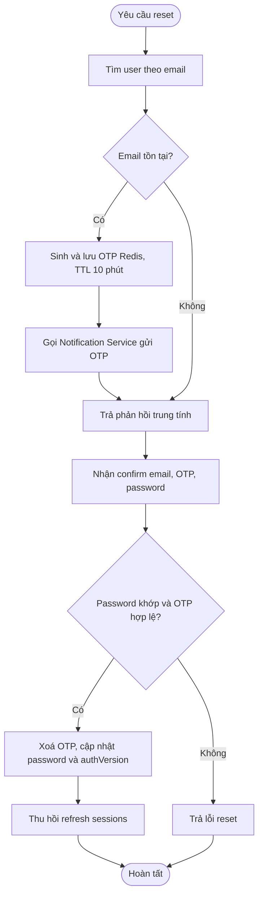

# Flow — Yêu cầu và xác nhận đặt lại mật khẩu

## Scope

Identity Service nhận request reset, chỉ gửi OTP khi email tồn tại. OTP được lưu Redis 10 phút; Notification Service kiểm tra header nội bộ bằng biến cấu hình rồi gửi email bất đồng bộ. Khi confirm, Identity Service kiểm tra OTP, đổi password, tăng `authVersion` và thu hồi refresh session.

## Activity: kiểm tra OTP

## Evidence

- Public endpoints: `Microservice-ecom/.../controller/AuthenticationController.java`.
- OTP, Redis và session revocation: `Microservice-ecom/.../service/PasswordResetService.java`.
- REST internal mail client: `Microservice-ecom/.../client/PasswordResetMailClient.java`.
- Header validation và email: `notification-service/.../controller/InternalMailController.java`, `service/MailService.java`.

## Chưa xác minh

- Giá trị `services.notification.internal-api-key`, SMTP credential, và Redis endpoint là secret/runtime configuration nên không được hiển thị.
- Không suy ra rate limiting hoặc CAPTCHA cho endpoint reset từ code đã kiểm tra.
