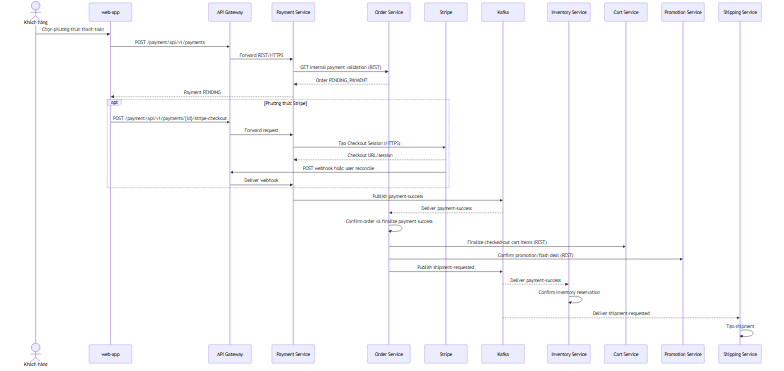
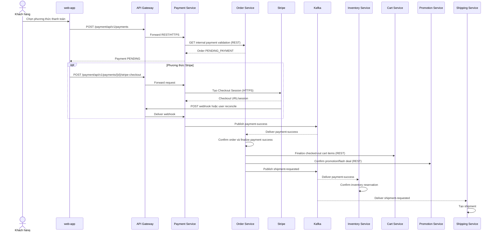
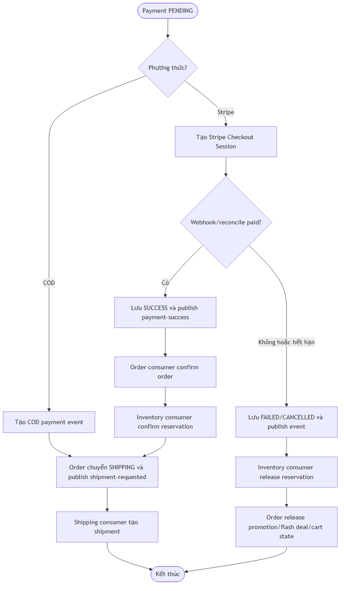
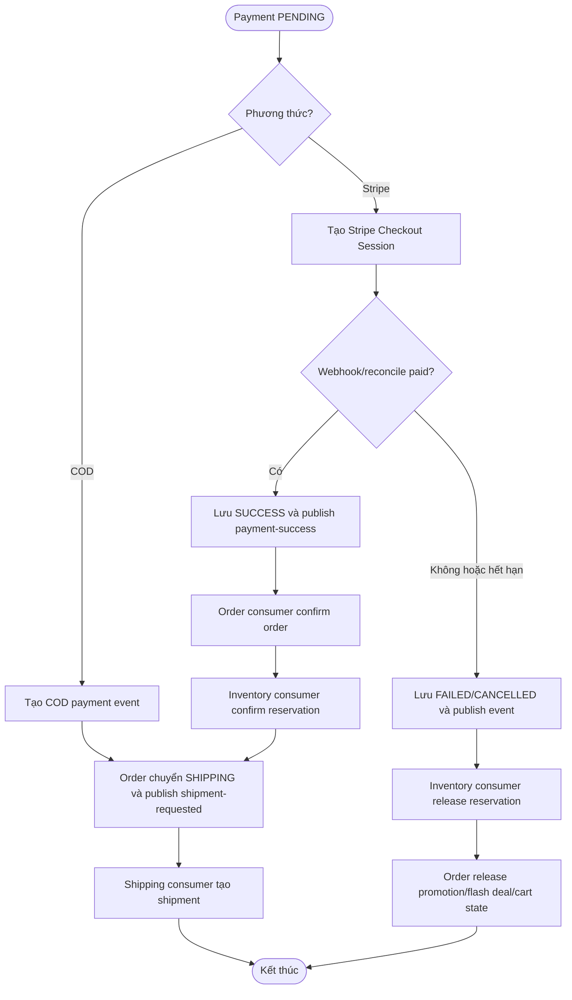

# Flow — Payment, fulfillment và shipment

## Scope

Payment Service tạo payment cho order `PENDING_PAYMENT`. Với Stripe, service tạo Checkout Session và xử lý webhook/reconcile. Khi payment thành công, Kafka event được Order và Inventory consumer xử lý; Order Service publish `shipment-requested`, sau đó Shipping Service tạo shipment.

## Activity: nhánh success và failure

## Evidence

- Payment API/Stripe entry points: `payment-service/src/main/java/com/example/paymentservice/controller/PaymentController.java`.
- Payment status/event publisher: `payment-service/src/main/java/com/example/paymentservice/service/implement/PaymentServiceImpl.java`.
- Order payment consumer/state transition: `order-service/src/main/java/com/example/orderservice/messaging/consumer/PaymentEventConsumer.java`, `service/implement/OrderServiceImpl.java`.
- Inventory consumer: `inventory-service/src/main/java/com/example/inventoryservice/messaging/consumer/PaymentEventConsumer.java`.
- Shipment consumer: `shipping-service/src/main/java/com/example/shippingservice/messaging/consumer/ShipmentRequestedConsumer.java`.

## Chưa xác minh

- Stripe webhook public reachability và production signature/secret provisioning cần xác minh tại runtime/deployment configuration.
- Nội dung/exact ordering của notification sau payment success không được gộp vào sequence này, vì consumer notification có nhiều topic riêng.
