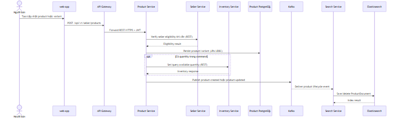
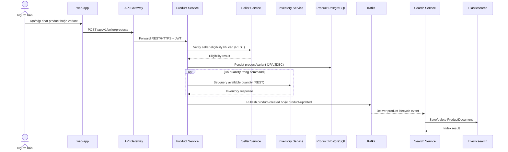
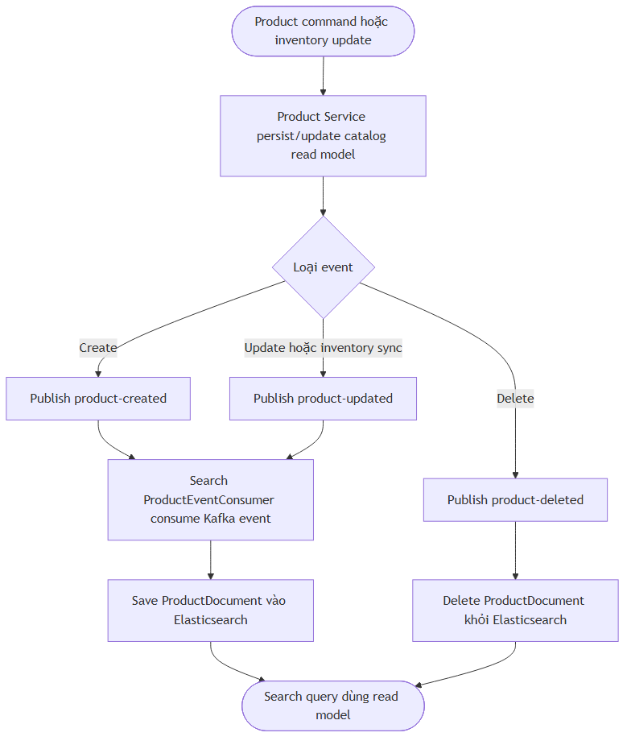
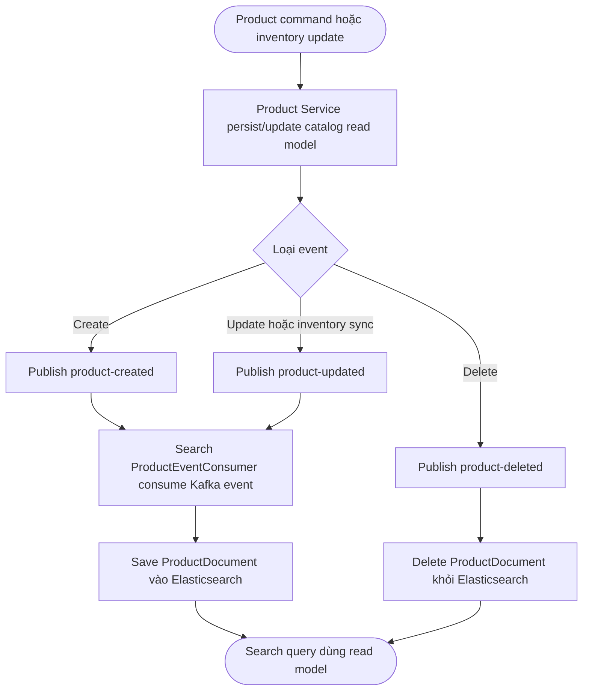

# Flow — Product command và search indexing

## Scope

Seller product command được Gateway route vào Product Service. `ProductServiceImpl` persist product, có thể tương tác Seller/Inventory client, và publish `product-created` hoặc `product-updated`. Search Service consume các topic này để cập nhật Elasticsearch document.

## Activity: event-driven read model

## Evidence

- Seller product endpoint: `product-service/src/main/java/com/example/productservice/controller/SellerProductController.java`.
- Product query endpoint: `product-service/src/main/java/com/example/productservice/controller/ProductController.java`.
- Product persist/event: `product-service/src/main/java/com/example/productservice/service/implement/ProductServiceImpl.java`.
- Seller/Inventory calls: `product-service/src/main/java/com/example/productservice/client/SellerClient.java`, `InventoryClient.java`.
- Search Kafka consumer: `search-service/src/main/java/com/example/searchservice/messaging/ProductEventConsumer.java`.

## Chưa xác minh

Không có transaction/outbox pattern được xác nhận giữa product database commit và `KafkaTemplate.send` trong phạm vi flow này. Cần integration test/runtime observation để đánh giá khả năng retry và eventual consistency khi publish event lỗi.
