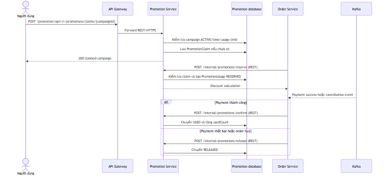
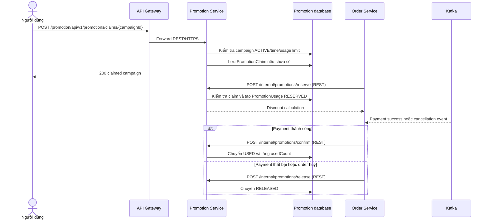
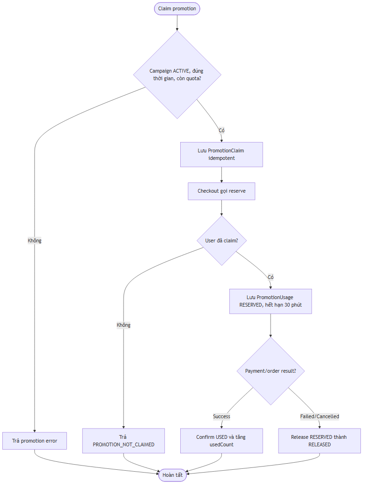
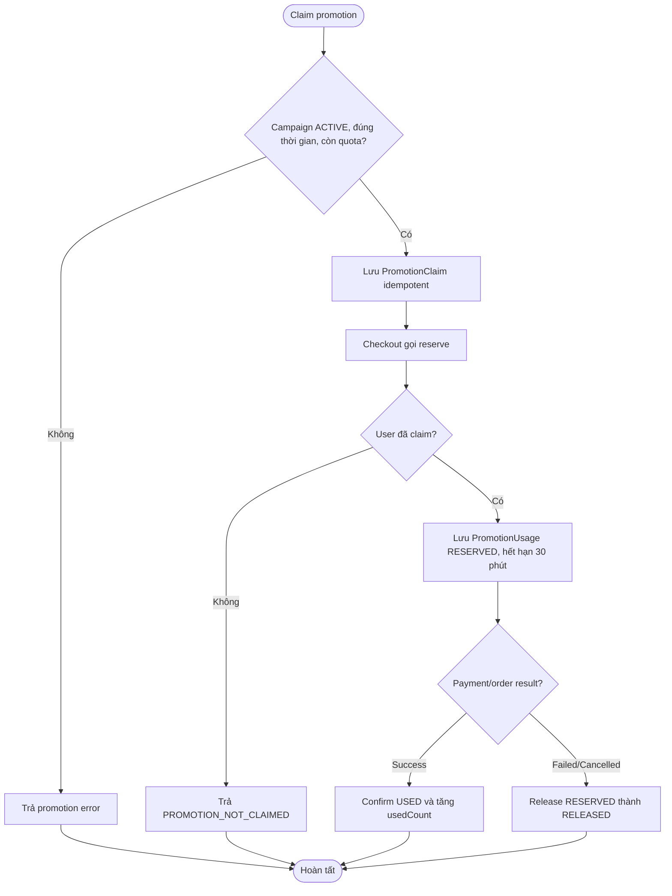

# Flow — Claim promotion và reservation theo order

## Scope

Người dùng claim promotion campaign đang ACTIVE. Khi checkout, Order Service gọi internal promotion reserve. Promotion Service yêu cầu claim tồn tại, tạo `PromotionUsage` ở `RESERVED` với hạn 30 phút. Payment thành công dẫn đến confirm/`USED`; cancellation hoặc payment failure dẫn đến release/`RELEASED`.

## Activity: eligibility và usage state

## Evidence

- Claim API: `promotion-service/.../controller/PromotionClaimController.java`.
- Claim/reserve/confirm/release and limits: `promotion-service/.../service/implement/PromotionUsageServiceImpl.java`.
- Internal APIs: `promotion-service/.../controller/InternalPromotionController.java`.
- Caller flows: `order-service/.../service/implement/OrderServiceImpl.java`.

## Chưa xác minh

- Job tự động xử lý reservation hết hạn không được thấy trong service đã kiểm tra; chỉ expiry timestamp được set.
