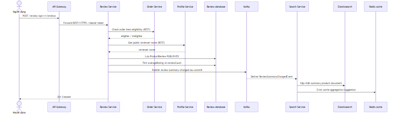
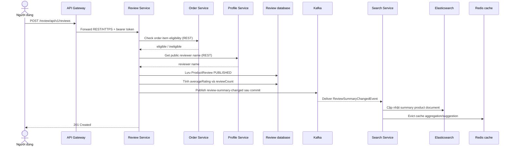
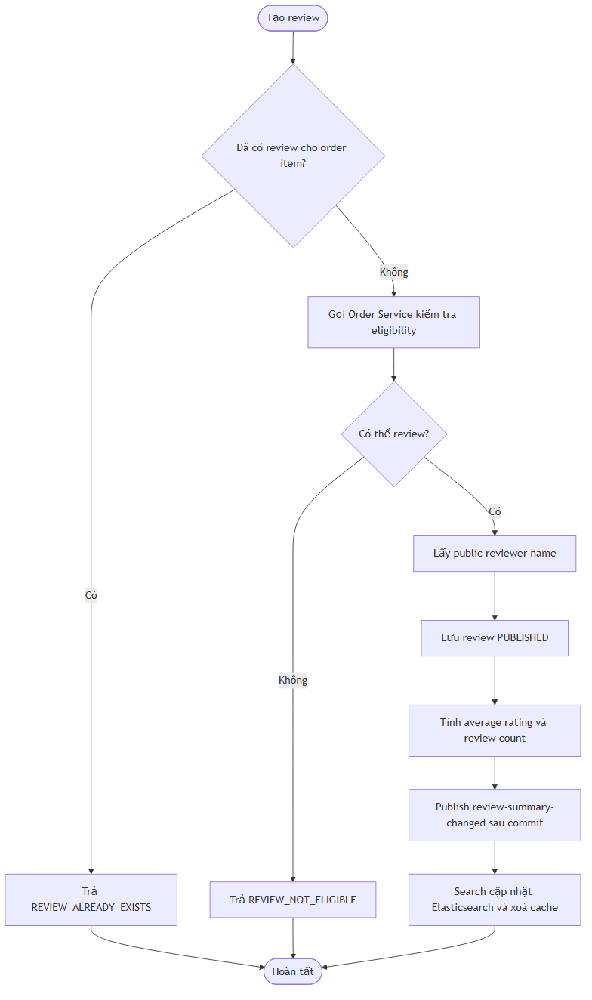
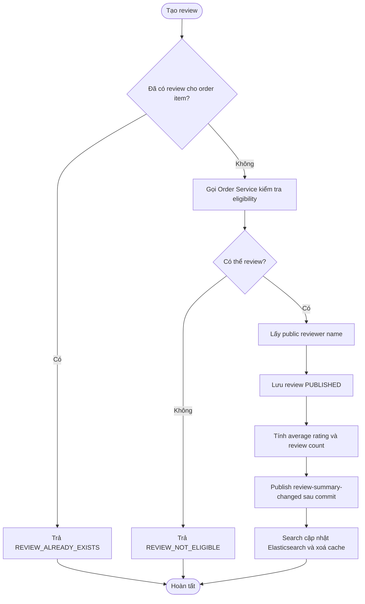

# Flow — Product review và đồng bộ review summary vào search

## Scope

Người dùng tạo review cho order item. Review Service kiểm tra eligibility qua Order Service, lấy tên public qua Profile Service, lưu review trạng thái `PUBLISHED`, tính review summary và chỉ publish `review-summary-changed` sau DB commit. Search Service nhận event để cập nhật average rating/review count trong Elasticsearch và xóa cache aggregate/suggestion liên quan.

## Activity: điều kiện tạo review

## Evidence

- Review endpoint và authorization: `review-service/.../controller/ReviewController.java`.
- Eligibility, profile lookup và summary: `review-service/.../service/implement/ReviewServiceImpl.java`.
- Publish after commit: `review-service/.../messaging/ReviewSummaryEventPublisher.java`.
- Kafka consumer/index update: `search-service/.../messaging/ReviewSummaryEventConsumer.java`, `service/impl/ProductDocumentServiceImpl.java`.

## Chưa xác minh

- Error mapping/retry khi Order hoặc Profile Service không phản hồi cần kiểm tra client configuration và test integration.
