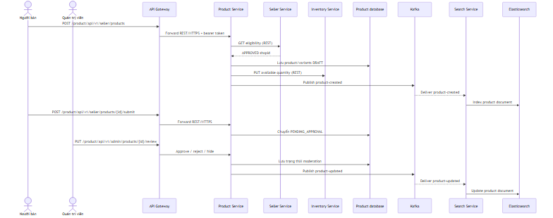
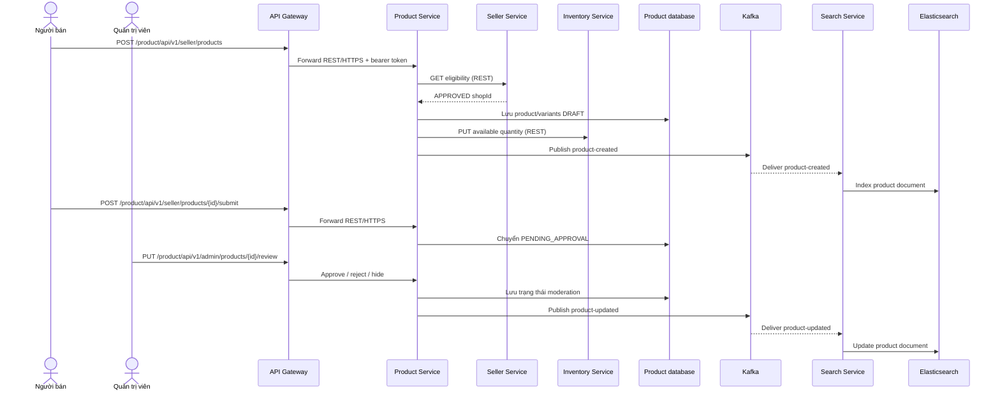
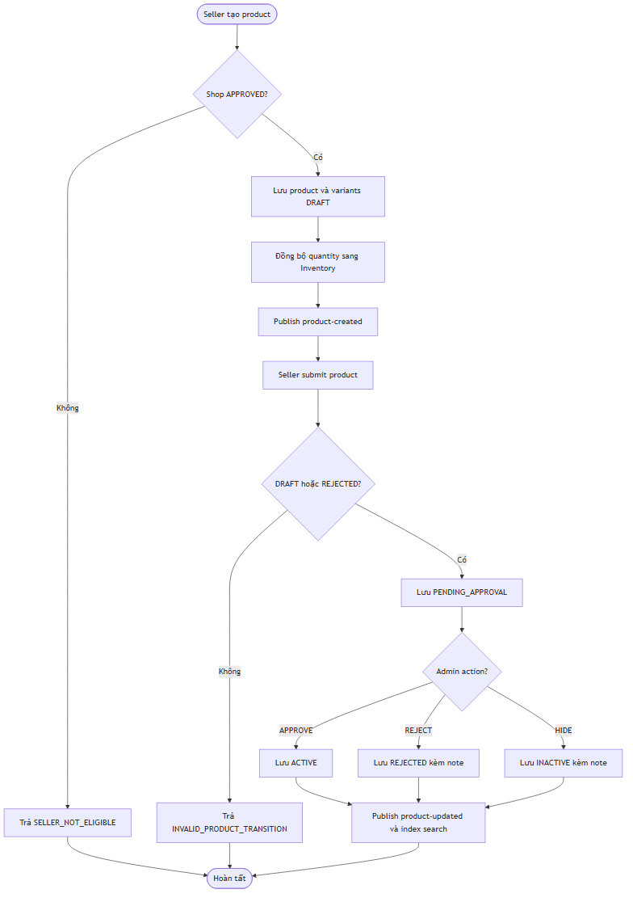
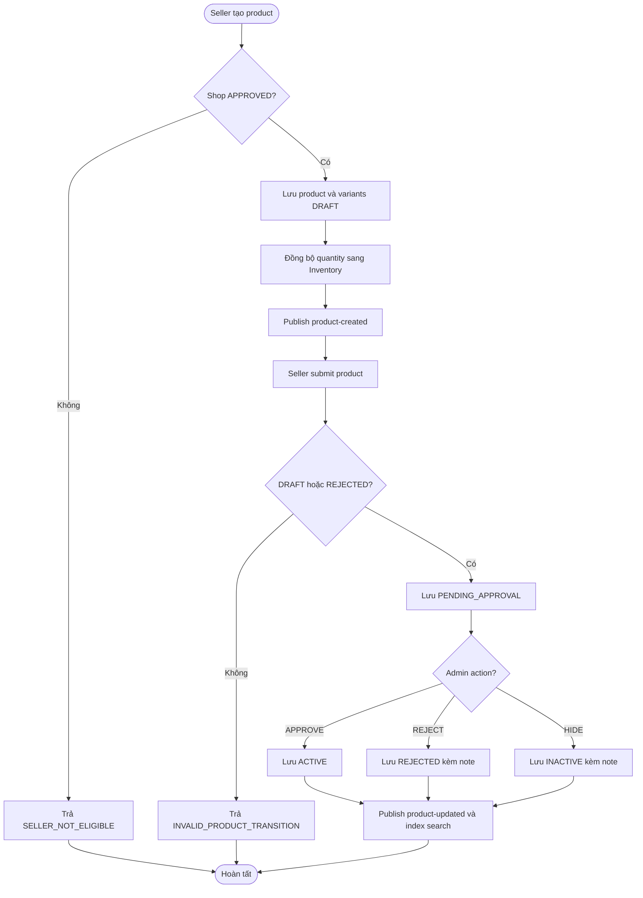

# Flow — Seller product draft, moderation và search indexing

## Scope

Seller tạo product draft khi Seller Service xác nhận shop `APPROVED`. Product Service lưu product/variant ở `DRAFT`, đồng bộ quantity với Inventory Service và phát event product. Seller submit product thành `PENDING_APPROVAL`; admin approve/reject/hide qua Product Service. Mỗi thay đổi phát event để Search Service cập nhật Elasticsearch read model.

## Activity: product state transition

## Evidence

- Seller endpoint: `product-service/.../controller/SellerProductController.java`.
- Product states, eligibility, inventory sync và event: `product-service/.../service/implement/ProductServiceImpl.java`.
- Admin moderation: `product-service/.../controller/AdminProductModerationController.java`.
- Search consumer: `search-service/.../messaging/ProductEventConsumer.java`.

## Chưa xác minh

- Retry/circuit-breaker parameters khi gọi Seller/Inventory Service cần đối chiếu runtime configuration.
