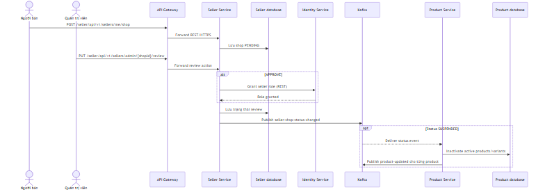
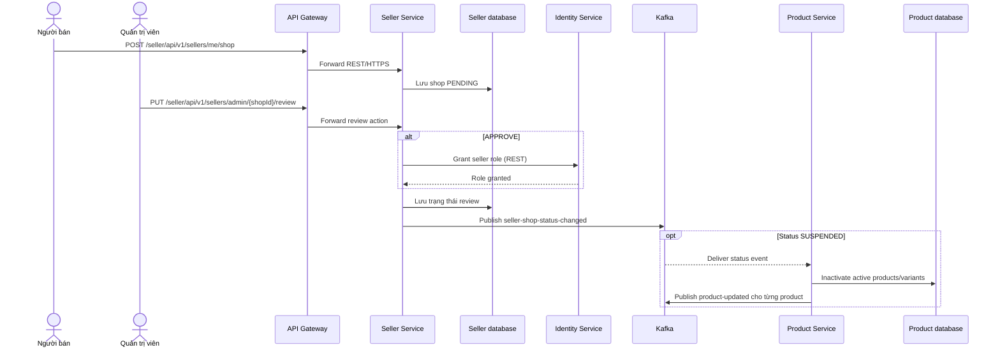
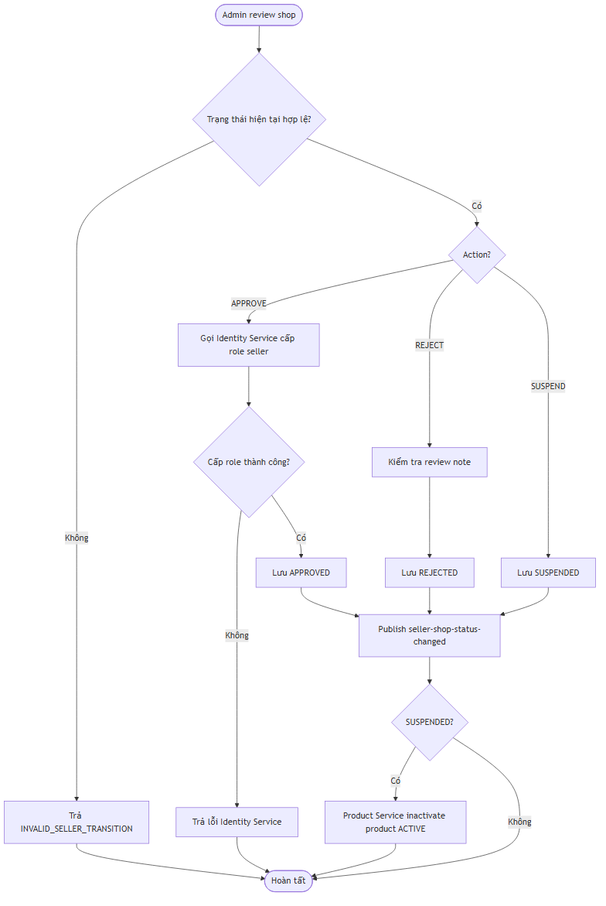
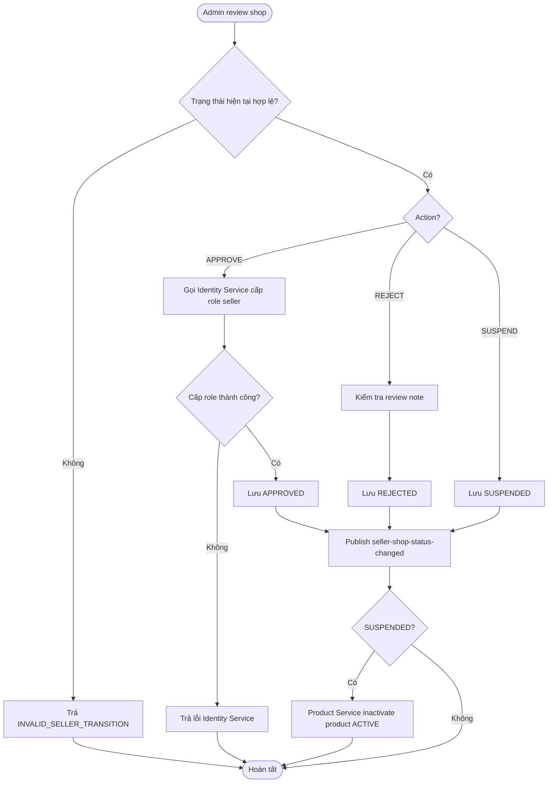

# Flow — Duyệt và suspend seller shop

## Scope

Seller tạo shop ở trạng thái `PENDING`. Admin duyệt, từ chối hoặc suspend qua Seller Service. Nhánh APPROVE gọi Identity Service để cấp role seller; mọi thay đổi trạng thái đều phát `seller-shop-status-changed`. Product Service chỉ phản ứng với trạng thái `SUSPENDED`: inactivate product/variant đang ACTIVE và phát `product-updated` cho từng product đã đổi.

## Activity: transition seller shop

## Evidence

- Seller/admin API: `seller-service/.../controller/SellerShopController.java`, `AdminSellerShopController.java`.
- State transition, role grant và publish: `seller-service/.../service/implement/SellerShopServiceImpl.java`, `messaging/SellerShopEventPublisher.java`.
- Product suspension reaction: `product-service/.../messaging/consumer/SellerShopEventConsumer.java`, `service/implement/ProductServiceImpl.java`.

## Chưa xác minh

- Consumer Product Service hiện chỉ có nhánh `SUSPENDED`; hành vi tự động re-activate product nếu shop được duyệt lại chưa được xác minh.
