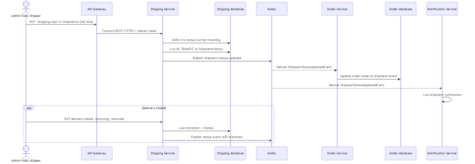
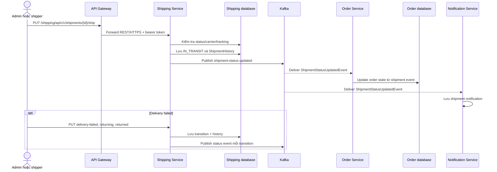
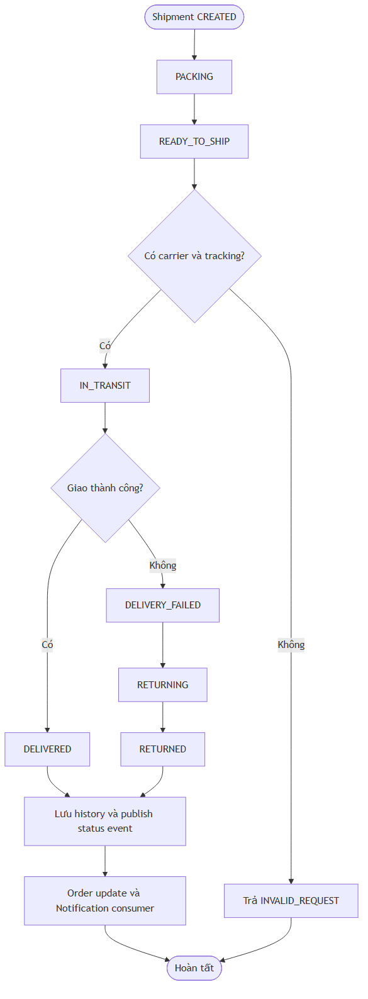
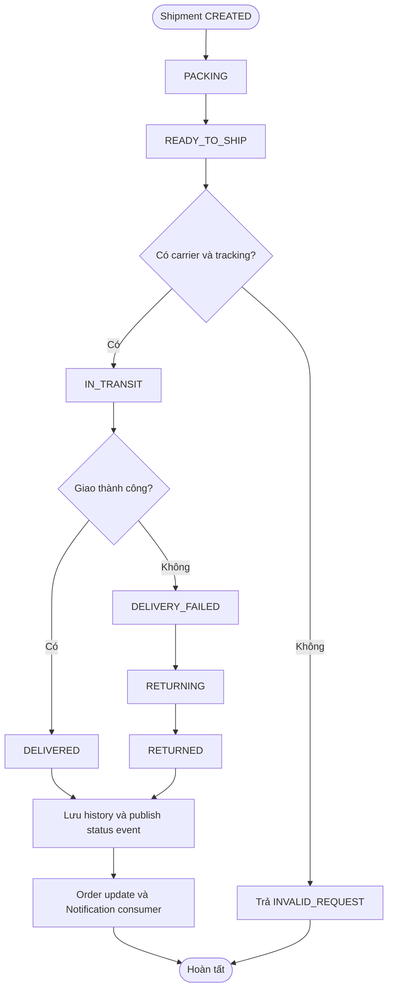

# Flow — Shipment tracking, delivery và return

## Scope

Admin gán carrier, chuyển shipment qua `PACKING`, `READY_TO_SHIP`, `IN_TRANSIT`; admin/shipper có thể mark `DELIVERED`, `DELIVERY_FAILED`, `RETURNING`, `RETURNED`. Mỗi status transition lưu ShipmentHistory và phát `shipment-status-updated`; Order Service cập nhật order theo event, Notification Service lưu thông báo cho user.

## Activity: shipment state machine

## Evidence

- Role-protected state endpoints: `shipping-service/.../controller/ShipmentController.java`.
- Valid transitions, history and Kafka publisher: `shipping-service/.../service/implement/ShipmentServiceImpl.java`.
- Order consumer: `order-service/.../messaging/consumer/ShipmentEventConsumer.java`.
- Notification consumer: `notification-service/.../messaging/consumer/ShipmentEventConsumer.java`.

## Chưa xác minh

- Mapping đầy đủ từ từng shipment status sang `OrderStatus` cần kiểm tra phần `updateOrderFromShipment` cùng test scenario.
