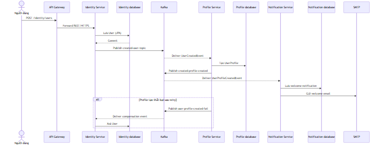
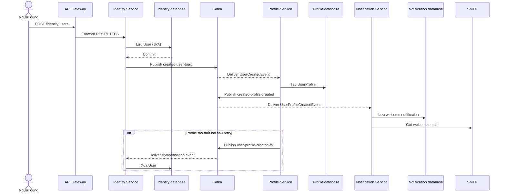
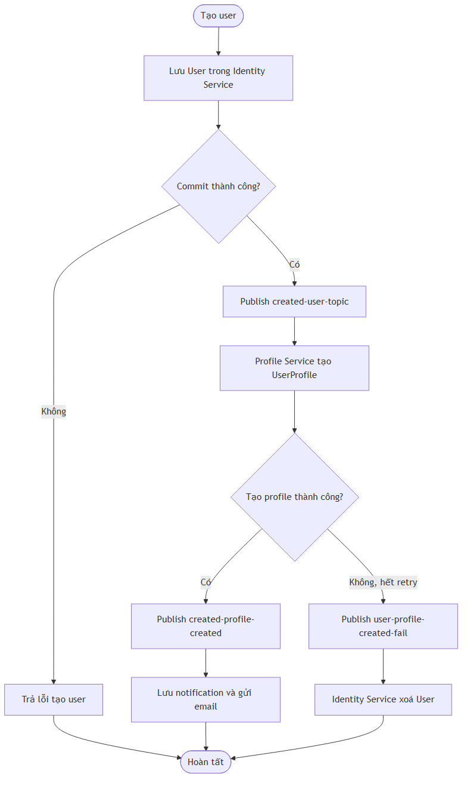
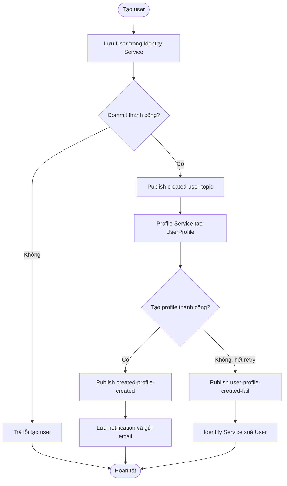

# Flow — Tạo user, profile và welcome notification

## Scope

Flow này bắt đầu tại `POST /users`. Identity Service lưu user, phát `UserCreatedEvent` sau commit. Profile Service tạo profile rồi phát event tiếp theo để Notification Service lưu welcome notification và gửi email. Khi Profile Service hết retry, nó phát event compensation để Identity Service xoá user đã tạo.

## Activity: provisioning và compensation

## Evidence

- API và tạo user: `Microservice-ecom/src/main/java/com/example/microserviceecom/controller/UserController.java`, `service/UserService.java`.
- Publish sau commit: `messaging/producer/UserCreatedEventKafkaPublisher.java`.
- Tạo profile, retry/DLT và compensation: `profile-service/.../messaing/consumer/UserProfileConsumer.java`.
- Welcome notification/email: `notification-service/.../messaging/consumer/UserCreatedConsumer.java`.

## Chưa xác minh

- Độ bền của event publish giữa transaction DB và Kafka chưa có outbox pattern được xác minh trong code đã đọc.
- Nội dung và cấu hình SMTP thực tế phụ thuộc runtime configuration; không được đưa vào tài liệu.
