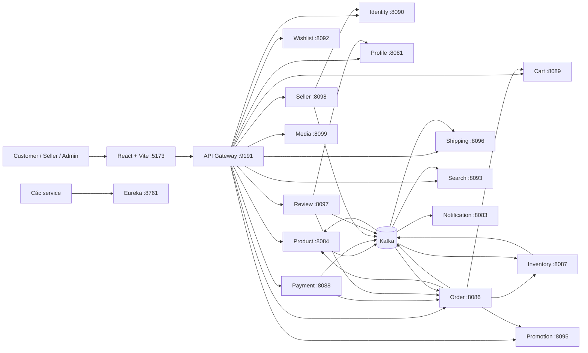

# Giới thiệu và học luồng code project E-commerce Microservices

> Tài liệu này được viết theo source code hiện tại của repo `e-com-microNservice`.
> Mục tiêu là giúp đọc code theo luồng đơn giản, hiểu tư duy microservice và có
> thể trình bày tự nhiên khi phỏng vấn. Nội dung được rà theo code ngày
> 29/07/2026; khi code thay đổi cần kiểm tra lại controller, event và cấu hình.

## 1. Giới thiệu project trong 60 giây

Đây là một hệ thống thương mại điện tử theo mô hình marketplace, được xây dựng
bằng Java, Spring Boot và React. Backend được tách thành các service theo nghiệp
vụ như Identity, Product, Seller, Cart, Order, Inventory, Payment, Promotion,
Shipping và Review.

Frontend gửi request qua API Gateway. Gateway định tuyến request tới service
phù hợp và kiểm tra access token với Identity Service. Những nghiệp vụ cần kết
quả ngay, ví dụ Order lấy thông tin Product hoặc giữ tồn kho, dùng REST. Những
thay đổi cần truyền cho nhiều service nhưng không cần phản hồi ngay, ví dụ
payment thành công hoặc sản phẩm được cập nhật, dùng Kafka.

Điểm quan trọng nhất của project là luồng mua hàng:

```text
Cart
-> Order tạo snapshot sản phẩm
-> Inventory giữ hàng
-> Flash Deal/Promotion giữ ưu đãi
-> Payment xử lý COD hoặc Stripe
-> Kafka thông báo kết quả
-> Order, Inventory, Cart và Promotion confirm hoặc rollback
-> Shipping tạo vận đơn
```

Nếu phỏng vấn viên hỏi ngắn gọn, có thể trả lời:

> Project của em là hệ thống e-commerce theo kiến trúc microservice. Em tách
> service theo business capability, dùng REST cho luồng đồng bộ và Kafka cho
> event bất đồng bộ. Inventory là nguồn dữ liệu chính xác về tồn kho, Order lưu
> snapshot giá tại thời điểm mua, Payment xác nhận kết quả qua event, còn các
> bước thất bại được xử lý bằng thao tác bù trừ như release stock, promotion và
> cart.

## 2. Công nghệ chính

| Nhóm | Công nghệ | Dùng để làm gì |
| --- | --- | --- |
| Backend | Java, Spring Boot | Xây dựng các service |
| Security | Spring Security, OAuth2 Resource Server, JWT/JWK | Xác thực và phân quyền |
| Gateway | Spring Cloud Gateway | Entry point, route và kiểm tra token |
| Discovery | Netflix Eureka | Đăng ký và tìm service |
| Giao tiếp đồng bộ | REST, WebClient/RestClient | Lấy kết quả ngay giữa các service |
| Giao tiếp bất đồng bộ | Apache Kafka | Truyền domain event |
| Database | PostgreSQL, MongoDB | Dữ liệu nghiệp vụ và document |
| Cache/read model | Redis, Elasticsearch | Cache và tìm kiếm sản phẩm |
| Payment | Stripe Checkout/Webhook | Thanh toán online |
| Media | Amazon S3-compatible storage | Lưu ảnh và metadata media |
| Frontend | React 19, Vite, Axios | Giao diện customer/admin/seller |
| Local infrastructure | Docker Compose | Chạy DB, Kafka, Redis, Elasticsearch |

## 3. Kiến trúc tổng quan



### Cách đọc sơ đồ

- Đường liền REST thể hiện bước cần kết quả ngay.
- Kafka được dùng để một thay đổi có thể lan sang nhiều service.
- Mỗi service chỉ nên thay đổi dữ liệu thuộc nghiệp vụ của nó.
- Gateway là cửa vào của frontend, nhưng business rule vẫn nằm trong service.
- Eureka giúp Gateway route theo tên như `lb://PRODUCT-SERVICE`.

## 4. Danh sách service và trách nhiệm

| Service | Port | Trách nhiệm chính | Nơi bắt đầu đọc |
| --- | ---: | --- | --- |
| Discovery | 8761 | Registry cho các service | `discovery-server` |
| API Gateway | 9191 | Route, CORS, kiểm tra access token | `GatewayConfiguration`, `GatewayAuthenticationFilter` |
| Identity | 8090, gRPC 9090 | User, role, login, refresh token, JWK, introspection | `AuthenticationController`, `JwtService` |
| Profile | 8081 | Hồ sơ người dùng | `UserProfileController` |
| Notification | 8083 | Thông báo và email | `NotificationController`, Kafka consumers |
| Product | 8084 | Category, product, variant, moderation | `ProductController`, `ProductServiceImpl` |
| Order | 8086 | Checkout và vòng đời đơn hàng | `OrderController`, `OrderServiceImpl` |
| Inventory | 8087 | Available, reserved, sold và reservation | `InventoryController`, `InventoryServiceImpl` |
| Payment | 8088 | COD, Stripe và trạng thái payment | `PaymentController`, `PaymentServiceImpl` |
| Cart | 8089 | Giỏ hàng và khóa item khi checkout | `CartController` |
| Wishlist | 8092 | Danh sách yêu thích | `WishlistController` |
| Search | 8093 | Elasticsearch product read model | `ProductDocumentController` |
| Promotion | 8095 | Campaign, coupon, Flash Deal | `PromotionCampaignController`, `FlashDealController` |
| Shipping | 8096 | Vận đơn và giao hàng | `ShipmentController`, `ShipmentServiceImpl` |
| Review | 8097 | Review, moderation, seller reply | `ReviewController`, `ReviewServiceImpl` |
| Seller | 8098 | Đăng ký và xét duyệt shop | `SellerShopController`, `SellerShopServiceImpl` |
| Media | 8099 | Upload/download ảnh | `MediaController` |
| Web app | 5173 | Customer, Admin và Seller Center | `AppRoutes.jsx`, `services/*.js` |

## 5. Cấu trúc code của một service

Phần lớn service đi theo luồng quen thuộc:

```text
HTTP Request
-> Controller
-> DTO request + validation
-> Service interface
-> ServiceImpl xử lý business rule
-> Repository đọc/ghi database
-> Mapper tạo DTO response
-> ApiResponse trả về frontend
```

Ví dụ với Product:

```text
GET /product/api/v1/products/{id}
-> ProductController.getProductById()
-> ProductService.getProductById()
-> ProductServiceImpl.getProductById()
-> ProductRepository
-> ProductDetailResponse
```

Ý nghĩa từng lớp:

- `Controller`: nhận HTTP, đọc path/query/body/JWT và chọn HTTP status.
- `DTO request`: định nghĩa dữ liệu client được phép gửi.
- `ServiceImpl`: nơi đặt business rule và transaction.
- `Repository`: truy cập dữ liệu, không nên chứa business flow dài.
- `Entity`: mô hình dữ liệu lưu trong database.
- `Client`: gọi REST sang service khác.
- `Consumer/Publisher`: nhận hoặc phát Kafka event.
- `SecurityConfiguration`: public endpoint và endpoint cần đăng nhập.
- `GlobalExceptionHandler`: chuyển exception nghiệp vụ thành response rõ ràng.

Khi học một chức năng, không đọc toàn bộ module từ đầu. Hãy đi theo thứ tự:

```text
Frontend service
-> Gateway route
-> Controller
-> DTO
-> ServiceImpl
-> Repository/Client
-> Event consumer/publisher
```

## 6. Luồng đăng ký, đăng nhập và JWT

### 6.1. Đăng ký

```text
Frontend
-> POST /identity/users
-> Gateway strip prefix /identity
-> Identity POST /identity/api/users
-> UserController
-> lưu user và role
-> publish created-user-topic
-> Profile Service consume event
-> tạo hồ sơ mặc định
```

Identity có context path `/identity/api/`. Gateway nhận `/identity/**`, bỏ prefix
`/identity` rồi thêm lại `/identity/api` trước khi chuyển request.

### 6.2. Đăng nhập

```text
POST /identity/auth/login
-> AuthenticationController
-> AuthenticationService
-> AuthenticationManager kiểm tra email/password
-> JwtService tạo access token + refresh token
-> access token trả trong response
-> refresh token đặt trong HttpOnly cookie
```

Access token hiện dùng:

- `iss`: `http://localhost:8090`
- `aud`: `novashop-api`
- `sub`: user ID
- authority/role để `@PreAuthorize` kiểm tra quyền

### 6.3. Một request có token đi qua Gateway

```text
Axios lấy token trong local storage
-> Authorization: Bearer <token>
-> GatewayAuthenticationFilter
-> gọi Identity /auth/token/introspect
-> token hợp lệ thì Gateway forward request
-> service đích tiếp tục verify chữ ký JWK, issuer và audience
-> Controller lấy user từ @AuthenticationPrincipal Jwt
```

Tại sao kiểm tra ở cả Gateway và service?

- Gateway chặn request sai sớm.
- Service vẫn tự bảo vệ nếu bị gọi trực tiếp.
- Đây là mô hình defense in depth.

Ví dụ phân quyền:

```java
@PreAuthorize("hasAuthority('ROLE_SELLER')")
```

Điểm cần nhớ khi debug `401`:

1. Token có tồn tại không?
2. Gateway có coi endpoint là public không?
3. Identity introspection có trả `valid=true` không?
4. `issuer` và `audience` của token có khớp service không?
5. JWK URL có truy cập được không?
6. Nếu token hợp lệ nhưng thiếu role, thường kết quả là `403`, không phải `401`.

## 7. Luồng xem sản phẩm và tìm kiếm

### Product Service

Product Service sở hữu:

- Tên, mô tả, giá và hình ảnh.
- Category.
- Product option và variant.
- Trạng thái moderation.
- Seller/shop sở hữu sản phẩm.
- Một bản sao `quantity` để hiển thị nhanh.

Trạng thái sản phẩm:

```text
DRAFT -> PENDING_APPROVAL -> ACTIVE
                         -> REJECTED
ACTIVE -> INACTIVE
```

Catalog public chỉ trả sản phẩm `ACTIVE`.

### Product và Inventory không giống nhau

`Product.quantity` dùng để đọc nhanh. Inventory Service mới là source of truth:

| Field | Ý nghĩa |
| --- | --- |
| `availableQuantity` | Có thể bán ngay |
| `reservedQuantity` | Đã giữ cho order chưa hoàn tất |
| `soldQuantity` | Đã bán |

Khi checkout, không được tin số lượng frontend hoặc Product; Order phải gọi
Inventory để reserve nguyên tử.

### Search Service

```text
Product tạo/sửa/xóa
-> publish product-created/product-updated/product-deleted
-> Search Service consume
-> cập nhật Elasticsearch
-> frontend gọi /api/v1/search/products
```

Đây là một read model gần với CQRS:

- PostgreSQL Product là dữ liệu catalog gốc.
- Elasticsearch là bản sao tối ưu cho tìm kiếm.
- Search có thể chậm hơn Product một khoảng ngắn vì đồng bộ qua event.

Trang chi tiết hiện lấy sản phẩm liên quan trực tiếp từ Product Service theo
`categoryId`, nên vẫn hiển thị được khi Search Service tạm thời không sẵn sàng.

## 8. Luồng Seller và duyệt sản phẩm

### 8.1. Đăng ký shop

```text
User đăng nhập
-> POST /api/v1/sellers/me/shop
-> SellerShopController
-> SellerShopServiceImpl
-> tạo shop status PENDING
```

Admin xử lý:

```text
Admin APPROVE
-> Seller Service gọi IdentityRoleClient
-> Identity cấp ROLE_SELLER
-> shop chuyển APPROVED
-> publish seller-shop-status-changed
```

Các trạng thái shop:

```text
PENDING -> APPROVED
        -> REJECTED
APPROVED -> SUSPENDED
REJECTED -> resubmit -> PENDING
```

### 8.2. Seller tạo sản phẩm

```text
Seller có shop APPROVED
-> POST /api/v1/seller/products
-> Product kiểm tra seller eligibility
-> tạo DRAFT
-> seller submit
-> PENDING_APPROVAL
-> admin approve
-> ACTIVE
-> publish product event
-> Search cập nhật index
```

Nếu shop bị suspend:

```text
Seller Service publish seller-shop-status-changed
-> Product Service consume
-> sản phẩm đang ACTIVE của shop chuyển INACTIVE
```

Điểm phỏng vấn đáng nói:

> Seller Service sở hữu vòng đời shop, còn Product Service sở hữu vòng đời sản
> phẩm. Hai service không sửa database của nhau; chúng giao tiếp qua REST và
> Kafka event.

## 9. Luồng Cart và Checkout

### 9.1. Thêm vào giỏ

```text
POST /api/v1/cart/items
-> CartController
-> Cart Service lưu productId, variantId, quantity theo user
```

Cart không quyết định giá cuối cùng. Giá phải được Order lấy lại từ Product tại
thời điểm checkout để tránh client sửa giá.

### 9.2. Checkout

Frontend gọi:

```http
POST /order/api/v1/orders/checkout
```

Luồng code:

```text
OrderController.checkout()
-> OrderServiceImpl.checkout()
-> CartClient.checkoutItems(userId)
-> chuyển cart item thành CreateOrderRequest
-> OrderServiceImpl.createOrder()
```

Chi tiết:

```text
1. Lấy các item có thể checkout từ Cart.
2. Gọi Product Service lấy tên, giá, variant và seller hiện tại.
3. Chặn checkout nhiều shop trong cùng một order.
4. Lưu snapshot item vào Order với status PENDING.
5. Gọi Inventory reserve.
6. Gọi Promotion reserve Flash Deal.
7. Áp dụng giá Flash Deal vào order item.
8. Validate và reserve campaign nếu user có nhập mã.
9. Chuyển Order sang PENDING_PAYMENT.
10. Publish order-created và order-status-updated.
11. Đánh dấu các Cart item bằng checkoutOrderId.
```

Tại sao Order phải lưu snapshot?

> Giá và tên sản phẩm có thể thay đổi sau khi đặt hàng. Order phải giữ lại dữ
> liệu tại thời điểm mua để hóa đơn cũ không bị thay đổi theo catalog mới.

### 9.3. Xử lý lỗi bằng compensation

Không thể dùng một transaction database bao trùm nhiều service. Project dùng
ý tưởng Saga orchestration đơn giản trong Order:

```text
Inventory reserve thành công
-> Promotion/Flash Deal lỗi
-> Order gọi release Inventory
-> release Promotion/Flash Deal đã giữ
-> Order chuyển trạng thái failed
```

Đây gọi là compensating transaction: không rollback database của service khác,
mà gọi thao tác ngược để đưa hệ thống về trạng thái hợp lý.

## 10. Luồng Payment

Trạng thái payment:

```text
PENDING -> SUCCESS
        -> FAILED
        -> CANCELLED
```

Payment chỉ được tạo khi:

- Order thuộc đúng user.
- Order đang `PENDING_PAYMENT`.
- Chưa có payment `PENDING` hoặc `SUCCESS` cho order đó.

Ngoài bước kiểm tra trong code, database có unique constraint/index để chống hai
request đồng thời tạo nhiều payment pending cho cùng order.

### 10.1. COD

```text
Tạo Payment method=COD
-> publish payment-cod-created
-> Order consume
-> Order PENDING_PAYMENT -> SHIPPING
-> finalize Cart
-> publish shipment-requested
-> Shipping tạo shipment
```

Khi COD được xác nhận thành công:

```text
payment-success
-> Order -> COMPLETED
-> confirm Inventory/Promotion/Flash Deal
```

### 10.2. Stripe

```text
1. Tạo Payment method=STRIPE, status=PENDING.
2. POST /payments/{id}/stripe-checkout.
3. Payment Service tạo Stripe Checkout Session.
4. Frontend redirect user sang Stripe.
5. Stripe gọi signed webhook về backend.
6. Backend verify signature và dữ liệu session.
7. Payment chuyển SUCCESS.
8. Publish payment-success.
9. Order chuyển CONFIRMED.
10. Confirm stock/promotion/cart và tạo shipment.
```

Frontend redirect về trang success không phải bằng chứng thanh toán. Server chỉ
tin Stripe webhook đã được xác thực hoặc kết quả reconcile trực tiếp với Stripe.

`stripe-reconcile` dùng để sửa trạng thái cục bộ nếu Stripe đã thanh toán nhưng
webhook/event bị gián đoạn.

### 10.3. Payment thất bại hoặc bị hủy

```text
payment-failed / payment-cancelled
-> Order consume event
-> Order chuyển CANCELLED
-> release Inventory reservation
-> release Promotion/Flash Deal
-> mở khóa Cart item của checkout đó
```

## 11. Luồng Shipping

```text
Order đủ điều kiện giao
-> publish shipment-requested
-> Shipping Service consume
-> tạo Shipment CREATED
```

Vòng đời vận đơn:

```text
CREATED
-> PACKING
-> READY_TO_SHIP
-> IN_TRANSIT
-> DELIVERED

IN_TRANSIT -> DELIVERY_FAILED -> RETURNING -> RETURNED
CREATED/PACKING/READY_TO_SHIP -> CANCELLED
```

Shipping publish `shipment-status-updated`. Order consume event và cập nhật trạng
thái tương ứng như `SHIPPING`, `DELIVERY_FAILED`, `RETURNING`, `RETURNED` hoặc
`COMPLETED`.

## 12. Luồng Review

User không thể review tùy ý:

```text
POST /api/v1/reviews
-> Review Service gọi Order internal API
-> kiểm tra order item thuộc user và đủ điều kiện review
-> lưu review PENDING/PUBLISHED theo rule
```

Các chức năng:

- User tạo, sửa và xóa review của mình.
- Admin moderation: publish hoặc hide.
- Seller xem review của sản phẩm mình và reply.
- Review Service publish `review-summary-changed`.
- Search Service consume để cập nhật rating trong search document.

Điểm thiết kế:

> Review không truy cập trực tiếp bảng Order. Nó gọi API của Order để giữ đúng
> ownership dữ liệu giữa các service.

## 13. Profile, Notification và Media

### Profile

```text
Identity tạo user
-> created-user-topic
-> Profile consume
-> tạo profile mặc định
```

Profile dùng MongoDB vì dữ liệu hồ sơ phù hợp document và có thể thay đổi linh
hoạt. Code có retry/DLT để xử lý event tạo profile thất bại.

### Notification

Notification consume các event nghiệp vụ và cung cấp danh sách thông báo theo
user/admin. Email reset mật khẩu được gọi qua internal endpoint. Khi chạy local,
Gmail credentials sai có thể làm aggregate health `DOWN` dù liveness/readiness
vẫn `UP`.

### Media

```text
Authenticated user upload multipart image
-> validate loại/kích thước
-> lưu object vào S3-compatible storage
-> lưu metadata trong PostgreSQL
-> trả mediaId/content URL
```

Production nên dùng private bucket, IAM/default credentials và presigned URL có
thời hạn thay vì hard-code AWS key hoặc để bucket public.

## 14. REST và Kafka: chọn cái nào?

| Trường hợp | Chọn | Lý do |
| --- | --- | --- |
| Order cần giá Product ngay | REST | Không có giá thì không thể tạo order |
| Order cần biết reserve stock thành công | REST | Cần quyết định response ngay |
| Payment thành công cần báo nhiều service | Kafka | Tách producer khỏi consumer |
| Product thay đổi cần cập nhật Search | Kafka | Chấp nhận eventual consistency |
| Review cần kiểm tra quyền review | REST | Cần kết quả trước khi lưu |
| Seller được duyệt cần Product phản ứng | Kafka | Hai service độc lập hơn |

Câu trả lời phỏng vấn:

> Em dùng REST khi business flow cần response ngay để tiếp tục. Em dùng Kafka
> khi muốn phát sự kiện cho nhiều consumer và chấp nhận eventual consistency.
> Kafka không thay thế hoàn toàn REST; hai cách giải quyết hai loại yêu cầu khác
> nhau.

## 15. Những pattern microservice có trong project

### Database ownership

Mỗi service chỉ thao tác entity/repository của mình. Service khác muốn biết dữ
liệu phải gọi API hoặc consume event.

Lưu ý trung thực: khi chạy local, Product, Cart, Order và Payment hiện cùng trỏ
vào PostgreSQL `localhost:5432/postgres`. Chúng dùng bảng riêng nhưng chưa đạt
database-per-service hoàn toàn ở mức hạ tầng.

### API Gateway

- Một entry point cho frontend.
- Route theo tên service qua Eureka.
- Xử lý CORS và authentication chung.
- Không đặt business logic checkout/payment vào Gateway.

### Service discovery

Service đăng ký tên với Eureka. Gateway dùng URI dạng `lb://SERVICE-NAME`, nhờ đó
không cần biết instance IP cụ thể.

### Saga/compensation

Order điều phối reserve và release Inventory, Promotion, Flash Deal, Cart. Đây
là Saga orchestration ở mức đơn giản.

### Eventual consistency

Search, Product quantity, Order và Notification có thể cập nhật sau event. Dữ
liệu không nhất thiết giống nhau ở đúng cùng một mili-giây.

### Idempotency

Consumer hoặc endpoint cần xử lý retry mà không tạo kết quả trùng. Ví dụ:

- Payment success nhận lại có thể chạy bước finalize còn thiếu.
- Cart finalize/release gắn với `orderId`.
- Inventory reservation có trạng thái.
- Wishlist có unique constraint.
- Payment có DB constraint chống nhiều payment pending.

### Transactional outbox

Inventory đã có `OutboxEvent` và `OutboxPublisher`: thay đổi database và ghi
event vào cùng transaction, sau đó publisher gửi event ra Kafka. Cách này giảm
rủi ro DB đã commit nhưng Kafka chưa gửi.

Không nên nói toàn hệ thống đã dùng outbox; nhiều service khác vẫn gửi Kafka
trực tiếp và còn transaction gap.

### Retry và Dead Letter Topic

Profile, Inventory, Shipping và Search có cấu hình retry/DLT hoặc công cụ replay.
Message lỗi nhiều lần được đưa vào `.DLT` để không chặn consumer chính và có thể
điều tra/replay.

## 16. Cách đọc project theo thứ tự dễ hiểu

### Bước 1: Frontend gọi API

Đọc:

1. `web-app/src/routes/AppRoutes.jsx`
2. `web-app/src/configurations/configuration.js`
3. `web-app/src/configurations/httpClient.js`
4. `web-app/src/services/*.js`

Mục tiêu: biết URL nào được gọi, token được gắn ở đâu và response được lấy từ
`response.data.data` như thế nào.

### Bước 2: Gateway và authentication

Đọc:

1. `api-gateway-service/.../GatewayConfiguration.java`
2. `api-gateway-service/.../GatewayAuthenticationFilter.java`
3. `Microservice-ecom/.../AuthenticationController.java`
4. `Microservice-ecom/.../JwtService.java`

### Bước 3: CRUD đơn giản

Đọc Product theo luồng:

```text
ProductController
-> ProductService
-> ProductServiceImpl
-> ProductRepository
-> Product entity/DTO
```

### Bước 4: Luồng nhiều service

Đọc checkout:

1. `OrderController.checkout`
2. `OrderServiceImpl.checkout`
3. `OrderServiceImpl.createOrder`
4. `CartClient`
5. `ProductClient`
6. `InventoryClient`
7. `PromotionClient`

### Bước 5: Event-driven flow

Đọc:

1. `PaymentServiceImpl.publishPaymentSuccessEvent`
2. `order-service/.../PaymentEventConsumer`
3. `inventory-service/.../PaymentEventConsumer`
4. `OrderServiceImpl.confirmOrderFromPaymentSuccess`

### Bước 6: Reliability

Đọc:

1. Inventory reservation và locking.
2. Payment unique constraint.
3. `OutboxEvent`/`OutboxPublisher`.
4. Kafka retry/DLT configuration.
5. Compensation khi checkout/payment thất bại.

## 17. Trạng thái nghiệp vụ cần nhớ

### Order

```text
PENDING
-> PENDING_PAYMENT
-> CONFIRMED / SHIPPING
-> COMPLETED

PENDING -> INVENTORY_FAILED
PENDING -> PROMOTION_FAILED
PENDING_PAYMENT -> CANCELLED
SHIPPING -> DELIVERY_FAILED -> RETURNING -> RETURNED
```

### Payment

```text
PENDING -> SUCCESS | FAILED | CANCELLED
```

### Inventory reservation

```text
PENDING -> CONFIRMED | RELEASED
CONFIRMED -> RETURNED
```

### Seller

```text
PENDING -> APPROVED | REJECTED
APPROVED -> SUSPENDED
REJECTED -> PENDING (resubmit)
```

### Product

```text
DRAFT -> PENDING_APPROVAL -> ACTIVE | REJECTED
ACTIVE -> INACTIVE
```

### Shipment

```text
CREATED -> PACKING -> READY_TO_SHIP -> IN_TRANSIT -> DELIVERED
IN_TRANSIT -> DELIVERY_FAILED -> RETURNING -> RETURNED
```

## 18. Câu hỏi phỏng vấn và câu trả lời ngắn

### Vì sao chọn microservice?

> Em muốn tách các nghiệp vụ có vòng đời và dữ liệu khác nhau như Product,
> Inventory, Order và Payment. Mỗi service có thể phát triển, scale và triển
> khai độc lập. Đổi lại hệ thống phức tạp hơn ở giao tiếp mạng, consistency,
> tracing và xử lý lỗi.

### Vì sao không để quantity trong Product?

> Product có thể giữ quantity bản sao để hiển thị nhanh, nhưng Inventory mới là
> source of truth. Checkout luôn reserve tại Inventory để tránh overselling khi
> nhiều request mua đồng thời.

### Làm sao tránh bán vượt tồn kho?

> Inventory thực hiện update/reservation trong transaction và kiểm tra số lượng
> tại database. Order chỉ chuyển sang PENDING_PAYMENT sau khi reserve thành
> công. Nếu bước sau lỗi thì Order gọi release để hoàn lại stock.

### Nếu Payment thành công nhưng Order chưa cập nhật thì sao?

> Đây là eventual consistency và có thể do Kafka/webhook gián đoạn. Consumer cần
> idempotent để retry. Stripe có reconcile để đối chiếu provider state. Với
> event quan trọng nên dùng outbox, retry/DLT, audit và replay.

### Làm sao xử lý transaction giữa nhiều database?

> Không dùng distributed ACID transaction. Em dùng local transaction trong mỗi
> service và Saga compensation. Order điều phối reserve/confirm/release cho
> Inventory, Promotion, Flash Deal và Cart.

### Tại sao Order lưu giá sản phẩm?

> Đó là snapshot tại thời điểm mua. Nếu Product đổi giá sau này thì lịch sử
> order và hóa đơn vẫn giữ đúng giá cũ.

### JWT được kiểm tra thế nào?

> Identity phát JWT có issuer, audience, subject và roles. Gateway introspect
> token trước khi route. Các resource service tiếp tục verify chữ ký qua JWK,
> issuer và audience, sau đó dùng `@PreAuthorize` để kiểm tra role.

### Kafka khác REST thế nào trong project?

> REST dùng khi cần kết quả ngay, ví dụ reserve inventory. Kafka dùng khi phát
> domain event như payment-success hoặc product-updated cho nhiều consumer và
> chấp nhận cập nhật trễ.

### Eureka có tác dụng gì?

> Service đăng ký với Eureka, Gateway gọi theo logical service name và
> load-balance qua `lb://...`, thay vì hard-code IP của từng instance.

### Elasticsearch có phải source of truth không?

> Không. Nó là read model để search nhanh. Product PostgreSQL mới là nguồn dữ
> liệu catalog. Nếu index lệch có thể rebuild từ dữ liệu gốc/event.

### Project đã production-ready chưa?

> Chưa hoàn toàn. Project đủ để demo nhiều luồng microservice thật, nhưng để
> production cần hoàn thiện outbox cho các event quan trọng, idempotency toàn
> bộ consumer, observability/tracing, secret management, HTTPS webhook,
> Testcontainers/E2E, database-per-service vật lý và quy trình replay/reconcile.

## 19. Điểm mạnh có thể trình bày

- Service boundary rõ theo nghiệp vụ.
- Có customer, seller và admin role.
- Checkout nhiều bước và có compensation.
- Inventory reservation thay vì trừ quantity trực tiếp.
- Payment hỗ trợ COD và Stripe signed webhook.
- Có seller/product moderation.
- Có Kafka, Elasticsearch, Redis, Eureka và Gateway.
- Có retry/DLT ở một số luồng.
- Inventory có transactional outbox.
- Có unique constraint/locking cho một số bài toán concurrency.

## 20. Hạn chế hiện tại và hướng cải thiện

Nên nói thẳng khi phỏng vấn:

1. Một số module local còn dùng chung PostgreSQL instance/database.
2. Outbox chưa áp dụng đồng đều cho Order, Payment, Product và Seller.
3. Một số internal endpoint còn cần chuẩn hóa service-to-service authentication.
4. Cấu hình local và Docker chưa hoàn toàn thống nhất. Trong `docker-compose.yaml`
   một số service vẫn override `JWT_ISSUER=identity-service`, trong khi token
   local hiện dùng `http://localhost:8090`; nếu chạy container cần đồng bộ lại.
5. Gateway route được khai báo cả Java và YAML, dễ trùng lặp hoặc lệch nhau.
6. Cần distributed tracing với correlation ID qua REST và Kafka.
7. Cần metrics/alert cho webhook, consumer lag, DLT và payment reconciliation.
8. Cần Testcontainers và end-to-end test cho checkout/payment/shipping.
9. Cần secret manager cho Stripe, email, database và AWS credentials.
10. Cần timeout, retry, circuit breaker có kiểm soát cho REST client.

Một câu trả lời tốt:

> Em không coi project là production-ready hoàn toàn. Em đã làm được business
> flow và một số reliability pattern, nhưng em hiểu các phần còn thiếu như
> outbox đồng đều, idempotency, tracing, secret management và E2E test. Nếu làm
> tiếp em ưu tiên độ tin cậy của payment/order/inventory trước khi tách thêm
> service.

## 21. Kế hoạch học project trong 7 ngày

### Ngày 1: Tổng quan

- Đọc tài liệu này.
- Vẽ lại sơ đồ service bằng tay.
- Nhớ trách nhiệm và port của từng service.

### Ngày 2: Spring flow cơ bản

- Đọc Product Controller -> Service -> Repository.
- Tự giải thích DTO, Entity, Mapper và Exception Handler.

### Ngày 3: Security

- Theo dõi từ Login -> JWT -> Axios -> Gateway -> resource service.
- Phân biệt `401` và `403`.

### Ngày 4: Checkout

- Đọc `OrderServiceImpl.checkout/createOrder`.
- Vẽ reserve và compensation.
- Giải thích vì sao Order lưu snapshot.

### Ngày 5: Payment và Kafka

- Đọc COD, Stripe webhook và reconcile.
- Theo event `payment-success` qua Order và Inventory.

### Ngày 6: Seller, Search và Shipping

- Theo shop approval -> role seller -> product moderation.
- Theo product event -> Elasticsearch.
- Theo shipment event -> Order status.

### Ngày 7: Luyện phỏng vấn

- Nói phần giới thiệu 60 giây không nhìn tài liệu.
- Trả lời 10 câu hỏi ở mục 18.
- Chọn một lỗi từng gặp và kể theo cấu trúc:

```text
Triệu chứng -> cách trace -> nguyên nhân -> cách sửa -> cách ngăn tái diễn
```

Ví dụ phù hợp project:

```text
Request seller bị 401
-> kiểm tra token introspection hợp lệ
-> phát hiện Gateway/service dùng issuer không đồng nhất
-> đồng bộ JWT issuer và restart service
-> thêm kiểm tra cấu hình/E2E authentication
```

## 22. Checklist trước buổi phỏng vấn

- [ ] Giới thiệu được project trong 60 giây.
- [ ] Vẽ được Gateway, Eureka, REST và Kafka.
- [ ] Giải thích được Product khác Inventory.
- [ ] Trình bày được checkout từ Cart đến Payment.
- [ ] Giải thích được Saga compensation.
- [ ] Phân biệt synchronous và asynchronous communication.
- [ ] Giải thích được idempotency và eventual consistency.
- [ ] Nói được một bài toán concurrency.
- [ ] Nêu được điểm chưa production-ready.
- [ ] Không nói quá những phần chưa được kiểm thử end-to-end.

## 23. File nên mở khi ôn nhanh

| Chủ đề | File |
| --- | --- |
| Frontend routes | `web-app/src/routes/AppRoutes.jsx` |
| Frontend API paths | `web-app/src/configurations/configuration.js` |
| Axios/JWT refresh | `web-app/src/configurations/httpClient.js` |
| Gateway routes | `api-gateway-service/src/main/java/com/example/apigatewayservice/configuration/GatewayConfiguration.java` |
| Gateway auth | `api-gateway-service/src/main/java/com/example/apigatewayservice/configuration/GatewayAuthenticationFilter.java` |
| Login/JWT | `Microservice-ecom/src/main/java/com/example/microserviceecom/controller/AuthenticationController.java` |
| Product | `product-service/src/main/java/com/example/productservice/service/implement/ProductServiceImpl.java` |
| Checkout | `order-service/src/main/java/com/example/orderservice/service/implement/OrderServiceImpl.java` |
| Inventory | `inventory-service/src/main/java/com/example/inventoryservice/service/implement/InventoryServiceImpl.java` |
| Payment/Stripe | `payment-service/src/main/java/com/example/paymentservice/service/implement/PaymentServiceImpl.java` |
| Seller | `seller-service/src/main/java/com/example/sellerservice/service/implement/SellerShopServiceImpl.java` |
| Shipping | `shipping-service/src/main/java/com/example/shippingservice/service/implement/ShipmentServiceImpl.java` |
| Review | `review-service/src/main/java/com/example/reviewservice/service/implement/ReviewServiceImpl.java` |
| Docker infrastructure | `docker-compose.yaml` |

---

## Kết luận ngắn để ghi nhớ

```text
Identity xác định bạn là ai.
Gateway quyết định request đi đâu.
Product mô tả món hàng.
Inventory quyết định còn hàng hay không.
Cart giữ thứ user muốn mua.
Order điều phối quá trình mua.
Promotion tính và giữ ưu đãi.
Payment xác nhận tiền.
Shipping giao hàng.
Review ghi nhận trải nghiệm.
Kafka giúp các service phản ứng với thay đổi.
```

Đừng cố học thuộc toàn bộ code. Hãy nhớ ownership dữ liệu, trạng thái nghiệp vụ,
điểm gọi REST, điểm phát Kafka event và cách hệ thống bù trừ khi một bước thất
bại. Đó là phần giúp thể hiện tư duy microservice rõ nhất khi phỏng vấn.
