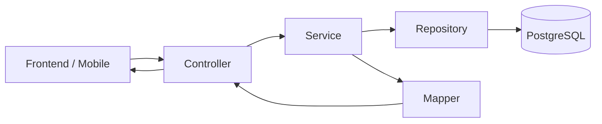

# Hướng dẫn xây dựng Backend Monolithic theo Package by Layer

## 1. Mục tiêu tài liệu

Tài liệu này hướng dẫn xây dựng backend cho website bán tranh, khung tranh và sản phẩm thiết kế theo yêu cầu bằng kiến trúc:

> **Monolithic kiểu phân tầng truyền thống – Package by Layer**

Hệ thống được triển khai dưới dạng:

- Một Spring Boot application.
- Một file JAR để deploy.
- Một PostgreSQL database chính.
- Một cổng API, ví dụ `8080`.
- Frontend React nằm trong thư mục `frontend` nhưng build độc lập với backend.
- Không sử dụng API Gateway, Eureka hoặc giao tiếp HTTP giữa các service.
- Các nghiệp vụ gọi nhau trực tiếp thông qua Java service trong cùng application.

Mục tiêu nghiệp vụ của phiên bản đầu tiên:

- Quản lý tài khoản khách hàng và nhân viên.
- Quản lý danh mục, sản phẩm, option và variant.
- Quản lý ảnh sản phẩm và ảnh khách hàng upload.
- Giỏ hàng và checkout.
- Khuyến mãi.
- Đơn hàng và thanh toán.
- Quy trình sản xuất sản phẩm theo yêu cầu.
- Giao hàng và tra cứu đơn.
- Trang chủ, banner, bài viết và nội dung SEO.

---

## 2. Monolithic là gì?

Monolithic không có nghĩa là tất cả code phải viết trong một file hoặc một package. Monolithic có nghĩa là toàn bộ backend chạy trong cùng một application và cùng một process.

```text
React frontend
      |
      v
Spring Boot application :8080
      |
      +-- Controller
      +-- Service
      +-- Repository
      +-- PostgreSQL
```

Những thành phần như PostgreSQL, Redis, MinIO/S3 và cổng thanh toán vẫn là hệ thống bên ngoài, nhưng business backend chỉ có một application.

### Những thành phần không cần dùng

Trong kiến trúc này không cần:

```text
API Gateway
Eureka Discovery Server
OpenFeign/WebClient giữa các nghiệp vụ nội bộ
Database riêng cho từng nghiệp vụ
Kafka cho luồng nghiệp vụ chính
Distributed transaction
Saga giữa các service
```

Kafka có thể được bổ sung sau nếu thực sự cần tích hợp với hệ thống ngoài. Trong phiên bản đầu tiên, event nội bộ và bảng outbox là đủ.

---

## 3. Kiến trúc phân tầng

Request đi qua các tầng theo thứ tự:



Quy tắc phụ thuộc:

```text
Controller -> Service -> Repository -> Entity
Controller -> DTO
Service -> DTO, Entity, Repository, Mapper
Mapper -> DTO, Entity
Repository -> Entity
```

Không được tạo phụ thuộc ngược:

```text
Entity       -X-> Controller
Repository   -X-> Controller
Repository   -X-> Service
Service      -X-> Controller
```

---

## 4. Cấu trúc thư mục tổng thể

```text
business-store/
├── .github/
│   └── workflows/
├── .mvn/
├── frontend/
│   ├── public/
│   ├── src/
│   ├── package.json
│   └── node_modules/
│
├── src/
│   ├── main/
│   │   ├── java/com/example/businessstore/
│   │   │   ├── cache/
│   │   │   ├── common/
│   │   │   ├── configuration/
│   │   │   ├── constant/
│   │   │   ├── controller/
│   │   │   ├── dto/
│   │   │   ├── entity/
│   │   │   ├── exception/
│   │   │   ├── mapper/
│   │   │   ├── repository/
│   │   │   ├── scheduling/
│   │   │   ├── security/
│   │   │   ├── service/
│   │   │   ├── util/
│   │   │   └── BusinessStoreApplication.java
│   │   │
│   │   └── resources/
│   │       ├── db/migration/
│   │       ├── templates/
│   │       ├── application.yaml
│   │       ├── application-dev.yaml
│   │       └── application-prod.yaml
│   │
│   └── test/
│       └── java/com/example/businessstore/
│           ├── controller/
│           ├── repository/
│           └── service/
│
├── .env.example
├── .gitignore
├── Dockerfile
├── docker-compose.yml
├── pom.xml
├── README.md
└── architecture.md
```

`node_modules` nên nằm trong `frontend/node_modules`, không đặt ở thư mục gốc của Maven backend.

---

## 5. Trách nhiệm của từng package

### 5.1. `controller`

Controller chịu trách nhiệm:

- Nhận HTTP request.
- Đọc path variable, query parameter và request body.
- Validate DTO bằng Jakarta Validation.
- Lấy thông tin người dùng từ Spring Security.
- Gọi service tương ứng.
- Trả về HTTP status và response DTO.

Controller không được:

- Truy cập repository trực tiếp.
- Tự tính giá sản phẩm.
- Tự reserve inventory.
- Chứa transaction nghiệp vụ.
- Chứa nhiều câu lệnh điều kiện mô tả business rule.

Cấu trúc đề xuất:

```text
controller/
├── AuthenticationController.java
├── CustomerController.java
├── ProductController.java
├── CategoryController.java
├── CollectionController.java
├── CartController.java
├── CheckoutController.java
├── OrderController.java
├── PaymentController.java
├── ProductionController.java
├── ShippingController.java
├── ArticleController.java
└── admin/
    ├── AdminProductController.java
    ├── AdminOrderController.java
    ├── AdminProductionController.java
    └── AdminContentController.java
```

### 5.2. `dto`

DTO là contract của API. Không trả JPA entity trực tiếp ra frontend.

```text
dto/
├── request/
│   ├── auth/
│   ├── customer/
│   ├── product/
│   ├── cart/
│   ├── order/
│   ├── payment/
│   ├── production/
│   └── content/
└── response/
    ├── auth/
    ├── customer/
    ├── product/
    ├── cart/
    ├── order/
    ├── payment/
    ├── production/
    └── content/
```

Ví dụ request:

```java
public record CreateProductRequest(
        @NotBlank String name,
        @NotBlank String categoryId,
        @NotNull @DecimalMin("0.00") BigDecimal basePrice,
        String description
) {
}
```

Ví dụ response:

```java
public record ProductResponse(
        UUID id,
        String name,
        String slug,
        BigDecimal basePrice,
        String status
) {
}
```

### 5.3. `entity`

Entity biểu diễn dữ liệu được lưu trong database.

```text
entity/
├── User.java
├── RefreshToken.java
├── CustomerProfile.java
├── CustomerAddress.java
├── Category.java
├── Collection.java
├── CollectionProduct.java
├── Product.java
├── ProductVariant.java
├── ProductOption.java
├── ProductOptionValue.java
├── ProductMedia.java
├── ProductCustomizationField.java
├── MediaAsset.java
├── Inventory.java
├── InventoryReservation.java
├── Cart.java
├── CartItem.java
├── Promotion.java
├── PromotionUsage.java
├── Order.java
├── OrderItem.java
├── Payment.java
├── ProductionJob.java
├── ProductionProof.java
├── Shipment.java
├── ShipmentHistory.java
├── Page.java
├── Article.java
├── ArticleCategory.java
├── Banner.java
├── HomeSection.java
├── SiteSetting.java
├── ProductReview.java
└── Notification.java
```

Không bắt buộc tạo toàn bộ entity ngay từ đầu. Nên thêm entity theo từng giai đoạn nghiệp vụ.

Quy tắc entity:

- Dùng UUID cho primary key.
- Tiền dùng `BigDecimal`, không dùng `double`.
- Thời gian dùng `Instant` hoặc `OffsetDateTime`.
- Enum lưu bằng `EnumType.STRING`.
- Không dùng `CascadeType.ALL` tùy tiện.
- Không serialize entity trực tiếp thành JSON.
- Không lưu URL tạm thời của S3 vào entity.
- Order item phải lưu snapshot tên, SKU, variant, giá và cấu hình tại thời điểm mua.

### 5.4. `repository`

Repository chỉ chịu trách nhiệm truy cập dữ liệu.

```text
repository/
├── UserRepository.java
├── ProductRepository.java
├── ProductVariantRepository.java
├── CategoryRepository.java
├── CartRepository.java
├── OrderRepository.java
├── PaymentRepository.java
└── ArticleRepository.java
```

Ví dụ:

```java
public interface ProductRepository extends JpaRepository<Product, UUID> {

    Optional<Product> findBySlugAndStatus(String slug, ProductStatus status);

    boolean existsBySlug(String slug);
}
```

Repository không được:

- Trả API response DTO.
- Gửi email.
- Gọi cổng thanh toán.
- Tính tổng tiền đơn hàng.
- Thay đổi nhiều aggregate không liên quan trong một repository method.

### 5.5. `service`

Service chứa use case và business rule.

```text
service/
├── AuthenticationService.java
├── ProductService.java
├── CartService.java
├── CheckoutService.java
├── OrderService.java
├── PaymentService.java
├── ProductionService.java
├── ShippingService.java
└── impl/
    ├── AuthenticationServiceImpl.java
    ├── ProductServiceImpl.java
    ├── CartServiceImpl.java
    ├── CheckoutServiceImpl.java
    ├── OrderServiceImpl.java
    ├── PaymentServiceImpl.java
    ├── ProductionServiceImpl.java
    └── ShippingServiceImpl.java
```

Ví dụ service interface:

```java
public interface ProductService {

    ProductResponse create(CreateProductRequest request);

    ProductDetailResponse findPublishedBySlug(String slug);

    PageResponse<ProductResponse> search(ProductSearchRequest request);
}
```

Ví dụ implementation:

```java
@Service
@RequiredArgsConstructor
public class ProductServiceImpl implements ProductService {

    private final ProductRepository productRepository;
    private final CategoryRepository categoryRepository;
    private final ProductMapper productMapper;

    @Override
    @Transactional
    public ProductResponse create(CreateProductRequest request) {
        Category category = categoryRepository.findById(request.categoryId())
                .orElseThrow(() -> new ResourceNotFoundException("Category not found"));

        Product product = productMapper.toEntity(request, category);
        product.setStatus(ProductStatus.DRAFT);

        return productMapper.toResponse(productRepository.save(product));
    }
}
```

Đặt `@Transactional` tại service method thay vì controller.

### 5.6. `mapper`

Mapper chuyển đổi giữa entity và DTO.

```text
mapper/
├── ProductMapper.java
├── CartMapper.java
├── OrderMapper.java
├── PaymentMapper.java
└── ArticleMapper.java
```

Có thể dùng MapStruct hoặc viết mapper thủ công. Không nên đặt logic truy vấn database trong mapper.

### 5.7. `exception`

```text
exception/
├── ErrorCode.java
├── ApplicationException.java
├── ResourceNotFoundException.java
├── BusinessRuleException.java
├── ErrorResponse.java
└── GlobalExceptionHandler.java
```

Response lỗi nên thống nhất:

```json
{
  "code": "PRODUCT_NOT_FOUND",
  "message": "Product not found",
  "path": "/api/v1/products/example",
  "timestamp": "2026-08-01T10:00:00Z",
  "requestId": "..."
}
```

### 5.8. `security`

```text
security/
├── JwtTokenProvider.java
├── JwtAuthenticationFilter.java
├── CustomUserDetailsService.java
├── SecurityUser.java
├── AuthenticationEntryPoint.java
└── AccessDeniedHandler.java
```

Security cần hỗ trợ:

- Access token ngắn hạn.
- Refresh token bằng HttpOnly cookie.
- Role-based authorization.
- Password hash bằng BCrypt hoặc Argon2.
- Rate limit login và password reset.
- Không ghi JWT, password hoặc refresh token vào log.

### 5.9. `configuration`

```text
configuration/
├── SecurityConfiguration.java
├── CorsConfiguration.java
├── JacksonConfiguration.java
├── JpaConfiguration.java
├── RedisConfiguration.java
├── S3Configuration.java
└── AsyncConfiguration.java
```

Configuration chỉ chứa cấu hình framework, không chứa business logic.

### 5.10. `constant`

Chứa enum và hằng số nghiệp vụ:

```text
constant/
├── UserRole.java
├── ProductStatus.java
├── FulfillmentType.java
├── OrderStatus.java
├── PaymentStatus.java
├── ProductionStatus.java
├── ShipmentStatus.java
└── MediaPurpose.java
```

Không cần tạo entity `Role` nếu hệ thống chỉ có một danh sách role cố định.

### 5.11. `cache`

Cache chỉ dùng cho dữ liệu đọc nhiều và thay đổi ít:

- Category tree.
- Product detail public.
- Storefront home.
- Published article.
- Site setting.

Không cache:

- Giá trị checkout cuối cùng.
- Inventory dùng để reserve.
- Trạng thái payment đang xử lý.
- Quyền người dùng mà không có cơ chế invalidation rõ ràng.

### 5.12. `scheduling`

```text
scheduling/
├── ExpiredReservationJob.java
├── ScheduledContentPublisher.java
├── OrphanMediaCleanupJob.java
├── PaymentReconciliationJob.java
└── OutboxProcessorJob.java
```

Các job chạy lặp phải idempotent. Nếu deploy nhiều instance, cần database lock hoặc distributed lock để tránh chạy trùng.

### 5.13. `common`

Chỉ chứa thành phần dùng chung thực sự:

```text
common/
├── BaseEntity.java
├── ApiResponse.java
├── PageResponse.java
├── Money.java
├── Address.java
├── DomainEvent.java
└── RequestContext.java
```

Không biến `common` thành nơi chứa những class không biết đặt ở đâu.

### 5.14. `util`

Chỉ chứa hàm thuần, không truy cập repository và không thay đổi database:

```text
util/
├── SlugUtils.java
├── HashUtils.java
├── DateTimeUtils.java
└── FileTypeUtils.java
```

---

## 6. Luồng request mẫu

### 6.1. Xem chi tiết sản phẩm

```text
GET /api/v1/products/{slug}
-> ProductController
-> ProductService.findPublishedBySlug
-> ProductRepository.findBySlugAndStatus
-> ProductMapper.toDetailResponse
-> trả ProductDetailResponse
```

### 6.2. Thêm sản phẩm vào giỏ

```text
POST /api/v1/cart/items
-> CartController
-> CartService.addItem
-> ProductRepository kiểm tra product/variant
-> ProductCustomizationValidator kiểm tra file và ghi chú
-> backend resolve giá
-> tạo configurationHash
-> CartItemRepository lưu item
-> trả CartResponse
```

Frontend không được truyền `unitPrice` làm nguồn giá chính thức.

### 6.3. Checkout

```text
POST /api/v1/checkout
-> CheckoutController
-> CheckoutService.checkout
-> lấy selected cart items
-> đọc lại giá hiện tại
-> validate promotion
-> reserve inventory cho item STOCKED
-> tạo Order và OrderItem snapshot
-> tạo Payment PENDING hoặc COD
-> khóa/finalize cart
-> commit một transaction
```

Trong monolith, các bước tạo order, reserve inventory và giữ promotion có thể thực hiện trong cùng một transaction database.

### 6.4. Sản phẩm làm theo yêu cầu

```text
Order CONFIRMED
-> nếu có item MADE_TO_ORDER
-> tạo ProductionJob
-> khách upload artwork
-> nhân viên upload proof
-> khách approve proof
-> IN_PRODUCTION
-> QUALITY_CHECK
-> READY_TO_SHIP
-> tạo Shipment
```

Không chuyển thẳng order sang shipping ngay sau payment nếu order có sản phẩm `MADE_TO_ORDER`.

---

## 7. Quy tắc thiết kế database

Sử dụng một PostgreSQL database.

Tên bảng nên có prefix nghiệp vụ để dễ quản lý:

```text
iam_users
iam_refresh_tokens
customer_profiles
customer_addresses

catalog_categories
catalog_collections
catalog_products
catalog_product_variants
catalog_product_options

inventory_stock
inventory_reservations

commerce_carts
commerce_cart_items
commerce_orders
commerce_order_items
commerce_payments
commerce_promotions

production_jobs
production_proofs

shipping_shipments
shipping_history

content_pages
content_articles
content_banners
content_home_sections

media_assets
notification_outbox
```

Quy tắc dữ liệu:

- Dùng Flyway cho tất cả thay đổi schema.
- Production sử dụng `ddl-auto: validate`.
- Index slug, SKU, order code, email và foreign key thường xuyên truy vấn.
- Dùng unique constraint để chống dữ liệu trùng.
- Dùng optimistic locking cho inventory, shipment hoặc production job cần chống lost update.
- Không lưu dữ liệu quan trọng chỉ trong JSONB.
- JSONB phù hợp cho snapshot, specification và validation rule.

---

## 8. API convention

Base path:

```text
/api/v1
```

Public API:

```text
GET /api/v1/storefront/home
GET /api/v1/categories/tree
GET /api/v1/collections/{slug}
GET /api/v1/products
GET /api/v1/products/{slug}
GET /api/v1/articles
GET /api/v1/articles/{slug}
```

Authenticated customer API:

```text
GET    /api/v1/cart
POST   /api/v1/cart/items
PUT    /api/v1/cart/items/{itemId}
DELETE /api/v1/cart/items/{itemId}
POST   /api/v1/checkout
GET    /api/v1/orders/me
GET    /api/v1/orders/{orderId}
```

Admin API:

```text
/api/v1/admin/products/**
/api/v1/admin/categories/**
/api/v1/admin/collections/**
/api/v1/admin/orders/**
/api/v1/admin/production/**
/api/v1/admin/content/**
```

Quy tắc:

- Dùng danh từ số nhiều.
- Không đặt động từ không cần thiết trong URL.
- Dùng HTTP status đúng ý nghĩa.
- Phân trang tất cả danh sách có thể tăng lớn.
- Giới hạn page size ở backend.
- Checkout và payment phải hỗ trợ `Idempotency-Key`.
- Không để frontend điều khiển order status trực tiếp.

---

## 9. Transaction và event nội bộ

Business operation chính sử dụng transaction đồng bộ:

```java
@Transactional
public CheckoutResponse checkout(CheckoutRequest request) {
    // validate cart
    // resolve price
    // reserve inventory
    // reserve promotion
    // create order
    // create payment
    // finalize cart
}
```

Event nội bộ dùng cho tác vụ không cần ảnh hưởng kết quả transaction chính:

```text
OrderConfirmedEvent
PaymentSucceededEvent
ProductionReadyEvent
ShipmentDeliveredEvent
```

Consumer nội bộ phù hợp cho:

- Gửi email.
- Tạo notification.
- Xóa cache.
- Ghi audit log.
- Tạo job sản xuất sau khi transaction order commit thành công.

Đối với tác vụ bắt buộc không được mất như email xác nhận đơn hoặc webhook ngoài, lưu event vào bảng `outbox_events`, sau đó scheduled job xử lý và retry.

---

## 10. Kế hoạch triển khai

### Phase 0: Khởi tạo project

- Tạo Spring Boot application mới.
- Cấu hình PostgreSQL và Flyway.
- Tạo BaseEntity.
- Tạo response/error convention.
- Cấu hình Security và CORS.
- Tạo Docker Compose cho PostgreSQL, Redis và MinIO.
- Thiết lập profile dev/prod.

### Phase 1: Identity và catalog

- User, refresh token và password reset.
- Category tree.
- Collection.
- Product, option và variant.
- Product customization field.
- Media upload.
- Public product API.
- Admin product API.

### Phase 2: Cart, inventory và promotion

- Guest cart và user cart.
- Merge cart sau login.
- Server-side price resolution.
- Inventory reservation.
- Coupon và usage limit.

### Phase 3: Order và payment

- Checkout transaction.
- Order snapshot.
- COD.
- Stripe hoặc bank transfer.
- Webhook idempotency.
- Order history và secure tracking token.

### Phase 4: Production và shipping

- Customer artwork.
- Production proof.
- Customer approval.
- Production workflow.
- Shipping rule và quote.
- Shipment và tracking history.

### Phase 5: Content và SEO

- Page.
- Article.
- Banner.
- Home section.
- Site setting.
- Scheduled publishing.
- Storefront home API.

### Phase 6: Hardening

- Unit test.
- Integration test.
- Rate limiting.
- Audit log.
- Outbox retry.
- Metrics và health check.
- Backup và migration rollback.

---

## 11. Testing

Cấu trúc test tương ứng với layer:

```text
src/test/java/com/example/businessstore/
├── controller/
├── repository/
├── service/
├── security/
└── integration/
```

### Unit test

Ưu tiên test:

- Resolve giá theo variant.
- Configuration hash của cart item.
- Promotion calculation.
- Inventory reserve/release.
- Order status transition.
- Payment status transition.
- Production status transition.
- Shipping restriction.

### Integration test

Sử dụng PostgreSQL thật thông qua Testcontainers cho:

- Repository query.
- Unique constraint.
- Flyway migration.
- Checkout transaction.
- Concurrent inventory reservation.
- Payment webhook idempotency.

Không dùng H2 để đại diện hoàn toàn cho PostgreSQL nếu hệ thống sử dụng JSONB, PostgreSQL search hoặc database-specific constraint.

---

## 12. Những lỗi kiến trúc cần tránh

### Controller gọi repository trực tiếp

Sai:

```java
productRepository.save(product);
```

Đúng:

```java
productService.create(request);
```

### Trả entity trực tiếp

Sai:

```java
public Product getProduct(...) { }
```

Đúng:

```java
public ProductDetailResponse getProduct(...) { }
```

### Tin giá từ frontend

Sai:

```json
{
  "productId": "...",
  "price": 1000
}
```

Backend phải lấy lại product/variant và tự tính giá.

### Một service implementation quá lớn

Không nên để `OrderServiceImpl` chứa checkout, payment, production, shipping và notification. Tách thành các service theo use case:

```text
CheckoutService
OrderService
PaymentService
ProductionService
ShippingService
```

### Lạm dụng `util`

Business rule không được đưa vào static utility chỉ để giảm số dòng trong service.

### Dùng entity cho mọi khái niệm

Role và status cố định nên là enum. Address snapshot có thể là `@Embeddable`. Không phải class nào cũng phải tạo thành bảng.

### Dùng `ddl-auto: update` ở production

Mọi thay đổi database phải được version bằng Flyway.

---

## 13. Definition of Done cho backend MVP

Backend MVP hoàn thành khi đáp ứng được các điều kiện:

- Public có thể xem category, collection và product detail.
- Product có nhiều size, màu và giá variant.
- Backend tự resolve giá.
- Khách có thể upload ảnh riêng tư.
- Hai artwork khác nhau không bị cart gộp.
- Checkout tạo order và reserve inventory trong transaction.
- Payment webhook gọi lặp không xử lý hai lần.
- Sản phẩm `MADE_TO_ORDER` tạo production job.
- Shipment chỉ được tạo khi sản phẩm đã sẵn sàng.
- Khách chỉ xem được artwork và order thuộc quyền của mình.
- Admin quản lý được product, order, production và content.
- Flyway migration chạy được trên database mới hoàn toàn.
- Các flow quan trọng có integration test.

---

## 14. Kết luận

Kiến trúc package by layer phù hợp khi:

- Team nhỏ.
- Muốn cách tổ chức Spring Boot quen thuộc.
- Muốn một application dễ chạy và dễ deploy.
- Nghiệp vụ chưa cần scale độc lập.
- Muốn tập trung hoàn thiện sản phẩm thay vì vận hành hạ tầng microservices.

Cấu trúc cốt lõi cần duy trì:

```text
Controller
    -> Service
        -> Repository
            -> Entity / PostgreSQL
```

Các nguyên tắc quan trọng nhất:

1. Controller mỏng.
2. Service sở hữu business rule và transaction.
3. Repository chỉ truy cập dữ liệu.
4. Không trả entity ra API.
5. Backend luôn là nguồn chính thức của giá và trạng thái.
6. Thêm entity theo từng use case, không tạo toàn bộ hệ thống trong một lần.
7. Dùng Flyway và integration test ngay từ giai đoạn đầu.
