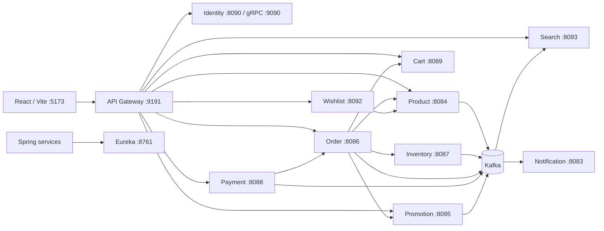

# START HERE — NovaShop E-commerce Microservices

Tài liệu này là điểm bắt đầu để đọc, chạy, kiểm tra và tiếp tục phát triển project `e-com-microNservice`. Nội dung được tổng hợp từ source code, `application.yaml`, `docker-compose.yaml`, controller, frontend routes và các luồng nghiệp vụ hiện có trong repository.

> Cấu hình chạy ổn định nhất ở môi trường local hiện tại: **Docker chạy database/hạ tầng; các Spring Boot service chạy bằng IntelliJ hoặc Maven**. Không chạy cùng một application service đồng thời ở Docker và IntelliJ vì Eureka sẽ đăng ký hai instance, khiến Gateway gọi lúc đúng lúc sai.

## 1. Project đang làm gì?

NovaShop là hệ thống thương mại điện tử gồm hai giao diện:

- Storefront cho khách hàng: xem sản phẩm, tìm kiếm, wishlist, cart, checkout, đơn hàng và tài khoản.
- Admin workspace: quản lý product, category, order, payment, promotion, flash sale, notification và profile.

Backend được tách theo nghiệp vụ:

- REST/WebClient cho thao tác cần kết quả ngay.
- Kafka cho đồng bộ và xử lý event bất đồng bộ.
- Eureka để các service tìm nhau bằng service name.
- API Gateway làm entry point cho frontend.
- gRPC giữa API Gateway và Identity Service để introspect token.

## 2. Công nghệ chính

| Thành phần | Công nghệ |
| --- | --- |
| Backend | Java 25, Spring Boot 4.x, Spring Cloud |
| Security | JWT, OAuth2 Resource Server, refresh token cookie |
| Service discovery | Netflix Eureka |
| Synchronous communication | REST, WebClient, gRPC |
| Asynchronous communication | Apache Kafka |
| Relational database | PostgreSQL |
| Document database | MongoDB |
| Cache/session support | Redis |
| Search | Elasticsearch |
| Mapping | MapStruct, Lombok |
| Frontend | React 19, Vite 7, MUI, Tailwind CSS, shadcn-style components |
| API testing | Bruno collection |
| Local infrastructure | Docker Compose |

## 3. Cấu trúc repository

```text
e-com-microNservice/
├── Microservice-ecom/       # Identity/authentication service
├── api-gateway-service/     # API Gateway + JWT introspection
├── discovery-server/        # Eureka server
├── profile-service/         # Hồ sơ người dùng
├── notification-service/    # Thông báo và email
├── product-service/         # Category, product, option, variant
├── inventory-service/       # Tồn kho và reservation
├── cart-service/            # Giỏ hàng và checkout locking
├── wishlist-service/        # Sản phẩm yêu thích
├── search-service/          # Elasticsearch search/read model
├── order-service/           # Checkout và vòng đời order
├── payment-service/         # Payment và payment event
├── promotion-service/       # Voucher, campaign, flash deal
├── shipping-service/        # Shipment, tracking và fulfillment
├── web-app/                 # Storefront + admin React app
├── database/                # SQL seed product/inventory
├── bruno/                   # Bruno collection, hiện có bộ Promotion
├── docker-compose.yaml      # Local infrastructure và một số app container
├── architecture.md          # Tài liệu kiến trúc chi tiết
├── README.md                # Tài liệu tổng quan cũ
└── start_here.md            # File đang đọc
```

## 4. Service, port và dữ liệu

| Service | Module | Port local | Dữ liệu / phụ thuộc chính |
| --- | --- | ---: | --- |
| Discovery Server | `discovery-server` | 8761 | Eureka registry |
| API Gateway | `api-gateway-service` | 9191 | Eureka, Identity gRPC `9090` |
| Identity Service | `Microservice-ecom` | 8090; gRPC 9090 | PostgreSQL `5433`, Redis, Kafka |
| Profile Service | `profile-service` | 8081 | MongoDB, Kafka |
| Notification Service | `notification-service` | 8083 | MongoDB, Kafka, SMTP |
| Product Service | `product-service` | 8084 | PostgreSQL `5432`, Kafka |
| Order Service | `order-service` | 8086 | PostgreSQL `5432`, Kafka, Product/Inventory/Cart/Promotion |
| Inventory Service | `inventory-service` | 8087 | PostgreSQL `5435`, Kafka |
| Payment Service | `payment-service` | 8088 | PostgreSQL `5432`, Kafka, Order |
| Cart Service | `cart-service` | 8089 | PostgreSQL `5432`, Product |
| Wishlist Service | `wishlist-service` | 8092 | PostgreSQL `5432`, Product |
| Search Service | `search-service` | 8093 | Elasticsearch `9200`, Kafka |
| Promotion Service | `promotion-service` | 8095 | PostgreSQL `5437`, Kafka |
| Shipping Service | `shipping-service` | 8096 | PostgreSQL `5438`, Kafka |
| Web app | `web-app` | 5173 | API Gateway `9191` |

### Promotion khi chạy Docker

Container `promotion-service` nghe port `8095` bên trong và được publish ra host bằng:

```text
localhost:8094 -> container:8095
```

Do đó:

- Chạy Promotion bằng IntelliJ: dùng `http://localhost:8095`.
- Chạy Promotion bằng Docker: dùng `http://localhost:8094`.
- Chỉ chạy một trong hai cách.

### Ownership dữ liệu hiện tại

| Storage | Service đang sử dụng |
| --- | --- |
| PostgreSQL `localhost:5432/postgres` | Product, Cart, Order, Payment, Wishlist |
| PostgreSQL `localhost:5433/identity-service` | Identity |
| PostgreSQL `localhost:5435/inventory_db` | Inventory |
| PostgreSQL `localhost:5437/promotion_db` | Promotion |
| PostgreSQL `localhost:5438/shipping_db` | Shipping |
| MongoDB database `profile-service` | Profile |
| MongoDB database `notification-service` | Notification |
| Elasticsearch | Search index |
| Redis | Identity/refresh-token support |

Các service Product, Cart, Order, Payment và Wishlist hiện chia sẻ cùng PostgreSQL instance/database. Với project cá nhân điều này chạy được, nhưng nếu tiến tới production nên tách database/schema và tài khoản DB cho từng service.

## 5. Sơ đồ giao tiếp



## 6. Chuẩn bị môi trường

Cần cài:

- Docker Desktop.
- JDK 25. Project hiện khai báo `<java.version>25</java.version>`.
- Maven hoặc Maven Wrapper trong từng module.
- Node.js LTS và npm.
- IntelliJ IDEA nếu muốn chạy từng service bằng Run Configuration.
- Bruno nếu muốn chạy collection API mẫu.

Kiểm tra nhanh trong PowerShell:

```powershell
java --version
mvn --version
node --version
npm --version
docker --version
docker compose version
```

Nếu vừa cài Node mà PowerShell báo không nhận `node`/`npm`, đóng terminal cũ và mở PowerShell mới để PATH được nạp lại.

## 7. Biến môi trường cần thiết

Không đưa secret thật vào tài liệu, Git hoặc ảnh chụp màn hình. Các biến quan trọng:

```dotenv
SPRING_PROFILES_ACTIVE=dev
JWT_RSA_PRIVATE_KEY=<Base64 PKCS#8 RSA private key>
JWT_RSA_KEY_ID=identity-rs256-v1
JWT_ISSUER=http://localhost:8090
JWT_AUDIENCE=novashop-api
JWT_JWK_SET_URI=http://localhost:8090/identity/api/.well-known/jwks.json
SECURITY_REFRESH_ALLOWED_ORIGINS=http://localhost:5173
APP_CORS_ALLOWED_ORIGINS=http://localhost:5173
EMAIL_USERNAME=<smtp username>
EMAIL_PASSWORD=<smtp app password>
ELASTICSEARCH_API_KEY=<api key nếu Elasticsearch bật security>
KAFKA_BOOTSTRAP_SERVERS=localhost:9094
```

Tạo private key cho local (không commit file/key sinh ra):

```powershell
$keyPath = Join-Path $env:TEMP "novashop-jwt-private.pem"
openssl genpkey -algorithm RSA -pkeyopt rsa_keygen_bits:3072 -out $keyPath
[Convert]::ToBase64String([IO.File]::ReadAllBytes($keyPath))
Remove-Item -LiteralPath $keyPath
```

Lưu giá trị in ra vào `JWT_RSA_PRIVATE_KEY` trong secret manager hoặc `.env.dev`. Identity chỉ phát JWKS public tại `/.well-known/jwks.json`; các service khác không nhận private key.

Lưu ý bảo mật:

- Repository hiện có một số password/API key cấu hình local. Không dùng lại các giá trị này cho production.
- Nên chuyển toàn bộ secret sang environment variable và xoay vòng các secret đã từng commit.
- Không log access token, refresh token, JWT secret hoặc API key.

## 8. Cách chạy local khuyến nghị

### Bước 1 — Khởi động Docker Desktop

Đợi Docker Desktop báo Engine đang chạy.

### Bước 2 — Chạy database và hạ tầng

Khuyến nghị chỉ chạy infrastructure bằng Docker:

```powershell
docker compose up -d product-postgres identity-postgres inventory-postgres promotion-postgres redis mongodb kafka kafka-ui elasticsearch
```

Kibana là tùy chọn:

```powershell
docker compose up -d kibana
```

Kiểm tra:

```powershell
docker compose ps
```

URL hạ tầng:

| Công cụ | URL |
| --- | --- |
| Kafka UI | http://localhost:8085 |
| Elasticsearch | http://localhost:9200 |
| Kibana | http://localhost:5601 |

### Bước 3 — Chạy Discovery Server trước

Trong PowerShell:

```powershell
cd discovery-server
.\mvnw.cmd spring-boot:run
```

Hoặc chạy class Spring Boot của module `discovery-server` trong IntelliJ.

Mở http://localhost:8761 và giữ service này chạy trước khi khởi động service khác.

### Bước 4 — Chạy Identity và service nền

Thứ tự thực tế dễ ổn định:

1. `profile-service` — port 8081.
2. `Microservice-ecom` — port 8090 và gRPC 9090.
3. `product-service` — port 8084.
4. `inventory-service` — port 8087.
5. `cart-service` — port 8089.
6. `promotion-service` — port 8095.
7. `order-service` — port 8086.
8. `payment-service` — port 8088.
9. `search-service` — port 8093.
10. `wishlist-service` — port 8092.
11. `notification-service` — port 8083.
12. `api-gateway-service` — port 9191.

Mỗi service chạy ở terminal riêng, ví dụ:

```powershell
cd product-service
.\mvnw.cmd spring-boot:run
```

Identity và Profile không có Maven Wrapper trong repo hiện tại, dùng Maven cài trên máy:

```powershell
mvn -f Microservice-ecom\pom.xml spring-boot:run
mvn -f profile-service\pom.xml spring-boot:run
```

### Bước 5 — Kiểm tra Eureka

Mở http://localhost:8761 và kiểm tra các application cần dùng có trạng thái `UP`.

Không được có hai instance của cùng service nếu bạn chỉ định chạy một bản local. Trường hợp Promotion thường xuyên lúc được lúc lỗi thường do cùng chạy:

- Promotion trong IntelliJ ở port 8095.
- Promotion container ở host port 8094.

Khi chạy IntelliJ, dừng riêng application container nhưng giữ database:

```powershell
docker compose stop promotion-service
docker compose up -d promotion-postgres
```

### Bước 6 — Chạy frontend

```powershell
cd web-app
npm ci
npm run dev
```

Mở:

- Storefront: http://localhost:5173/shop
- Admin: http://localhost:5173/dashboard
- Admin login: http://localhost:5173/login
- Customer login: http://localhost:5173/shop/login

Nếu `npm ci` lỗi `EPERM` hoặc `ENOTEMPTY`, dừng Vite, đóng terminal đang giữ file trong `node_modules`, sau đó xoá `node_modules` và chạy lại `npm ci`.

## 9. Chạy Promotion bằng Docker thay vì IntelliJ

Chỉ dùng chế độ này khi bạn không chạy Promotion từ IntelliJ:

```powershell
docker compose up -d promotion-postgres
docker compose up -d --build promotion-service
```

Kiểm tra trực tiếp:

```powershell
curl.exe http://localhost:8094/actuator/health
```

Nếu API Gateway chạy trên host nhưng Eureka hiển thị Promotion bằng hostname/container port mà host không truy cập được, hãy chạy Promotion bằng IntelliJ theo mục 8. Đây là giới hạn của cấu hình Compose hiện tại; production nên đặt Gateway, Eureka và application containers chung một Docker network hoặc cấu hình chính xác advertised hostname/port.

## 10. Gateway routes

Gateway base URL:

```text
http://localhost:9191
```

Các route được khai báo cả trong `GatewayConfiguration.java` và `application.yaml`:

| Public path | Target |
| --- | --- |
| `/identity/**` | Identity; strip `/identity`, prefix `/identity/api` |
| `/profile/**` | Profile; strip prefix đầu |
| `/notification/**` | Notification; strip prefix đầu |
| `/product/**` | Product; strip prefix đầu |
| `/search/**` | Search; strip prefix đầu |
| `/api/v1/search/**` | Search giữ nguyên path |
| `/inventory/**` | Inventory; strip prefix đầu |
| `/api/v1/inventory/**` | Inventory giữ nguyên path |
| `/order/**` | Order; strip prefix đầu |
| `/payment/**` | Payment; strip prefix đầu |
| `/api/v1/cart/**` | Cart giữ nguyên path |
| `/api/v1/wishlist/**` | Wishlist giữ nguyên path |
| `/api/v1/promotions/**` | Promotion giữ nguyên path |
| `/api/v1/flash-deals/**` | Promotion/Flash Deal giữ nguyên path |

Ví dụ:

```text
POST http://localhost:9191/identity/auth/login
GET  http://localhost:9191/product/api/v1/products
GET  http://localhost:9191/api/v1/search/products
GET  http://localhost:9191/api/v1/cart
GET  http://localhost:9191/api/v1/promotions/campaigns
POST http://localhost:9191/order/api/v1/orders/checkout
```

Các API bảo vệ yêu cầu:

```http
Authorization: Bearer <access-token>
```

Frontend dùng refresh token trong cookie và `withCredentials: true`. Khi access token hết hạn, HTTP interceptor gọi `/identity/auth/refresh-token`, lưu access token mới rồi thử lại request cũ.

## 11. Frontend routes

### Storefront

| Route | Chức năng |
| --- | --- |
| `/shop` | Landing page |
| `/shop/search` | Search/filter storefront |
| `/shop/categories/:slug` | Sản phẩm theo category |
| `/shop/products/:slug` | Chi tiết sản phẩm theo slug |
| `/shop/hot-deals` | Hot deal |
| `/shop/best-deals` | Best deal |
| `/shop/wishlist` | Wishlist |
| `/cart` | Giỏ hàng |
| `/checkout` | Checkout |
| `/shop/orders` | Đơn hàng của tôi |
| `/shop/account` | Tài khoản khách hàng |
| `/shop/account/profile` | Sửa hồ sơ khách hàng |
| `/shop/login`, `/shop/register` | Auth dành cho khách hàng |

### Admin

| Route | Chức năng |
| --- | --- |
| `/dashboard` | Tổng quan admin |
| `/products` | Danh sách product |
| `/products/new` | Tạo product |
| `/products/:id/edit` | Cập nhật product |
| `/categories` | Category admin |
| `/search` | Search admin |
| `/orders` | Quản lý order |
| `/payments` | Quản lý payment |
| `/promotions` | Promotion campaign |
| `/flash-deals` | Flash sale/long-term sale |
| `/notifications` | Notification admin |
| `/profile` | Profile admin |

`PrivateRoute` hiện chỉ kiểm tra có phiên đăng nhập, chưa khoá route theo role ADMIN.

## 12. Mô hình dữ liệu quan trọng

### Product catalog

```text
Category
└── Product
    ├── ProductImage
    ├── ProductOption (Color, Size, Storage...)
    │   └── ProductOptionValue
    └── ProductVariant
        └── attributes JSON dùng value hợp lệ từ ProductOption
```

`ProductVariant` đại diện SKU có thể bán thực tế. Cart, Wishlist, Order và Inventory nên giữ cả `productId` và `variantId` khi sản phẩm có biến thể.

### Inventory

| Field | Ý nghĩa |
| --- | --- |
| `availableQuantity` | Có thể bán ngay |
| `reservedQuantity` | Đã giữ cho order chờ thanh toán |
| `soldQuantity` | Đã bán sau khi payment thành công |

Inventory Service là source of truth của tồn kho. `Product.quantity` hoặc `Search.inStock` chỉ là read model/giá trị đồng bộ để hiển thị nhanh.

### Trạng thái chính

| Aggregate | Trạng thái |
| --- | --- |
| Product | `ACTIVE`, `INACTIVE` |
| Cart | `ACTIVE`, `CHECKED_OUT`, `ABANDONED` |
| Order | `PENDING`, `PENDING_PAYMENT`, `INVENTORY_FAILED`, `PROMOTION_FAILED`, `CONFIRMED`, `SHIPPING`, `COMPLETED`, `CANCELLED` |
| Payment | `PENDING`, `SUCCESS`, `FAILED`, `CANCELLED` |
| Inventory reservation | `PENDING`, `CONFIRMED`, `RELEASED` |
| Promotion | `DRAFT`, `ACTIVE`, `INACTIVE`, `EXPIRED` |
| Promotion usage | `RESERVED`, `USED`, `RELEASED` |
| Flash deal | `DRAFT`, `SCHEDULED`, `LIVE`, `ENDED`, `SOLD_OUT` |

## 13. Luồng checkout hoàn chỉnh

```text
Client chọn CartItem
-> POST /api/v1/orders/checkout
-> Order Service lấy selected cart items
-> lấy snapshot Product/Variant hiện tại
-> tính subtotal
-> validate Promotion/Flash Deal nếu có
-> tạo Order PENDING
-> Inventory reserve
-> Promotion reserve
-> Order PENDING_PAYMENT
-> CartItem được gắn checkoutOrderId
-> Payment Service tạo Payment PENDING
```

### Payment thành công

```text
Payment SUCCESS
-> publish payment-success
-> Order CONFIRMED
-> Inventory: reservedQuantity giảm, soldQuantity tăng
-> Promotion usage: RESERVED -> USED
-> Flash deal reservation được confirm
-> Cart finalize: chỉ xoá item có checkoutOrderId đúng order
```

### Payment thất bại hoặc bị huỷ

```text
Payment FAILED/CANCELLED
-> publish payment-failed/payment-cancelled
-> Inventory release
-> Promotion release
-> Flash deal release
-> Cart release checkoutOrderId
-> user có thể thanh toán lại
```

Các thao tác confirm/release được thiết kế idempotent: event gửi lại không được tăng `soldQuantity` hai lần, dùng promotion hai lần hoặc xoá nhầm cart item mới thêm.

## 14. Product, Search và Inventory event flow

```text
Product create/update/delete
-> Product Service lưu PostgreSQL
-> publish product event
-> Search Service cập nhật Elasticsearch document
```

```text
Inventory thay đổi
-> publish inventory-updated
-> Product cập nhật quantity read model
-> Product publish update
-> Search cập nhật inStock/filter data
```

Search storefront hỗ trợ tên, category, khoảng giá, tồn kho, aggregation và autocomplete ở header. Checkout vẫn phải hỏi Inventory Service, không tin hoàn toàn dữ liệu Elasticsearch.

## 15. Promotion và Flash Deal

Promotion Service hiện quản lý:

- `PromotionCampaign`: voucher theo code, phần trăm/số tiền, thời gian, giới hạn sử dụng, product/category áp dụng.
- `PromotionUsage`: reserve, confirm hoặc release theo order.
- `PromotionClaim`: voucher user đã nhận.
- `FlashDeal` và `FlashDealItem`: sale theo lịch, stock/giá deal.
- Notification subscription cho flash deal.

Internal API cho Order Service:

```text
POST /internal/promotions/validate
POST /internal/promotions/reserve
POST /internal/promotions/confirm
POST /internal/promotions/release

POST /internal/flash-deals/reserve
POST /internal/flash-deals/confirm
POST /internal/flash-deals/release
```

Request mẫu nằm tại:

```text
bruno/promotion-service/
```

## 16. Seed dữ liệu demo

File có sẵn:

- `database/seed-products.sql`
- `database/seed-inventory.sql`

Trong PowerShell, dùng pipe thay vì toán tử `<`:

```powershell
Get-Content .\database\seed-products.sql -Raw | docker exec -i product-postgres psql -U root -d postgres
Get-Content .\database\seed-inventory.sql -Raw | docker exec -i inventory-postgres psql -U postgres -d inventory_db
```

Chạy product seed trước inventory seed để `productId` và `variantId` đã tồn tại.

## 17. Build và kiểm tra

### Build toàn bộ module đã khai báo trong root POM

```powershell
mvn -DskipTests package
```

Lưu ý: root `pom.xml` hiện **chưa khai báo `promotion-service`** trong `<modules>`, nên build root không build Promotion. Build riêng:

```powershell
mvn -f promotion-service\pom.xml -DskipTests package
```

### Build một service

```powershell
.\order-service\mvnw.cmd -f .\order-service\pom.xml -DskipTests package
```

Hoặc:

```powershell
mvn -f order-service\pom.xml -DskipTests package
```

### Frontend

```powershell
cd web-app
npm run lint
npm run build
```

Vite hiện có thể cảnh báo JS chunk lớn hơn 500 kB. Đây là cảnh báo tối ưu bundle, không phải build failure; có thể xử lý sau bằng lazy loading và manual chunks.

## 18. Checklist smoke test

1. Eureka mở được và service cần dùng đều `UP`.
2. `POST /identity/auth/login` qua Gateway trả access token và refresh cookie.
3. `GET /product/api/v1/products` trả catalog.
4. `GET /api/v1/search/products` trả Elasticsearch results.
5. Thêm wishlist rồi reload, trạng thái tim vẫn còn.
6. Thêm variant vào cart, sửa quantity và chọn item.
7. Checkout tạo Order `PENDING_PAYMENT` và Inventory tăng reserved.
8. Tạo Payment rồi chuyển SUCCESS.
9. Order chuyển `CONFIRMED`, Inventory tăng sold, cart item được finalize.
10. Campaign/flash deal reserve và confirm/release đúng theo payment result.
11. Notification xuất hiện sau order/payment event.
12. Storefront và admin reload không bị 401 khi refresh token còn hợp lệ.

## 19. Lỗi thường gặp

### `ECONNREFUSED 127.0.0.1:9191`

API Gateway chưa chạy. Chạy Discovery, Identity rồi API Gateway.

### `401 Unauthorized`

- Kiểm tra header `Authorization: Bearer ...`.
- Đăng nhập lại nếu access token và refresh cookie đều hết hạn.
- Bruno không tự dùng token frontend; cần lưu access token vào environment của Bruno.
- Login đúng qua Gateway là `POST http://localhost:9191/identity/auth/login`.

### Promotion lúc được lúc lỗi

Kiểm tra Eureka. Nếu có hai instance Promotion, dừng một bản:

```powershell
docker compose stop promotion-service
```

Giữ `promotion-postgres` chạy để IntelliJ vẫn lưu database.

### `Port ... was already in use`

```powershell
Get-NetTCPConnection -LocalPort 8095 -State Listen
```

Sau đó dừng đúng Run Configuration/container đang chiếm port; không kill hàng loạt Java process.

### Service không xuất hiện trong Eureka

- Discovery phải chạy trước service.
- Kiểm tra `defaultZone=http://localhost:8761/eureka/`.
- Service trong Docker cần dùng `host.docker.internal`, không dùng `localhost` để gọi Eureka trên host.
- Chờ một chu kỳ heartbeat khoảng 30 giây.

### Order `INVENTORY_FAILED`

- Inventory của `productId`/`variantId` chưa tồn tại.
- `availableQuantity` không đủ.
- Inventory Service chưa chạy hoặc không được Eureka discover.

### `soldQuantity` không tăng

Kiểm tra chuỗi:

```text
Payment SUCCESS event
-> Order consumer
-> /internal/inventory/confirm
-> reservation đang PENDING
```

Reservation đã `CONFIRMED` thì request lặp phải no-op.

### Search không thấy product mới

- Kafka phải chạy ở `localhost:9094` cho app chạy local.
- Product phải publish event.
- Search consumer phải chạy.
- Elasticsearch phải healthy.

### Docker data có bị mất khi stop không?

Không. `docker compose stop <service>` chỉ dừng container. `docker compose down` cũng giữ named volume theo mặc định. Chỉ `docker compose down -v` mới xoá volume và dữ liệu database.

## 20. Quy ước khi phát triển tiếp

- Mỗi service sở hữu nghiệp vụ và repository của chính nó; không truy cập trực tiếp repository service khác.
- Giao tiếp nội bộ qua DTO/API/event, không dùng chung JPA entity.
- Order giữ snapshot tên, giá và variant tại thời điểm mua.
- Inventory là source of truth cho stock.
- Checkout phải idempotent và có compensation cho mọi reservation.
- Payment SUCCESS/FAILED/CANCELLED phải phát event đầy đủ.
- Internal endpoint phải có idempotency và chỉ cho service-to-service sử dụng.
- API public trả error format thống nhất qua `ErrorCode`, service exception và `GlobalExceptionHandler`.
- Không hardcode secret, URL production hoặc credential trong source.
- Khi thêm service mới: thêm Eureka config, Gateway route, Docker config, health check, exception contract và mục trong tài liệu này.
- Khi đổi API, cập nhật đồng thời frontend service client và Bruno collection.

## 21. Việc kỹ thuật nên ưu tiên tiếp theo

1. Thêm `promotion-service` vào root Maven `<modules>`.
2. Loại bỏ route trùng giữa `GatewayConfiguration.java` và Gateway YAML, chọn một nguồn cấu hình.
3. Chuẩn hoá Docker cho toàn bộ application service hoặc chỉ giữ infrastructure trong Compose.
4. Tách database/schema cho Cart, Order, Payment và Wishlist.
5. Di chuyển password, JWT secret và Elasticsearch credential hoàn toàn sang environment.
6. Thêm health check cho mọi service và Docker `depends_on` theo health.
7. Thêm migration bằng Flyway/Liquibase thay cho phụ thuộc hoàn toàn vào `ddl-auto:update`.
8. Bổ sung integration test cho checkout/payment compensation và event idempotency.
9. Thêm observability: correlation ID, centralized logs, metrics và distributed tracing.
10. Tách frontend bundle bằng route-level lazy loading.

## 22. Điểm bắt đầu theo loại công việc

| Muốn sửa | Bắt đầu từ |
| --- | --- |
| Login/JWT/refresh token | `Microservice-ecom` và `api-gateway-service` |
| Product/category/variant | `product-service` |
| Stock/reservation/sold | `inventory-service` |
| Cart/selected item | `cart-service` |
| Checkout/order lifecycle | `order-service` |
| Payment event | `payment-service` |
| Voucher/flash sale | `promotion-service` |
| Search/autocomplete/filter | `search-service` |
| Wishlist | `wishlist-service` |
| Email/in-app notification | `notification-service` |
| Storefront/admin UI | `web-app/src/pages`, `components`, `services` |
| Gateway path/auth filter | `api-gateway-service` |

Khi chưa rõ lỗi thuộc service nào, bắt đầu bằng Network tab của browser hoặc response Bruno, ghi lại HTTP status/path, sau đó kiểm tra API Gateway và Eureka trước khi đi vào log business service.
